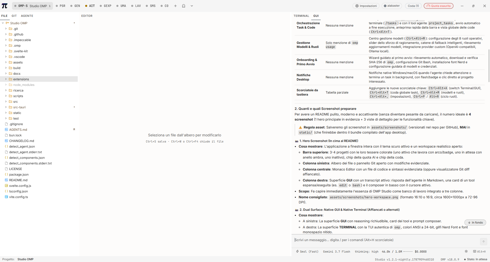
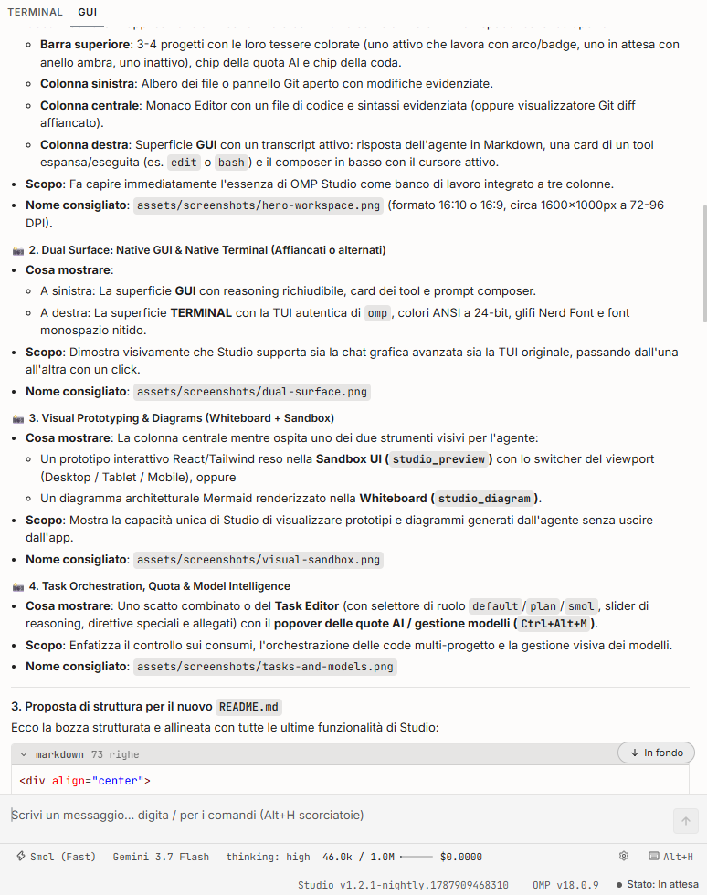
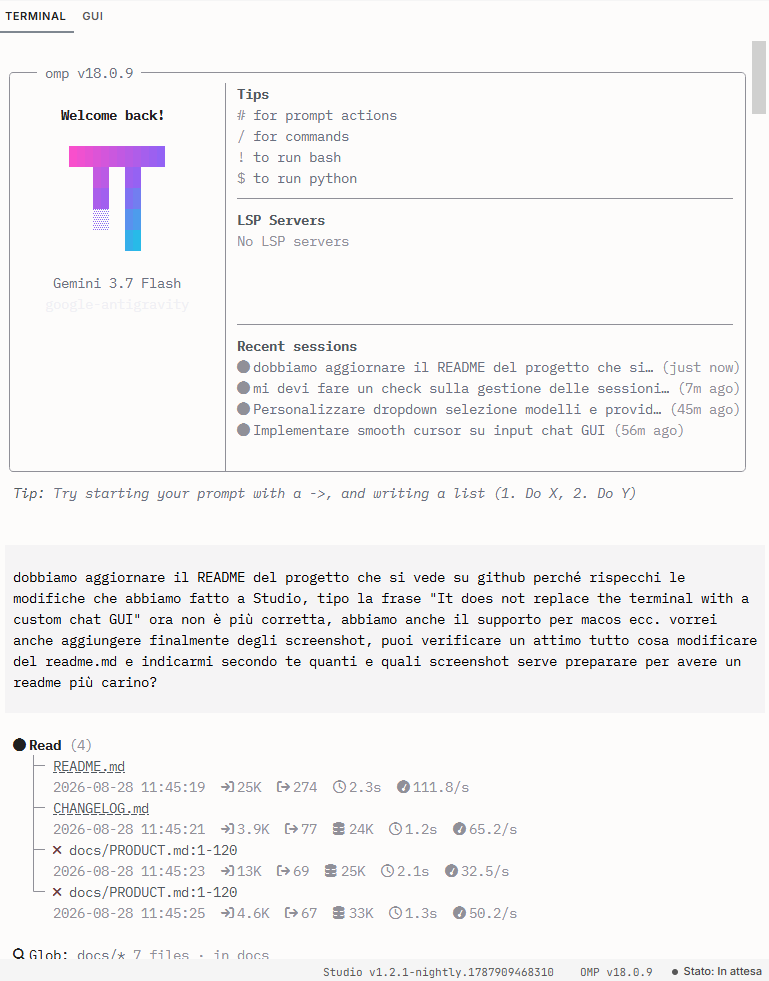
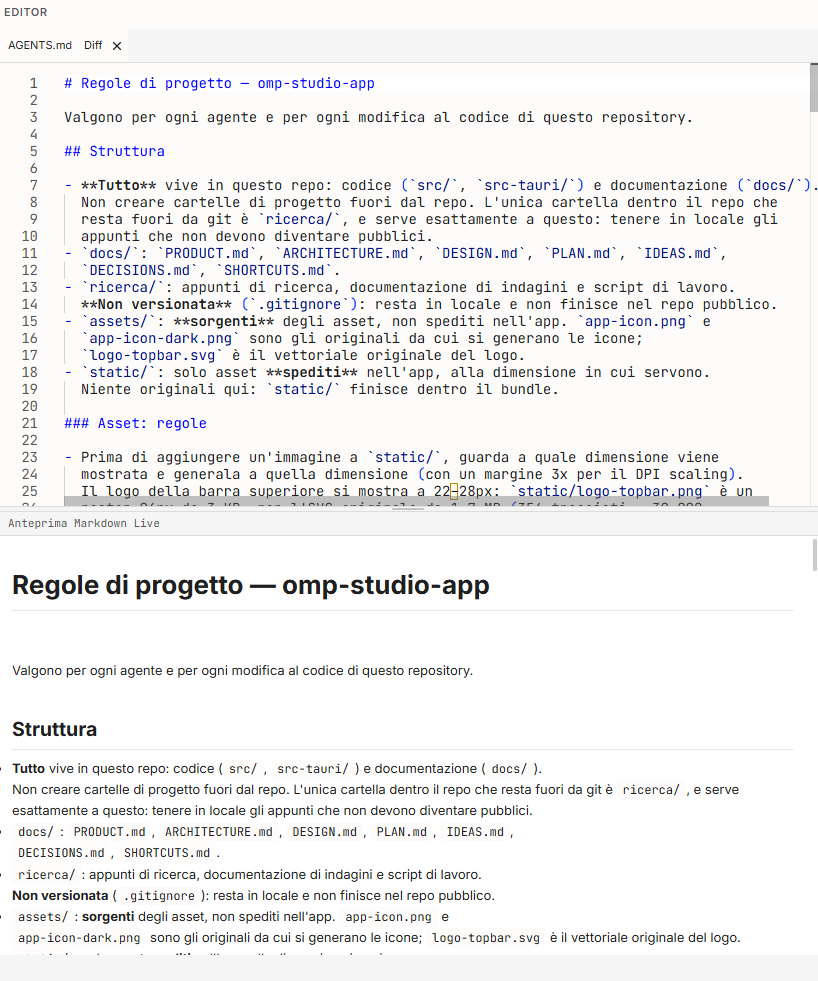
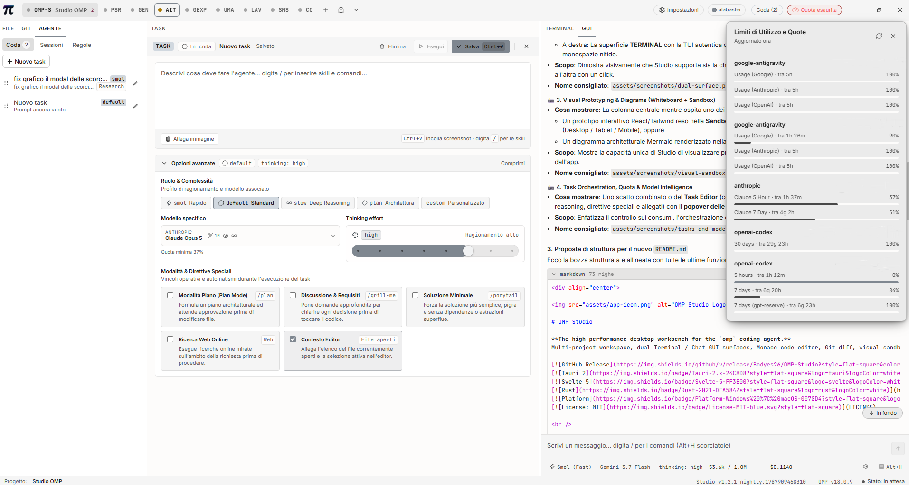

<div align="center">


# OMP Studio

**The high-performance desktop workbench for the `omp` coding agent.**
Multi-project workspace, dual Terminal / Chat GUI surfaces, Monaco editor with Git diff, visual sandboxes, task orchestration, and real-time AI quota monitoring.

[](https://github.com/Bodyes26/OMP-Studio/releases)
[](https://tauri.app/)
[](https://svelte.dev/)
[](https://www.rust-lang.org/)
[](https://github.com/Bodyes26/OMP-Studio/releases)
[](LICENSE)

<br />



<br /><br />

[Download](#-download--installation) • [Key Features](#-key-features) • [Screenshots](#-visual-walkthrough) • [Shortcuts](#-keyboard-shortcuts) • [Built with OMP](#-built-with--for-omp) • [Development](#-local-development) • [Docs](docs/PRODUCT.md)

</div>

---

## 🎯 Overview

**OMP Studio** is a focused, distraction-free desktop workbench engineered around the [`omp`](https://github.com/...) AI coding agent.

Rather than forcing a single paradigm or wrapping the agent in bloated layers, OMP Studio provides a cooperative **Dual Surface**:

1. **Native High-Performance Terminal**: Pixel-perfect `@xterm/xterm` Canvas renderer powered by ConPTY (Windows) and POSIX PTY (macOS), with 24-bit Truecolor, bundled Nerd Font ligatures, and zero-conversion byte streaming.
2. **Native Chat GUI**: Built with Svelte 5 and Rust RPC transport (`omp --mode rpc-ui`), featuring collapsible reasoning trees, 30+ structured tool cards, interactive `ask` wizards, clickable file paths, image attachments, and a fluid typing cursor.

Switch between Terminal and Chat GUI on the fly with **`Ctrl+Alt+A`** on the **exact same running session** with zero state loss.

---

## ✨ Key Features

- 🗂️ **Zero-Friction Multi-Project Bar**: Switch between open repositories with zero latency. Background agent processes keep running uninterrupted. Project tiles reflect live agent states (working spinner, amber awaiting-input ring, idle) and task queue counts.
- ⚡ **Dual Agent Surface (`TERMINAL | GUI`)**: Use the authentic terminal TUI or the rich Svelte 5 GUI. Full support for markdown streaming, image pasting (`Ctrl+V`), slash commands (`/`), and subagent inspection.
- 📝 **Integrated Monaco Editor & Side-by-Side Diff**: Inspect, edit, and verify code touched by the agent. Built-in Git panel with branch switching, uncommitted diffs, and session history timelines.
- 📋 **Project Task Orchestration (`.omp/tasks.json`)**: Persistent, local task queues shared in real time between Studio and the terminal `/tasks` command. Features operational role presets (`plan`, `smol`, `default`, `slow`, `advisor`), reasoning effort slider, visual attachments, and automatic task execution.
- 🎨 **Visual Prototyping & Whiteboards**:
  - **UI Sandbox (`studio_preview`)**: Instant live rendering for React/TSX and HTML components with responsive viewport switching (Desktop, Tablet, Mobile).
  - **Mermaid Whiteboard (`studio_diagram`)**: Zoomable visual architecture diagrams rendered directly in the central column.
- 📊 **Real-Time AI Quota & Model Intelligence**: Live quota monitoring across all providers (`Ctrl+Alt+U`), 24h trend sparklines, reset countdowns, and an integrated Model & Role manager (`Ctrl+Alt+M`) with automated fallback chains.
- 📜 **Context Rules & Anti-Friction Engine**: Dedicated Rules tab listing project context files (`AGENTS.md`, `.omp/rules/`, `CLAUDE.md`) and installed skills. Analyzes recurring user corrections to propose targeted project rules with 1-click application.
- 🔔 **Native Desktop Notifications**: Windows 10/11 toast notifications (with registered AUMID and taskbar flashing) and macOS notifications (with dock bounce and badge counter) when the agent needs input or finishes a task.
- 🛡️ **Private, Lean & Safe**: 100% offline-capable local desktop app built on Tauri 2. Connects directly to local SQLite databases in strict read-only mode (`PRAGMA query_only = ON`).

---

## 📸 Visual Walkthrough

### Dual Agent Surface: Chat GUI & Native Terminal
Switch between the rich Svelte 5 chat GUI and the pixel-perfect ANSI terminal on the same session using `Ctrl+Alt+A`:

<p align="center">
  
  
</p>

### Monaco Editor & Git Diff
Inspect changes, compare side-by-side Git diffs, preview SVGs, and edit files directly alongside the agent:

<p align="center">
  
</p>

### Task Orchestration & Model Intelligence
Queue prompts, tune reasoning effort and roles, attach screenshots, and monitor token quotas across providers:

<p align="center">
  
</p>

---

## 🤖 Built with & for `omp`

This entire application is **developed, maintained, and evolved iteratively using `omp` itself**.

- **AI-First Documentation**: Guidelines like [`AGENTS.md`](AGENTS.md), architecture blueprints in [`docs/`](docs/), and workflow contracts are explicitly crafted for AI coding agents to inspect, reason about, and act upon with zero ambiguity.
- **Bilingual Context**: While the public interface and this README are in English, internal design documents, commit histories, and agent prompt dialogues are maintained in **Italian** (the author's native language).
- **Strict Invariants**: The codebase is engineered to be resilient to AI modifications, with automated release scripts, single-source-of-truth configuration checks, and automated type validation.

---

## 📥 Download & Installation

Pre-built releases are available for Windows, macOS, and Linux (x86_64).

### Windows (10 / 11 64-bit)
Download the lightweight NSIS installer (`.exe`) from **[Releases](https://github.com/Bodyes26/OMP-Studio/releases/latest)**.
- Per-user installation (no administrator privileges / UAC required).
- Silent, background in-app updates.

### macOS (Apple Silicon & Intel)
Download the Universal DMG (`.dmg`) from **[Releases](https://github.com/Bodyes26/OMP-Studio/releases/latest)**.
- Universal binary (`aarch64` Apple Silicon + `x86_64` Intel).
- Native WebKit rendering and system notifications.

### Linux (x86_64)
Download Debian package (`.deb`) or portable AppImage (`.AppImage`) from **[Releases](https://github.com/Bodyes26/OMP-Studio/releases/latest)**.
- Native GTK3 / WebKitGTK rendering with desktop notifications.
- Compatible with Ubuntu, Debian, Fedora, Arch, and major distributions.
*Note: If `omp` is not installed on your system, Studio's built-in **Setup Wizard** will automatically offer to download, verify, and configure it on first launch.*

---

## ⌨️ Keyboard Shortcuts

All terminal keybindings pass directly through to the PTY. Global Studio actions use the dedicated **`Ctrl+Alt`** modifier:

| Shortcut | Scope | Action |
|---|---|---|
| `Ctrl+Alt+A` | Global | Switch between **TERMINAL** and **GUI** surfaces (same session) |
| `Ctrl+Alt+N` | Global | Open / Add a new project workspace |
| `Ctrl+Alt+T` | Global | Open multi-project global Task Queue drawer |
| `Ctrl+Alt+U` | Global | Toggle AI Quota & token usage monitor popover |
| `Ctrl+Alt+M` | Global | Open Model & Role configuration manager |
| `Ctrl+Alt+,` | Global | Open unified Settings Center |
| `Ctrl+Alt+S` | Global | Open temporary Scratchpad chat (`--no-session`) |
| `Ctrl+Alt+→` / `←` | Global | Switch to next / previous open project |
| `Ctrl+P` / `Alt+R` | GUI | Quick-cycle / select agent operational roles (`default`, `plan`, `smol`...) |
| `Ctrl+S` | Editor | Save current file in Monaco editor |
| `Ctrl+W` / `Ctrl+F4` | Editor | Close active file tab in editor |
| `Esc` | Global | Dismiss active modal dialog, popover, or cancel streaming response |

*See [`docs/SHORTCUTS.md`](docs/SHORTCUTS.md) for the complete keyboard shortcuts reference.*

---

## 🛠️ Local Development

### Prerequisites
- Node.js (v18+) or [Bun](https://bun.sh/)
- Rust toolchain (`stable`)
- Platform C++ build tools (Visual Studio C++ on Windows / Xcode Command Line Tools on macOS)

### Getting Started
```bash
# 1. Clone repository
git clone https://github.com/Bodyes26/OMP-Studio.git
cd OMP-Studio

# 2. Install dependencies
npm install

# 3. Run desktop app in development mode
npm run tauri -- dev

# 4. Run Svelte / TypeScript typechecks
npm run check

# 5. Run automated test suites
npm test
```

---

## 📦 Versioning & Release Workflow

Version bumps are synchronized across `package.json`, `src-tauri/Cargo.toml`, `src-tauri/Cargo.lock`, and `src-tauri/tauri.conf.json` using the automated release pipeline:

```bash
npm run release -- 1.2.0            # Version bump + closes [Unreleased] in CHANGELOG.md
node scripts/release.mjs --notes    # Generates clean release notes for GitHub Releases
```

For the full step-by-step release rules and agent protocols, see [`AGENTS.md`](AGENTS.md).

---

## 📐 Philosophy & Architecture

1. **The agent session is the content, the app is the frame**: Viewports are never delayed by heavy UI decorators. The chrome uses neutral chroma-0 palettes so ANSI colors and code themes remain true.
2. **Instant project switching**: Changing projects is instantaneous and never reloads the DOM or drops PTY processes.
3. **Dual Surface by design**: The chat GUI is an ergonomic companion that speaks `omp --mode rpc-ui`; it never replaces the native terminal or forks the agent engine.
4. **Resilience and privacy**: All agent databases are opened read-only (`PRAGMA query_only = ON`). No remote telemetry or proprietary cloud lock-in.

Detailed architectural blueprints:
- [PRODUCT.md](docs/PRODUCT.md) — Product vision, problems solved, and non-goals
- [ARCHITECTURE.md](docs/ARCHITECTURE.md) — ConPTY/POSIX PTY streaming, Svelte 5 RPC transport, and threading model
- [DESIGN.md](docs/DESIGN.md) — Design tokens, color system, and UI state rules
- [DECISIONS.md](docs/DECISIONS.md) — Architecture Decision Records (ADR)
- [SHORTCUTS.md](docs/SHORTCUTS.md) — Complete keyboard shortcuts reference

---

## 📄 License & Contributing

Distributed under the **[MIT License](LICENSE)**.

*This is a personal project published as read-only. Pull requests are automatically closed, but you are very welcome to fork it and adapt it to your own workflow.*
