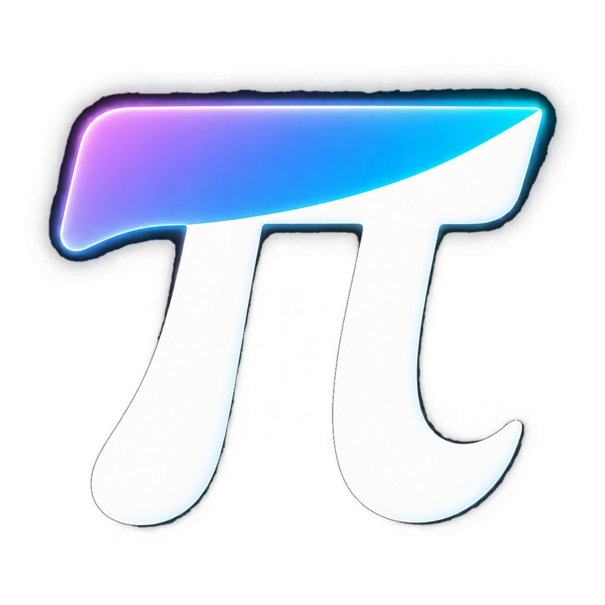

<div align="center">



# OMP Studio

**The multi-project desktop workbench for the `omp` coding agent.**  
Native ConPTY terminal, file tree, Monaco editor with Git diff, and real-time AI quota monitoring.

[](https://github.com/Bodyes26/OMP-Studio/releases)
[](https://tauri.app/)
[](https://svelte.dev/)
[](https://www.rust-lang.org/)
[](https://microsoft.com)
[](LICENSE)

<br />

[Download](#-download--requirements) • [Key Features](#-key-features) • [Shortcuts](#-keyboard-shortcuts) • [Built with OMP](#-built-with--for-omp) • [Development](#-local-development) • [Docs](docs/PRODUCT.md)

</div>

---

## 🎯 Overview

**OMP Studio** is a focused, high-performance desktop workbench built around the official TUI of the [`omp`](https://github.com/...) AI coding agent.

It does **not** replace the terminal with a custom chat GUI, and it is **not** an all-in-one bloated IDE. Instead, it treats the agent's interactive terminal session as a first-class citizen, wrapping it in a resilient multi-project shell alongside an agile code editor.

### 🖥️ Workspace Anatomy

```text
┌────────────────────────────────────────────────────────────────────────────────────────┐
│  [📁 Project A (● idle)]  [📁 Project B (⚡ working)]  [+ New]      [⚡ Quota: 82%] [⚙️]  │  <- Top Bar
├───────────────────┬──────────────────────────────────┬─────────────────────────────────┤
│                   │                                  │                                 │
│    File Tree      │          Monaco Editor           │      Native ConPTY Terminal     │
│                   │                                  │                                 │
│  • Lazy explorer  │  • Syntax highlighting           │  • Pixel-perfect ANSI/UTF-8     │
│  • Quick search   │  • Git diff & gutter markers     │  • Truecolor & ligatures        │
│  • Fast toggle    │  • Side-by-side verification     │  • Zero-drop raw byte streaming │
│                   │                                  │                                 │
└───────────────────┴──────────────────────────────────┴─────────────────────────────────┘
```

---

## 🤖 Built with & for `omp`

This entire application is **developed, maintained, and evolved iteratively using `omp` itself**.

- **AI-First Documentation**: Guidelines like [`AGENTS.md`](AGENTS.md), architecture blueprints in [`docs/`](docs/), and workflow contracts are explicitly crafted for AI coding agents to inspect, reason about, and act upon with zero ambiguity.
- **Bilingual Context**: While the public interface and this README are in English, internal design documents, commit histories, and agent prompt dialogues are maintained in **Italian** (the author's native language).
- **Strict Invariants**: The codebase is engineered to be resilient to AI modifications, with automated release scripts, single-source-of-truth configuration checks, and automated type validation.

---

## ✨ Key Features

- 🗂️ **Zero-Friction Multi-Project Switch**: Open multiple repositories in distinct top-bar tabs. Switch between active workspaces in a single click with zero lag; background agent processes keep running uninterrupted.
- ⚡ **Pixel-Perfect ConPTY Terminal**: Powered by `@xterm/xterm` with the hardware Canvas renderer, 24-bit Truecolor support, and full font ligatures (JetBrains Mono). Terminal bytes stream directly from Rust PTY channels without conversion overhead.
- 📝 **Integrated Monaco Editor**: Built-in Monaco editor instance to inspect and tweak files touched by the agent without launching an external heavy IDE.
- 📊 **Live AI Quota & Usage Monitor**: Check token consumption, trend sparklines, and quota reset times (`Ctrl+Alt+U`) with real data directly from `omp usage --json`, without disrupting your active agent session.
- 🔎 **Instant Session History & Full-Text Search**: Search and resume previous agent sessions directly from local SQLite history (`history.db`) with one keystroke.
- 🪶 **Lean, Secure & Private**: Built on Tauri 2 and native Windows WebView2 (approx. 15 MB binary, no Chromium runtime bundled). Reads agent databases in read-only mode and runs completely offline/local.

---

## ⌨️ Keyboard Shortcuts

All standard shortcuts (`Ctrl+C`, `Ctrl+V`, `Ctrl+R`, etc.) pass directly to the terminal PTY. Global Studio commands use the dedicated **`Ctrl+Alt`** modifier:

| Shortcut | Scope | Action |
|---|---|---|
| `Ctrl+Alt+N` | Global | Open / Add a new project workspace |
| `Ctrl+Alt+S` | Global | Launch Scratchpad temporary chat (`--no-session`) |
| `Ctrl+Alt+U` | Global | Toggle AI Quota & token usage panel |
| `Ctrl+Alt+→` | Global | Switch to next open project |
| `Ctrl+Alt+←` | Global | Switch to previous open project |
| `Ctrl+S` | Editor | Save current file in Monaco editor |
| `Ctrl+W` / `Ctrl+F4` | Editor | Close active file tab |
| `Esc` | Modal / Popover | Dismiss active dialog or popover |

*More keybindings and customization details in [`docs/SHORTCUTS.md`](docs/SHORTCUTS.md).*

---

## 📥 Download & Requirements

### System Requirements
- **Windows 10 / 11 (64-bit)**
- [`omp`](https://github.com/...) installed and accessible in system `PATH`.

### Installation
Download the latest setup executable (`.exe`) or Windows Installer package (`.msi`) from the **[Releases](https://github.com/Bodyes26/OMP-Studio/releases/latest)** page.

---

## 🛠️ Local Development

### Prerequisites
- Node.js (v18+) or [Bun](https://bun.sh/)
- Rust toolchain (`stable-x86_64-pc-windows-msvc`)
- Visual Studio C++ Build Tools

### Getting Started
```bash
# 1. Clone repository
git clone https://github.com/Bodyes26/OMP-Studio.git
cd OMP-Studio

# 2. Install dependencies
npm install

# 3. Run desktop app in development mode
npm run tauri dev

# 4. Run Svelte / TypeScript typechecks
npm run check

# 5. Launch with remote WebView2 DevTools on 127.0.0.1:9222
npm run tauri:cdp
```

---

## 📦 Versioning & Release Workflow

Version bumps are synchronized across `package.json`, `src-tauri/Cargo.toml`, `src-tauri/Cargo.lock`, and `src-tauri/tauri.conf.json` using the automated release pipeline:

```bash
npm run release -- 0.7.0            # Version bump + closes [Unreleased] in CHANGELOG.md
node scripts/release.mjs --notes    # Generates clean release notes for GitHub Releases
```

For the full step-by-step release rules and agent protocols, see [`AGENTS.md`](AGENTS.md).

---

## 📐 Philosophy & Design Principles

1. **The terminal is the content, the app is the frame**: The viewport is never obstructed or delayed. The app uses exact chroma-0 neutrals so ANSI colors inside the terminal remain authentic.
2. **Instant project switching**: Changing projects is changing rooms, not navigating a webpage. No fake loading transitions or latency.
3. **Sessions never die because of UI actions**: Resizing, collapsing sidebars, or switching projects never kills or corrupts a background PTY process.
4. **Zero AI Slop**: No decorative glassmorphism, gradient text gimmicks, or intrusive widgets. A quiet, fast, and durable tool built for 8-hour workdays.

Detailed architecture blueprints and design specs:
- [PRODUCT.md](docs/PRODUCT.md) — Product vision, problems solved, and non-goals
- [ARCHITECTURE.md](docs/ARCHITECTURE.md) — ConPTY lifecycle, raw byte IPC streaming, and threading model
- [DESIGN.md](docs/DESIGN.md) — Design tokens, color system, and UI state rules
- [DECISIONS.md](docs/DECISIONS.md) — Architectural decision log (ADR)

---

## 📄 License & Contributing

Distributed under the **[MIT License](LICENSE)**.

*This is a personal project published as read-only. Pull requests are automatically closed, but you are very welcome to fork it and adapt it to your own workflow.*
