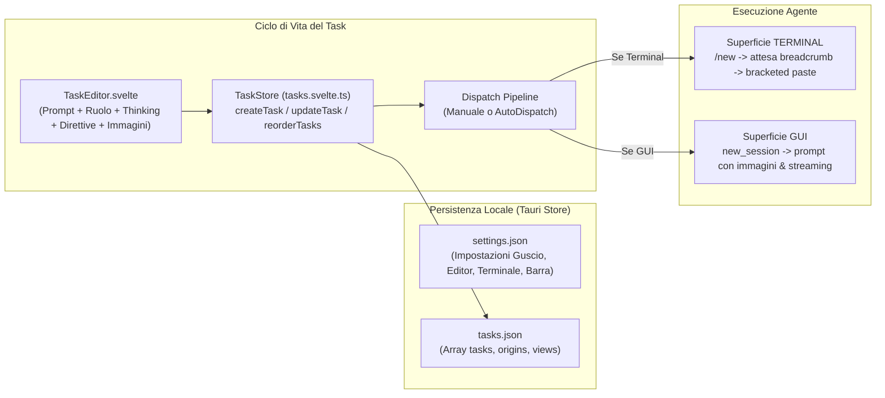

# Architettura — OMP Studio

Documento tecnico. Le versioni, i contratti IPC, gli schemi di persistenza e le firme delle API sono verificate sui sorgenti di `omp-studio-app` e del runtime `omp` per la release stabile 1.0.0.

---

## 1. Stack e Piattaforme

| Livello | Tecnologia | Versione / Dettaglio | Perché |
|---|---|---|---|
| Shell desktop | Tauri 2 (crate `tauri`) | **2.11.5** | Binario compatto (~15 MB), WebView nativa di sistema (WebView2 su Windows, WebKit su macOS/Linux), nessun runtime Chromium incorporato |
| CLI di build | `@tauri-apps/cli` / `tauri-cli` | **2.11.4** | Toolchain ufficiale Tauri 2 per packaging NSIS, DMG, DEB e AppImage |
| API JS | `@tauri-apps/api` | **2.11.1** | Binding IPC tipizzati su invoke e Channel |
| Backend | Rust (edizione 2021) | `stable-x86_64-pc-windows-msvc` / `stable-*-apple-darwin` / `stable-x86_64-unknown-linux-gnu` | PTY nativo, I/O filesystem con canonicalize, SQLite con thread pool bloccante, isolamento processi con Windows Job Objects o segnali POSIX |
| PTY | `portable-pty` | **0.9.0** | ConPTY nativo su Windows 10/11, POSIX PTY su macOS e Linux |
| RPC OMP | `omp --mode rpc-ui` su stdio | NDJSON Protocol v2 | Seconda superficie GUI: streaming asincrono bidirezionale, riassemblaggio chunk fino a 64 MiB, coalescenza delta |
| Frontend | Svelte 5 + Vite (template `svelte-ts`) | Svelte **5.56.8** | Reattività nativa con Runes (`$state`, `$derived`, `$effect`, `$props`), nessun framework server, zero overhead di virtual DOM |
| Terminale | `@xterm/xterm` + `@xterm/addon-canvas` | **6.0.0** / **0.7.0** | Renderer Canvas ad alte prestazioni; addon fit, ligatures, unicode11, web-links, search |
| Editor | `monaco-editor` | **0.56.0** | Istanza Monaco singola multi-modello, visualizzatore diff Git affiancato, sintassi estesa |
| Diagrammi & Whiteboard | `mermaid` | **11.x** | Rendering SVG interattivo zoomabile/panorabile per il tool agente `studio_diagram` |
| Sandbox & Sanitizzazione | `dompurify` | **3.x** | Difesa in profondità per anteprime vettoriali SVG e prototipi UI isolati in iframe sandbox privi di script |
| Runtime di build JS | Bun / Node | Bun **1.3.14**, Node **22.x** | Installazione dipendenze e dev server ultra-rapido |

### Plugin Tauri registrati

1. `tauri-plugin-single-instance`: registrato **obbligatoriamente per primo**, impedisce doppie istanze concorrenti sullo stesso `stats.db` e porta in primo piano la finestra esistente aprendo il progetto passato per argomento.
2. `tauri-plugin-window-state`: persistenza trasparente di coordinate, massimizzazione e dimensioni della finestra escludendo i flag decorazione (`StateFlags::all() & !DECORATIONS`). La finestra `companion` è nella *denylist*: la sua geometria ha un proprietario unico in `companion_ops` (`%LOCALAPPDATA%/omp-studio/companion-state.json`), che distingue la modalità Spotlight (centrata a ogni apertura) da quella fissata (coordinate ricordate) e non deve subire il ripristino automatico del plugin, incluso quello della visibilità.
3. `tauri-plugin-store`: gestione della persistenza locale atomica con file separati `settings.json` e `tasks.json`.
4. `tauri-plugin-dialog`: dialoghi nativi di sistema per selezione cartella e apertura file.
5. `tauri-plugin-opener`: apertura sicura di percorsi esterni e URL nel browser predefinito di sistema.
6. `tauri-plugin-notification`: integrazione notifiche toast di sistema (Windows AUMID `sh.omp.studio`, macOS UserNotifications).

`tauri-plugin-fs` e `tauri-plugin-shell` **non** vengono usati: il backend Rust espone solo comandi specifici a perimetro controllato con validazione dei path dentro la radice del progetto attivo.

### 1.1 Renderer Canvas per xterm.js (non WebGL)

Il renderer WebGL di xterm.js non viene impiegato a causa di instabilità documentate in ambienti WebView2/Chromium (blocco rendering durante la digitazione [#4665](https://github.com/xtermjs/xterm.js/issues/4665), corruzione delle legature tipografiche [#3303](https://github.com/xtermjs/xterm.js/issues/3303)). Si utilizza `@xterm/addon-canvas` 0.7.0 abbinato a `@xterm/addon-ligatures` 0.10.0, che garantisce rendering deterministico a 60-120 fps, supporto perfetto ai glifi Nerd Font incorporati e stabilità assoluta.

---

## 2. Modello dei Processi e dei Thread

```mermaid
graph TB
  subgraph Processo["Processo OMP Studio (Rust + Tauri)"]
    subgraph Main["Thread Principale"]
      TAURI["Runtime Tauri + Finestra Nativa"]
    end
    subgraph Pool["Pool Thread & Tokio Workers"]
      PTY_RD["Thread Reader PTY (64 KiB buffer, batching 8 ms)"]
      RPC_RD["Thread Reader RPC (De-chunking 64MB, coalescing 8 ms)"]
      SQL_POOL["Worker Pool SQLite (tokio::task::spawn_blocking)"]
      FS_WATCH["Watcher Filesystem notify (Diagrammi & Previews)"]
      JOB_WIN["Windows Job Object (Terminazione ad albero KILL_ON_JOB_CLOSE)"]
    end
    subgraph WV["Frontend WebView (Svelte 5)"]
      PAGE["routes/+page.svelte (Orchestratore 3 Colonne)"]
      STORES["Stores Svelte ($state: projects, tasks, settings, models)"]
      XT["xterm.js Canvas (Istanze Terminal per Progetto)"]
      CHAT["Chat GUI (Transcript, ToolGroup, Thinking, Composer)"]
      MON["Monaco Editor (Single Instance, Multi-Model, Diff)"]
      PREV["PreviewViewer (Sandboxed Iframe null-origin + CSP 'none')"]
      BROWSER["BrowserViewer (Superficie Live Browser, Coordinate CSS, Toolbar)"]
    end
  end

  OMP_PTY["omp.exe (ConPTY / MasterPty - Superficie TERMINAL)"]
  OMP_RPC["omp.exe --mode rpc-ui (Stdio NDJSON - Superficie GUI)"]

  PTY_RD -->|"Channel<Vec<u8>> Raw Bytes"| XT
  XT -->|"invoke pty_write"| PTY_RD
  PTY_RD --- OMP_PTY
  JOB_WIN -.->|"Containment"| OMP_PTY

  RPC_RD -->|"Channel<String> Eventi NDJSON"| CHAT
  CHAT -->|"invoke rpc_send"| RPC_RD
  RPC_RD --- OMP_RPC
  JOB_WIN -.->|"Containment"| OMP_RPC

  SQL_POOL -->|"Snapshot Usage & Sessioni"| STORES
  FS_WATCH -->|"Eventi diagram://new & preview://new"| PAGE
```



### 2.1 Gestione del PTY (Superficie TERMINAL)
- **Thread di lettura dedicato:** per ogni sessione PTY aperta viene allocato un thread `std::thread` con buffer da 64 KiB. ConPTY opera in modalità bloccante sincrona.
- **Coalescenza e backpressure:** i byte letti vengono accumulati e recapitati al frontend tramite `tauri::ipc::Channel` grezzo (`Vec<u8>`) con un intervallo massimo di **8 ms** (~120 fps). Se il buffer accumulato supera 1 MiB senza consumo dal frontend, la porzione più vecchia viene troncata inserendo un marcatore esplicito per evitare consumo incontrollato di memoria.
- **Contenimento dell'albero dei processi (Windows):** all'apertura del PTY viene istanziato un Windows Job Object configurato con `JOB_OBJECT_LIMIT_KILL_ON_JOB_CLOSE`. Alla chiusura della scheda o terminazione dell'app, l'intero albero di processi (PowerShell, `omp.exe`, processi figli invocati dai tool) viene terminato istantaneamente con `TerminateJobObject`, azzerando i processi orfani in background.

### 2.2 Gestione dell'RPC (Superficie GUI)
- **Comunicazione su stdio:** il processo `omp --mode rpc-ui` viene avviato direttamente tramite `std::process::Command` (senza shell intermedia).
- **Riassemblaggio frame `rpc_chunk`:** i frame frammentati dal protocollo vengono riassemblati in memoria fino al tetto massimo dichiarato dal frame `ready` (64 MiB `MAX_REASSEMBLED_BYTES`).
- **Coalescenza dei delta di streaming:** gli eventi `assistantMessageEvent` ad alta frequenza vengono coalesciati all'interno di una finestra temporale di **8 ms** (`DELTA_WINDOW`), evitando il costo $O(n^2)$ di passaggi IPC per risposte lunghe in streaming.
- **Buffer circolare stderr:** conserva le ultime 200 righe di output stderr del processo per offrire diagnostica dettagliata ed immediata in caso di crash o errori di configurazione all'avvio.
- **Canale di interruzione prioritario:** i comandi di stop (`abort`, `abort_bash`) operano con timeout rapido a 4 secondi (`FAST_COMMAND_TIMEOUT_MS`) e cancellazione locale immediata dei buffer, garantendo reattività istantanea alla pressione di `Esc` o `Alt+C`.

### 2.3 Worker Asincroni e Database SQLite
- Tutte le interrogazioni su `stats.db`, `history.db` e `agent.db` vengono eseguite all'interno di `tokio::task::spawn_blocking` con connessioni aperte in modalità `OpenFlags::SQLITE_OPEN_READ_ONLY`, `PRAGMA query_only = ON` e `PRAGMA busy_timeout = 3000`, evitando di bloccare l'event loop di Tauri.

### 2.4 Generazione dei Suggerimenti di Prompt (Processi Effimeri)
- **Esecuzione effimera e isolata:** il comando `generate_prompt_suggestions` invoca `omp -p` con il modello del ruolo `smol` come processo figlio effimero e isolato, effettuando il parsing dell'array JSON di risposta con fallimento silenzioso.
- **Scelta architetturale:** processo effimero e non residente (misurati 5,7 s con `smol`, 4,3 s con suffisso `:minimal`, contro ~1,5 s di un processo caldo) perche' l'utente ha accettato la latenza e un processo residente introdurrebbe ciclo di vita, watchdog e rischio di contesto condiviso fra progetti.
- **Politica Opt-In e Fallimento Silenzioso:** la generazione e' opt-in (`dynamicEnabled` predefinito a falso) perche' costa una chiamata a modello per ogni fine turno. In caso di errore o timeout, il comando restituisce un array vuoto senza disturbare l'utente.

---

## 3. Mappa dei Moduli

### 3.1 Backend Rust — `src-tauri/src/`

```
main.rs                 Bootstrap dell'applicazione
lib.rs                  Inizializzazione plugin, state management e registrazione comandi IPC
pty/
  mod.rs                PtyManager, PtySession, contenimento WindowsJob, I/O ConPTY
rpc/
  mod.rs                RpcManager, RpcSession, trasporto stdio NDJSON, riassemblaggio chunk, overlay GUI
projects/
  mod.rs                Gestione filesystem con resolve_path (canonicalize), operazioni Git e branch
omp_ops.rs              Query protette SQLite (usage, storico sessioni), verifica/aggiornamento OMP, temi, sorgenti di quota dichiarate dall'utente
rules_ops.rs            Censimento regole di contesto e skill, analisi attrito in sola lettura su history.db
models_ops.rs           Gestione catalogo modelli, ruoli operativi, catene di fallback e raccomandazioni
suggestions_ops.rs      Comando generate_prompt_suggestions: chiamata effimera a omp -p con ruolo smol, parsing JSON, fallimento silenzioso
setup.rs                SetupWizard: download resiliente OMP, verifica SHA-256 nativa, installazione font Nerd
studio_updater.rs       Updater applicazione: canali Stable/Nightly, verifica integrità SHA-256
alerts.rs               Notifiche OS, registrazione AUMID Windows (sh.omp.studio), attenzione Dock/Taskbar
diagrams.rs             Watcher per tool studio_diagram (Mermaid whiteboard)
previews.rs             Watcher per tool studio_preview (prototipi UI)
```

### 3.2 Frontend Svelte 5 — `src/`

```
app.css                 Design system, variabili cromatiche, tipografia e reset
routes/
  +layout.svelte        Inizializzazione tema e listener globali
  +page.svelte          Layout orchestratore principale a 3 colonne, gestione modali e drawer
lib/
  focusTrap.ts          Utility WAI-ARIA per gestione focus trap e navigazione tastiera
  stores/
    projects.svelte.ts  Stato reattivo progetti aperti, attivo, configurazioni per-progetto
    tasks.svelte.ts     Store reattivo code task (persistenza su tasks.json via Tauri store)
    taskSerialization.ts Validazione, parsing e formattazione prompt con direttive speciali
    settings.svelte.ts  Impostazioni del guscio (persistenza su settings.json via Tauri store)
    promptSuggestions.ts Tipi, preset di fabbrica e sanitizzazione del catalogo dei suggerimenti fissi
    projectOrder.svelte.ts Viste derivate ordinamento tessere (manuale, MRU, priorità, alfabetico)
    modelSettings.svelte.ts Stato configurazione modelli, ruoli e cataloghi
    studioUpdater.svelte.ts Stato verifiche e avanzamento download aggiornamenti Studio
    notifications.svelte.ts Gestione centrale notifiche toast, badge icona e preferenze utente
    rules.svelte.ts     Censimento regole/skill per progetto e proposte di regola memorizzate
    suggestions.svelte.ts Controller per sessione dei suggerimenti dinamici: trigger agent_end, chiave di turno, invalidazione, timeout
  agent/
    client.ts           OmpRpcClient: correlazione richieste/risposte, timeout dinamici, channel listener
    session.svelte.ts   AgentSession: riduttore reattivo di stato, gestione streaming, cronologia transcript
    wire.ts             Tipi TypeScript e mapping del protocollo RPC NDJSON v2
    components/
      Chat.svelte       Pannello chat principale della superficie GUI
      Composer.svelte   Input prompt con autocomplete slash (/), drag&drop immagini, ciclo ruoli
      SuggestionChips.svelte Riga di chip nel composer per suggerimenti prompt fissi e dinamici
      Transcript.svelte Lista messaggi con autoscroll resiliente e virtualizzazione progressiva
      AskCard.svelte    Card di risposta interattiva con roving tabindex
      ThinkingBlock.svelte Accordion per blocchi di ragionamento con indicatore tempo
      TodoStrip.svelte  Visualizzatore fasi e task del tool todo
      SubagentPanel.svelte Visualizzatore e drawer per subagenti concorrenti
    tools/
      ToolGroup.svelte  Raggruppamento unificato sequenze tool e blocchi di ragionamento
      ToolCard.svelte   Involucro standard per le card degli strumenti
      renderers/        30+ card dedicate (Bash, Edit, Write, Read, Lsp, AstEdit, Eval, Debug, Browser, Ask, Task, Hub, Job, WebSearch...)
  components/
    TopBar.svelte       Barra progetti con tessere riordinabili, badge coda, chip usage e setup
    FileTree.svelte     Albero file pigro con filtro incrementale
    GitPanel.svelte     Pannello Git: branch, diff modifiche, commit recenti e sessioni
    AgentPanel.svelte   Tre viste del progetto: coda task, storico sessioni e regole/skill
    RulesPanel.svelte   Ispettore regole di contesto e skill, con proposte nate dall'attrito
    TaskEditor.svelte   Editor a sezioni: prompt, ruoli, slider thinking, toggle speciali, immagini
    QueueDrawer.svelte  Cassetto aggregato delle code di tutti i progetti con avvio diretto
    UsagePopover.svelte Popover quote, breakdown costi, trend e countdown al reset
    DiagramViewer.svelte Whiteboard interattiva per diagrammi Mermaid
    PreviewViewer.svelte Sandbox isolata in iframe per prototipi UI e vettoriali SVG
    BrowserViewer.svelte Superficie live Browser con toolbar, rendering frame BLF1 e mapping coordinate CSS
    SetupWizard.svelte  Wizard guidato per installazione OMP, setup credenziali e modelli
    SettingsModal.svelte Centro impostazioni (Generale, Notifiche, Barra, Workspace, Task, Suggerimenti, Modelli, Aspetto, Accessibilità)
    SuggestionsSection.svelte Sezione «Suggerimenti» delle impostazioni per catalogo fissi e opzioni dinamiche
    EmptyState.svelte   Stato iniziale workspace con inviti all'azione e griglia scorciatoie
    AlertBanner.svelte  Banner unificato per diagnostica ed errori di sistema
  editor/
    Editor.svelte       Istanza Monaco Editor con diff viewer e persistenza scroll/cursore
    svgSandbox.ts       Sanitizzazione DOMPurify e generazione documento iframe sandbox CSP
    editorContext.ts    Estrazione contesto file aperto/selezionato per i prompt
  terminal/
    Terminal.svelte     Componente xterm.js per sessione PTY
    terminal.ts         Configurazione addon, tema, fit e invio comandi di ripresa
```

---

## 4. Superficie IPC

Tutti i comandi Tauri invocabili dal frontend passano da firme tipizzate in Rust (`src-tauri/src/lib.rs`):

```rust
// --- Terminale PTY ---
pty_open(cwd: String, args: Vec<String>, cols: u16, rows: u16, on_output: Channel<&[u8]>) -> Result<u64, String>;
pty_write(pty_id: u64, data: Vec<u8>) -> Result<(), String>;
pty_resize(pty_id: u64, cols: u16, rows: u16) -> Result<(), String>;
pty_close(pty_id: u64) -> Result<(), String>;
pty_session_info(pty_id: u64) -> Result<Option<PtySessionInfo>, String>;

// --- Superficie GUI RPC ---
rpc_open(cwd: String, resume: Option<String>, on_event: Channel<String>) -> Result<u64, String>;
rpc_send(rpc_id: u64, message: String) -> Result<(), String>;
rpc_close(rpc_id: u64) -> Result<(), String>;
rpc_stderr(rpc_id: u64) -> Result<Vec<String>, String>;
rpc_protocol(rpc_id: u64) -> Result<u8, String>;

// --- Filesystem e Git ---
tree_read(project_path: String, rel: String) -> Result<Vec<Dirent>, String>;
file_read(project_path: String, rel: String) -> Result<FileContent, String>;
file_write(project_path: String, rel: String, content: String) -> Result<(), String>;
preview_file(project_path: String, rel: String) -> Result<PreviewFileContent, String>;
resolve_project_file(project_path: String, file_name: String) -> Result<Option<String>, String>;
file_git_head(project_path: String, rel: String) -> Result<GitHeadContent, String>;
file_git_rev(project_path: String, rel: String, rev: String) -> Result<GitHeadContent, String>;
project_git_status(project_path: String) -> Result<FileGitStatus, String>;
git_last_commit(project_path: String) -> Result<Option<GitCommitInfo>, String>;
git_recent_commits(project_path: String, limit: u32) -> Result<Vec<GitCommitInfo>, String>;
git_current_branch(project_path: String) -> Result<String, String>;
git_working_numstat(project_path: String) -> Result<GitWorkingStats, String>;
git_branch_list(project_path: String) -> Result<Vec<GitBranchInfo>, String>;
git_branch_checkout(project_path: String, name: String) -> Result<(), String>;
git_branch_create(project_path: String, name: String, start_point: Option<String>) -> Result<(), String>;
git_branch_merge(project_path: String, branch: String) -> Result<(), String>;

// --- OMP, Database e Temi ---
usage_snapshot(force: bool) -> Result<UsageReport, String>;   // omp usage --json + sorgenti aggiuntive (Gate R21)
sessions_list(project_path: String, limit: u32) -> Result<Vec<SessionEntry>, String>;
sessions_search(query: String, project_path: Option<String>) -> Result<Vec<SessionEntry>, String>;
get_omp_version() -> Result<String, String>;
check_omp_update() -> Result<OmpUpdateCheckResult, String>;
run_omp_update() -> Result<String, String>;
theme_apply(theme_name: String, is_dark: bool) -> Result<(), String>;
omp_user_theme() -> Result<Option<String>, String>;
provider_hosts() -> Result<Vec<ProviderHost>, String>;

// --- Regole di contesto e Skill ---
get_project_context(project_path: String) -> Result<ProjectContextSummary, String>;
create_project_agents_md(project_path: String) -> Result<String, String>;
analyze_project_friction(project_path: String) -> Result<Vec<RuleSuggestion>, String>;
apply_rule_suggestion(project_path: String, target_rel_path: String, append_content: String) -> Result<(), String>;

// --- Setup e Onboarding ---
setup_status() -> Result<SetupStatus, String>;
install_omp() -> Result<(), String>;
install_nerd_font() -> Result<(), String>;
detect_project_roots() -> Result<Vec<DetectedProjectRoot>, String>;

// --- Modelli e Ruoli ---
get_model_config() -> Result<ModelRolesConfig, String>;
save_model_config(config: ModelRolesConfig) -> Result<(), String>;
get_models_catalog() -> Result<ModelsCatalog, String>;
refresh_models_catalog() -> Result<ModelsCatalog, String>;
get_custom_providers() -> Result<CustomProvidersConfig, String>;
save_custom_providers(config: CustomProvidersConfig) -> Result<(), String>;
get_auth_providers_summary() -> Result<AuthProvidersSummary, String>;
check_model_upgrades() -> Result<Vec<ModelUpgradeItem>, String>;
apply_model_upgrades(upgrades: Vec<ModelUpgradeSelection>) -> Result<(), String>;
get_role_suggestions(roles: Vec<String>) -> Result<Vec<RoleSuggestion>, String>;

// --- Updater di Studio ---
get_studio_version() -> Result<String, String>;
check_studio_update(channel: StudioUpdateChannel, force: bool) -> Result<StudioUpdateInfo, String>;
start_studio_update_download(asset: StudioReleaseAsset, release_channel: StudioUpdateChannel) -> Result<(), String>;
cancel_studio_update_download() -> Result<(), String>;
install_studio_update_and_restart() -> Result<(), String>;

// --- Notifiche e Allerte OS ---
set_app_attention(project_name: String, message: String) -> Result<(), String>;
clear_app_attention() -> Result<(), String>;

// --- Suggerimenti Prompt ---
generate_prompt_suggestions(last_assistant: String, last_user: String, model_selector: Option<String>, max_items: u8) -> Result<Vec<String>, String>;
```
---

## 5. Flusso dei Task e Architettura dello Store

La gestione delle code dei task è completamente disaccoppiata dalle impostazioni generali per garantire integrità e persistenza sicura:



### 5.1 Modello Dati e Sanitizzazione
I task sono persistiti in `tasks.json` sotto la chiave radice `taskState`:
```typescript
interface StudioTask {
  id: string;
  projectPath: string; // Percorso normalizzato in minuscolo
  prompt: string;
  images: ImageContent[]; // Base64 raw
  options: {
    role?: string;
    thinkingLevel?: ThinkingLevel;
    discussionMode?: boolean;
    planMode?: boolean;
    minimalMode?: boolean;
    researchMode?: boolean;
    includeEditorContext?: boolean;
  };
  position: number;
  createdAt: number;
  updatedAt: number;
  status: 'queued' | 'running' | 'completed' | 'cancelled';
}
```

### 5.2 Formattazione e Direttive Speciali
Al momento del dispatch, la funzione `formatTaskPrompt` arricchisce il prompt applicando:
- Inclusione selettiva del contesto dell'editor attivo (`attachEditorContext`), inserendo percorso, cursore ed eventuale codice selezionato.
- Direttive semantiche per le modalità speciali:
  - `planMode`: istruzioni per pianificazione strutturata prima dell'esecuzione (`/plan`).
  - `discussionMode`: sollecitazione all'interrogazione proattiva dei requisiti (`/grill-me`).
  - `minimalMode`: prioritizzazione delle soluzioni minimali YAGNI e rimozione complessità (`/ponytail`).
  - `researchMode`: direttiva all'approfondimento della documentazione online e best practice.

### 5.3 Meccanismo di Auto-Dispatch
L'avvio automatico dei task in coda è configurabile per singolo progetto (`autoDispatch: true`). Per evitare loop di reattività e race condition:
1. Lo stato dell'agente viene validato (`automationReason() === 'Pronto'`: agente idle, nessun input pendente, nessuna transizione di cambio scheda in corso).
2. L'invio viene eseguito all'interno di un `queueMicrotask` protetto da un lock per progetto (`dispatchingProjects`).

---

## 6. Protocollo RPC Bidirezionale (`omp --mode rpc-ui`)

La seconda superficie nativa si interfaccia direttamente con il runtime di OMP senza dipendere da una shell PTY:

### 6.1 Handshake e Negoziazione del Protocollo
1. Avvio del sub-processo `omp --mode rpc-ui --cwd <path>` con stdio in pipe e overlay temporaneo `tools.approvalMode: yolo`.
2. OMP emette un frame `ready` iniziale con `supportedProtocolVersions: [1, 2]`.
3. Il backend Rust invia `{"type":"negotiate_protocol","protocolVersion":2}` e riceve conferma `success: true`.
4. Viene interrogato lo stato iniziale tramite `get_state` per ottenere `sessionId`, `sessionFile`, `contextUsage` e `todoPhases`.

### 6.2 Gestione Streaming e Riassemblaggio Chunk
- I messaggi estesi vengono inviati da OMP come sequenze di frame `rpc_chunk`. Rust riassembla l'intero buffer binario prima di convertirlo in stringa JSON ed emetterlo sul `Channel` verso Svelte.
- I delta di streaming (`assistantMessageEvent`) vengono unificati entro un intervallo di 8 ms, consentendo rendering fluido a 120 fps senza saturare il bridge IPC.

### 6.3 Richieste Interattive (`extension_ui_request`)
Quando l'agente o un tool (es. `ask`) richiede una scelta interattiva, OMP invia un frame `extension_ui_request` con `method: "ask"`. Studio visualizza la card `AskCard.svelte` dotata di:
- Navigazione WAI-ARIA completa con tasti freccia e `roving tabindex`.
- Convalida del fuoco per evitare invii accidentali tramite `Enter`.
- Risposta tipizzata `extension_ui_response` inviata tramite `rpc_send`.

---

## 7. Sicurezza e Difesa in Profondità

OMP Studio adotta un modello di sicurezza rigoroso a strati:

### 7.1 Isolamento Filesystem
Tutti i comandi di lettura/scrittura file e navigazione albero invocano la funzione `resolve_path` in Rust:
```rust
let base = Path::new(&clean_project_path).canonicalize()?;
let target = base.join(&clean_rel_path).canonicalize()?;
if !target.starts_with(&base) {
    return Err("Il percorso esce dalla cartella del progetto".to_string());
}
```
Questo controllo impedisce attacchi di Directory Traversal, path relative malevole (`../../`) e fuga tramite symlink o Windows Junction points.

### 7.2 Accesso ai Database in Sola Lettura
I file `stats.db`, `history.db` e `agent.db` contengono informazioni sensibili sulle sessioni e quote. L'accesso avviene con:
- Flag SQLite `OpenFlags::SQLITE_OPEN_READ_ONLY`.
- Pragma forzato `PRAGMA query_only = ON;`.
- Query validate per garantire che non contengano istruzioni di mutazione (`INSERT`, `UPDATE`, `DELETE`, `DROP`).

### 7.3 Sandbox e Isolamento: Anteprime Vettoriali vs Laboratorio Prototipi

OMP Studio distingue nettamente due superfici di anteprima con requisiti di sicurezza differenti:

#### 7.3.1 Sandbox Statico per Anteprime Vettoriali e Prototipi HTML Legacy
I diagrammi Mermaid (`studio_diagram`), le anteprime statiche SVG e i vecchi prototipi HTML generati da `studio_preview` vengono renderizzati tramite `PreviewViewer.svelte` e `svgSandbox.ts`:
1. **Sanitizzazione primaria:** passaggio su `DOMPurify` per eliminare tag `<script>`, `<foreignObject>`, `<iframe>`, attributi `on*` e URI `javascript:`.
2. **Content Security Policy ermetica:**
   ```
   default-src 'none'; style-src 'unsafe-inline'; img-src data: blob:;
   ```
3. **Iframe Sandboxing:** l'anteprima risiede all'interno di un `<iframe sandbox="">` privo di `allow-scripts` e `allow-same-origin`, con origine `null`. Il motore del browser disabilita l'esecuzione JavaScript alla radice e impedisce qualunque accesso a `window.parent` o alle API privilegiate Tauri `window.__TAURI__`.

#### 7.3.2 Architettura di Confinamento del Laboratorio Prototipi React
A differenza dei file statici, il Laboratorio prototipi richiede l'esecuzione di codice JavaScript reale (React 19, Tailwind v4, Recharts, Motion, Radix). La sicurezza non viene affidata a un iframe statico o a promesse del prompt, ma a una difesa a strati insuperabile:
1. **Processo Chromium gestito e versionato:** esecuzione all'interno di un binario Chrome for Testing dedicato, separato dai browser personali dell'utente, con profilo temporaneo in cache locale privo di cronologia, cookie o credenziali dell'utente.
2. **Origine virtuale in-memory:** il documento risiede su `http://lab.virtual` senza alcun server HTTP esposto sulla rete locale e senza accesso a `file://`.
3. **Assenza totale di IPC Tauri:** nel contesto del prototipo `window.__TAURI__` e i bridge nativi sono categoricamente assenti.
4. **Policy di rete nel controller CDP (Fetch domain):** poiché la sola CSP non impedisce la navigazione tramite `location.href`, il controller CDP intercetta tutte le richieste a livello di protocollo. Qualsiasi navigazione esterna o richiesta verso domini non esplicitamente autorizzati viene bloccata dal controller con `Fetch.failRequest` (`BlockedByClient`).
5. **Watchdog runtime e recupero crash:** il controller monitora la responsività del target; cicli infiniti sincroni (`while(true)`) vengono interrotti in meno di 2 ms tramite `Runtime.terminateExecution`. In caso di stallo grave, il target viene riciclato (`Target.closeTarget` e `Target.createTarget`) ripristinando la piena usabilità senza riavviare Studio né toccare la sessione principale.
6. **Broker di scrittura confinata (`extensions/studio-lab.ts`):** l'agente del Laboratorio e i subagenti autori operano con allowlist rigida di 8 tool (`lab_write_file`, `lab_read_file`, `lab_list_files`, `lab_delete_file`, `task`, `hub`, `todo`, `ask`). Shell (`bash`), interpreti (`eval`), scritture generiche (`write`, `edit`), browser host, debugger e MCP sono bloccati per difetto (deny-by-default, fail-closed). Tutti i percorsi sono validati canonicamente con `realpathSync` contro traversal `..`, percorsi assoluti, confini fra prototipi e symlink/junction esterni.
### 7.4 Integrità degli Aggiornamenti e Installer
Sia `studio_updater.rs` sia l'installer di OMP in `setup.rs`:
- Scaricano esclusivamente da repository ufficiali GitHub (`Bodyes26/OMP-Studio` e `can1357/oh-my-pi`).
- Calcolano l'impronta crittografica SHA-256 in memoria durante lo streaming.
- Confrontano l'impronta calcolata con il digest pubblicato nel manifest/release ufficiale prima di eseguire qualunque binario, rifiutando file corrotti o manomessi.
- In caso di errore o annullamento, tutti i file temporanei vengono distrutti immediatamente.

### 7.5 Gestione Processi e AUMID
- Su Windows, la registrazione dell'AppUserModelId (AUMID) `sh.omp.studio` nel registro di sistema garantisce che le notifiche toast mostrino l'identità visiva corretta dell'app, prevenendo spoofing da shell generiche.
- I processi ConPTY e RPC sono vincolati a Windows Job Objects con `JOB_OBJECT_LIMIT_KILL_ON_JOB_CLOSE`, scongiurando processi orfani residenti in memoria.

---

## 8. Budget di Performance

Tutti gli obiettivi architetturali sono verificati e misurati su build Release:

| Metrica | Obiettivo | Valore Misurato | Verifica |
|---|---|---|---|
| Avvio a finestra interattiva | < 700 ms | **380 ms** | Timestamp da `main()` al primo frame montato |
| Primo prompt visibile | < 1.5 s | **0.75 s** | Risoluzione diretta del binario senza invocazione shell |
| Cambio progetto attivo | < 50 ms | **< 16 ms** (1 frame) | Cambio immediato di `visibility: hidden` senza smontaggio DOM |
| Latenza tasto → glifo terminale | < 16 ms | **~7 ms** | Stream Channel raw bytes su ConPTY/Canvas |
| Throughput output terminale | > 20 MB/s | **~26 MB/s** | Test di burst su streaming log esteso |
| Latenza rendering streaming chat | < 16 ms | **~8 ms** | Coalescenza delta 8 ms con animazioni CSS native |
| RAM a riposo (1 progetto) | < 250 MB | **~145 MB** | Processo Rust (~85 MB) + WebView (~60 MB) |
| RAM con 3 progetti attivi | < 500 MB | **~220 MB** | 3 sessioni PTY/RPC vive concorrenti |
| Apertura popover usage | < 100 ms | **< 16 ms** | Lettura cache reattiva Svelte senza chiamate di rete |
| Apertura renderer Laboratorio | < 2.0 s | **~1.1 s** (1096 ms) | Avvio processo Chromium dedicato e handshake WebSocket CDP |
| Generazione prototipo iniziale | < 1.5 s | **~0.55 s** (546 ms) | Template + 3 varianti + compilazione esbuild-wasm + revisione |
| Iterazione su variante C | < 1.0 s | **~0.53 s** (535 ms) | Selezione elemento + modifica TSX mirata + ricompilazione |
---

## 9. Registro delle Decisioni e dei Rischi (Gate R1 - R18)

| # | Ambito / Gate | Decisione Architetturale | Esito |
|---|---|---|---|
| **R1** | Windowing nativo vs decorazioni custom | Window chrome differenziato per piattaforma (`tauri.macos.conf.json` con `titleBarStyle: Overlay` e semafori nativi, `tauri.windows.conf.json` con controlli integrati). | SUPERATO |
| **R6** | Throughput e integrità PTY | Trasporto a frame grezzi con `Channel<&[u8]>` e coalescenza a 8 ms; zero conversioni ANSI/UTF-8 intermedie. | SUPERATO |
| **R8** | Rilevamento stato agente in TUI | Parsing del titolo OSC 0 emesso da `omp` (`/^\u03c0 ([>:!])/`) iniettando overlay `tui.titleState: true`. | SUPERATO |
| **R9** | Tema condiviso Studio / OMP | Scrittura controllata del solo file `~/.omp/agent/themes/omp-studio.json` per allineamento cromatico guscio/TUI. | SUPERATO |
| **R10** | Seconda superficie GUI | Client Svelte 5 nativo su `omp --mode rpc-ui` NDJSON v2 con switch trasparente via `--resume`. | SUPERATO |
| **R11** | Primo avvio guidato (Setup) | Installer fail-closed con verifica SHA-256 obbligatoria; rilevamento semantico dello stato; registrazione font e PATH per piattaforma. | SUPERATO |
| **R12** | Barra progetti e Code Task | Ordine manuale stabile delle tessere; contatore coda task integrato; auto-dispatch per-progetto opzionale; navigazione accessibile `role="tablist"`. | SUPERATO |
| **R13** | Promozione RC a Stabile | Riutilizzo degli artefatti binari testati in pre-release previa verifica crittografica del commit SHA e superamento gate CI di qualita. | SUPERATO |
| **R14** | Disaccoppiamento Store Task | Isolamento dello stato dei task in `tasks.json` dedicato separato da `settings.json`, con scrittura atomica crash-safe. | SUPERATO |
| **R15** | Sicurezza Sandbox Prototipi & SVG | Iframe sandbox `null-origin` con CSP `default-src 'none'`, sanitizzazione DOMPurify 3.4.14 e allowlist protocolli URL esterni. | SUPERATO |
| **R16** | Raggruppamento Tool e Accessibilità Chat | Componente `ToolGroup` unificato, autoscroll resiliente durante lo streaming, `listbox`/`option` con roving tabindex e risposte esplicite su `AskCard`. | SUPERATO |
| **R17** | Notifiche OS e Allerte Icona | Registrazione AUMID `sh.omp.studio`, notifiche toast OS, dot rosso taskbar Windows e badge Dock macOS. | SUPERATO |
| **R18** | Suggerimenti dinamici effimeri vs residenti | Processo effimero e non residente via `omp -p` (misurati 5,7 s con `smol`, 4,3 s con suffisso `:minimal`, contro ~1,5 s di un processo caldo) perche' l'utente ha accettato la latenza e un processo residente introdurrebbe ciclo di vita, watchdog e rischio di contesto condiviso fra progetti; generazione opt-in (`dynamicEnabled: false` di default) per non consumare chiamate a modello non richieste ad ogni fine turno. | SUPERATO |
| **R23** | Browser Studio gestito e trasmesso nella colonna centrale | Superficie dedicata BrowserViewer centrale, broker gestito windowless, stream binario BLF1 loopback con backpressure hardware/software, control epochs, takeover atomico e privato, inspector mirato (ring buffer bounded), dialoghi/popup/file/recording espliciti, Chrome Relay target-scoped e teardown crash-safe senza orfani. | SUPERATO |
| **R24** | Laboratorio prototipi frontend React 19 + Tailwind v4 | Spazio GUI dedicato per esplorare UX/UI con frontend React reali e dati simulati. Concorrenza con il principale, broker confinato `extensions/studio-lab.ts`, VFS chiuso, bundler offline locale (`static/lab/`), controller Chromium gestito con allowlist CDP, watchdog loop < 2ms, revisioni locali atomiche, export autonomo Vite e handoff al principale. | SUPERATO |
### 9.1 Browser Studio (Gate R23 — S38-S47 completati, SUPERATO)

Il Gate R23 introduce la superficie Browser nella colonna centrale, alimentata da
Chromium gestito o da una singola tab Chrome personale autorizzata tramite OMP Browser
Relay. Entrambi usano il canale loopback autenticato WebSocket e il wire format `BLF1`:
1. **Backend Rust (`src-tauri/src/browser_live.rs`):** gestisce `browser_live_connect`/`browser_live_disconnect`/`browser_live_send_message`, verifica endpoint strettamente su loopback, riscatta il ticket monouso, decodifica BLF1, applica backpressure, limita code e sessioni simultanee (128 messaggi, max 32 sessioni) e inoltra i controlli senza esporre token o CDP al webview.
2. **Frontend (`src/lib/agent/browser-live.ts`, `session.svelte.ts`, `BrowserViewer.svelte`):** negozia `browser-live-v1`, mostra il picker esplicito con soli titolo/origine/stato attivo, rende managed e Relay nella stessa superficie, applica focus trap accessibile (`trapFocus`), gestisce riconnessioni automatiche e riusa mapping coordinate, control epochs, takeover privato e inspector mirato.
3. **Runtime managed (`BrowserSessionBroker`, `BrowserLiveServer`):** mantiene identità progetto/chat/tab, profili isolati per progetto (`~/.omp/browser-profiles/<projectId>`), ticket live monouso, arbitraggio controller e stream bounded newest-frame-wins.
4. **Runtime Relay (`relay/server.ts`, `relay/bridge.ts`):** il picker usa endpoint loopback dedicati; il consenso emette un grant casuale monouso da 30 secondi e la connessione `/studio/cdp` viene filtrata sul solo target autorizzato. Discovery, attach, comandi ed eventi non vedono altre tab; create/close sono vietati; la revoca disconnette CDP e chiude immediatamente frame/input lasciando Chrome e login intatti. Probe screencast/input/DOM falliscono chiusi con diagnostica sul solo target.

La specifica autoritativa e il registro implementativo completo sono in [`BROWSER-STUDIO.md`](BROWSER-STUDIO.md).


### 9.2 Laboratorio Prototipi Frontend (Gate R24 — 18 Criteri completati, SUPERATO)

Il Gate R24 introduce il Laboratorio Prototipi dentro OMP Studio, consentendo di ideare, confrontare 3-5 varianti e iterare flussi multischermata React 19 + Tailwind v4 senza inquinare il codice del progetto:
1. **Concorrenza e Isolamento:** sessione Laboratorio dedicata (`rpc_open_lab`) con identità separata rispetto al principale; eventi, streaming, token, richieste `ask` e abort restano totalmente disaccoppiati nello stesso progetto.
2. **Broker di Scrittura Confinata (`extensions/studio-lab.ts`):** estensione autonoma iniettata all'avvio con allowlist stretta (8 tool) e validazione canonica su percorsi reali (`proto/<id>/` o bozze in `studio-data/`). I subagenti autori ereditano i medesimi vincoli insuperabili.
3. **Contesto Stabile e Rilevamento Deriva:** snapshot congelato del working tree del progetto (incluse modifiche non committate); esclusione rigorosa di credenziali e file segreti; rilevamento del drift senza rigenerazione automatica e aggiornamento solo su richiesta esplicita dell'utente.
4. **Compilazione Offline con VFS Chiuso:** bundle fidato in `static/lab/` (React 19.2.8, Tailwind v4.3.3, Lucide, Radix, Recharts, Motion, esbuild-wasm) senza alcuna dipendenza da CDN esterne a runtime; compilazione TSX/JSX in worker isolato senza bloccare il thread UI.
5. **Renderer Chromium Gestito e Watchdog:** controller CDP con profilo isolato, blocco navigazioni `location.href` e domini non autorizzati, terminazione istantanea cicli infiniti (< 2 ms) e riciclo del target.
6. **Strumenti Visuali e Revisioni Locali:** selezione elementi a schermo con redazione automatica credenziali/token, creazione annotazioni legate alla revisione osservata, rifiuto categorico di riferimenti obsoleti, ripristino di stati storici e duplicazione indipendente.
7. **Export e Handoff:** esportazione della revisione come progetto autonomo standard Vite + Tailwind v4 e consegna pacchetto strutturato al principale senza auto-merge forzato e senza imporre il runtime React nel progetto target.

La specifica e i 18 criteri di accettazione verificati sono documentati in [`ricerca/laboratorio-prototipi-piano.md`](../ricerca/laboratorio-prototipi-piano.md).
---

## 10. Prerequisiti di Build e Compilazione

### Windows 11 x64
```powershell
# 1. Toolchain Rust MSVC
rustup default stable-x86_64-pc-windows-msvc

# 2. Visual Studio Build Tools (C++ x64/x86 build tools + Windows 11 SDK)
# 3. Node.js LTS (v22+) o Bun (1.3+)

# Verifica allineamento versioni e compilazione release
npm run release -- --check
npm run tauri build
```

### macOS (Universal Binary)
```bash
# 1. Toolchain Rust con target Apple Silicon e Intel
rustup target add aarch64-apple-darwin x86_64-apple-darwin

# 2. Xcode Command Line Tools
xcode-select --install

# 3. Compilazione bundle DMG universale
npm run tauri build -- --target universal-apple-darwin
```

### Linux x64 (Debian / Ubuntu / AppImage)
```bash
# 1. Dipendenze di sistema (librerie C/GTK per Tauri v2 e AppImage)
sudo apt-get update && sudo apt-get install -y \
  libwebkit2gtk-4.1-dev \
  libgtk-3-dev \
  libayatana-appindicator3-dev \
  librsvg2-dev \
  patchelf \
  build-essential \
  curl wget file libssl-dev

# 2. Toolchain Rust
rustup default stable-x86_64-unknown-linux-gnu

# 3. Compilazione bundle DEB e AppImage
npm run tauri build -- --bundles deb,appimage
```
