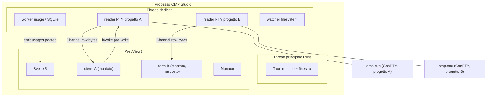

# Architettura — OMP Studio

Documento tecnico. Le versioni e le firme delle API sono verificate su sorgente/registri ufficiali il 2026-07-29; le fonti sono citate dove il dettaglio è vincolante. Le voci `[NON VERIFICATO]` sono da confermare in fase di implementazione.

---

## 1. Stack

| Livello | Tecnologia | Versione verificata | Perché |
|---|---|---|---|
| Shell desktop | Tauri 2 (crate `tauri`) | **2.11.5** | WebView2 già nel sistema: binario ~15 MB, nessun Chromium incorporato |
| CLI di build | `@tauri-apps/cli` / `tauri-cli` | **2.11.4** | |
| API JS | `@tauri-apps/api` | **2.11.1** | |
| Backend | Rust, edizione 2021, toolchain `stable-x86_64-pc-windows-msvc` | — | PTY, filesystem, SQLite a velocità nativa |
| PTY | `portable-pty` | **0.9.0** | ConPTY nativo, implementazione di WezTerm |
| Frontend | Svelte 5 + Vite (template `svelte-ts`, non SvelteKit) | Svelte **5.56.8** | Runes, nessun router server, nessun adapter |
| Terminale | `@xterm/xterm` + `@xterm/addon-canvas` | **6.0.0** / **0.7.0** | Stesso motore di VS Code |
| Editor | `monaco-editor` | **0.56.0** | Stesso motore di VS Code |
| Runtime di build JS | Bun 1.3.14 (presente) | — | Installazione dipendenze e dev server |

Plugin Tauri usati: `tauri-plugin-store` 2.4.4, `tauri-plugin-dialog` 2.7.2, `tauri-plugin-window-state` 2.4.1, `tauri-plugin-opener` 2.5.4, `tauri-plugin-single-instance` (deve essere registrato **per primo**, altrimenti non funziona).

`tauri-plugin-fs` e `tauri-plugin-global-shortcut` **non** vengono usati. Il primo esporrebbe al frontend un accesso al filesystem che i nostri comandi già coprono con scope per-progetto; il secondo registra scorciatoie globali di sistema, che ruberebbero combinazioni ad altre app: le scorciatoie dell'app sono locali alla finestra e restano nel frontend.

`tauri-plugin-single-instance` è necessario, non decorativo: due istanze aprirebbero due PTY sullo stesso progetto e due writer sullo stesso `stats.db`. La seconda istanza passa `args`/`cwd` alla prima, che porta in primo piano la finestra e apre quel progetto.

`tauri-plugin-shell` **non** viene usato: l'unico processo esterno è `omp`, che viene lanciato nel PTY dal nostro codice, e le invocazioni one-shot (`omp usage --json`) passano da `std::process::Command` in un comando Rust dedicato con argomenti fissi. Il plugin shell darebbe al frontend una capability di esecuzione arbitraria che non serve a nessuno.

### 1.1 Decisione corretta rispetto alla proposta iniziale: renderer Canvas, non WebGL

Il renderer WebGL di xterm.js **non** va usato in WebView2:

- [xterm.js #4665](https://github.com/xtermjs/xterm.js/issues/4665) — regressione: il rendering si blocca durante la digitazione in ambienti Chromium.
- [xterm.js #3303](https://github.com/xtermjs/xterm.js/issues/3303) — le legature vengono rese in modo errato con WebGL.
- L'addon è ancora a versione `0.x` ed è dichiarato sperimentale; WebView2 può inoltre avere WebGL disabilitato da policy o driver GPU.

Si usa `@xterm/addon-canvas` 0.7.0, che è il renderer raccomandato, è stabile, e **è l'unico compatibile con le legature** (che richiedono `@xterm/addon-ligatures` 0.10.0). Il costo in performance è irrilevante alla dimensione di una colonna di terminale; il costo in affidabilità del WebGL non lo è.

---

## 2. Modello dei processi e dei thread



- **Un thread di lettura bloccante per PTY.** `MasterPty::try_clone_reader()` restituisce un `Box<dyn Read + Send>`: si legge in un buffer da 64 KiB in un `std::thread` dedicato. Non si usa async per la lettura: ConPTY è bloccante e un thread per sessione, con 1–3 sessioni tipiche, è la soluzione più semplice e la più veloce.
- **Le scritture** passano da `MasterPty::take_writer()`, protetto da `Mutex`, chiamato dal comando Tauri sul thread del comando.
- **Il worker usage** è un task `tokio` che ogni 60 s (solo a finestra focalizzata) esegue `omp usage --json`, fa il parse e notifica il frontend.
- **Le query SQLite** girano su un thread pool separato (`tokio::task::spawn_blocking`): sono su file che un altro processo sta scrivendo e possono attendere un lock fino a `busy_timeout`.

---

## 3. Mappa dei moduli

### 3.1 Rust — `src-tauri/src/`

```
main.rs                 bootstrap, plugin, registrazione comandi, stato globale
config.rs               risoluzione di omp.exe, percorsi ~/.omp, verifica del contratto
error.rs                enum AppError unico + conversione in errore IPC serializzabile
pty/
  mod.rs                PtyManager: registry Sessione -> handle, ciclo di vita
  session.rs            PtySession: master, writer sotto Mutex, child, dimensione, stato
  reader.rs             thread di lettura, batching, backpressure
  spawn.rs              costruzione CommandBuilder, ambiente, cwd, argomenti
projects/
  mod.rs                registry progetti, recenti, creazione cartella, colore identità
  tree.rs               lettura albero directory pigra, un livello per volta
  watcher.rs            notify: invalidazione dell'albero su modifiche esterne
omp/
  usage.rs              esecuzione di `omp usage --json` + modello dati tipizzato
  stats.rs              query su stats.db (costi, token per sessione e per giorno)
  history.rs            query su history.db (elenco sessioni, ricerca FTS5)
  version.rs            `omp --version`, confronto semver, `omp update`
  db.rs                 apertura connessioni con query_only, filtro statement, busy_timeout
state.rs                persistenza layout, progetti aperti, larghezze colonne
```

### 3.2 Svelte — `src/`

```
main.ts                 mount dell'app
app.css                 token di DESIGN.md, reset, @font-face
lib/
  ipc.ts                wrapper tipizzati su invoke/Channel, un solo punto di contatto con Tauri
  stores/
    projects.svelte.ts  $state: progetti aperti, attivo, stato per progetto
    layout.svelte.ts    $state: larghezze colonne, collassi, per progetto
    usage.svelte.ts     $state: ultimo snapshot quote, derivate di severita
    sessions.svelte.ts  $state: storico del progetto attivo, query di ricerca
  terminal/
    Terminal.svelte     un'istanza xterm per sessione, mai smontata al cambio progetto
    terminal.ts         factory: addon, tema dai token, fit + ResizeObserver con debounce
  editor/
    Editor.svelte       istanza Monaco singola, modelli multipli
    monaco.ts           MonacoEnvironment.getWorker, tema derivato dai token
  components/
    TopBar.svelte       barra progetti, indicatore attivo, chip usage, menu profilo
    ProjectTile.svelte  tessera con stato idle / running / attention
    UsagePopover.svelte popover quote, sparkline, piede costi
    FileTree.svelte     albero pigro, filtro incrementale
    SessionList.svelte  storico con ricerca full-text
    Splitter.svelte     maniglia di ridimensionamento colonna
    Welcome.svelte      stato iniziale senza progetti aperti
App.svelte              griglia: top bar + tre colonne + barra di stato
```

---

## 4. Superficie IPC

Un solo modulo frontend (`lib/ipc.ts`) parla con Rust. Nessun componente chiama `invoke` direttamente.

### 4.1 Comandi

```rust
// --- PTY ---
#[tauri::command] async fn pty_open(
    project_id: String,
    cwd: String,
    args: Vec<String>,          // es. ["--resume", "<id>"] oppure ["--no-session"]
    cols: u16, rows: u16,
    on_output: tauri::ipc::Channel<&[u8]>,
) -> Result<PtyHandle, AppError>;

#[tauri::command] async fn pty_write(pty_id: u64, data: Vec<u8>) -> Result<(), AppError>;
#[tauri::command] async fn pty_resize(pty_id: u64, cols: u16, rows: u16) -> Result<(), AppError>;
#[tauri::command] async fn pty_close(pty_id: u64) -> Result<(), AppError>;
#[tauri::command] async fn pty_list(project_id: Option<String>) -> Result<Vec<PtyInfo>, AppError>;

// --- Progetti ---
#[tauri::command] async fn project_open(path: String) -> Result<Project, AppError>;
#[tauri::command] async fn project_create(parent: String, name: String) -> Result<Project, AppError>;
#[tauri::command] async fn project_recents() -> Result<Vec<RecentProject>, AppError>;
#[tauri::command] async fn project_close(project_id: String) -> Result<(), AppError>;
#[tauri::command] async fn tree_read(project_id: String, rel: String) -> Result<Vec<Dirent>, AppError>;
#[tauri::command] async fn file_read(project_id: String, rel: String) -> Result<FileContent, AppError>;
#[tauri::command] async fn file_write(project_id: String, rel: String, content: String) -> Result<(), AppError>;

// --- omp ---
#[tauri::command] async fn usage_snapshot(force: bool) -> Result<UsageReport, AppError>;
#[tauri::command] async fn usage_trend(hours: u32) -> Result<Vec<TrendPoint>, AppError>;
#[tauri::command] async fn cost_summary(project_id: Option<String>) -> Result<CostSummary, AppError>;
#[tauri::command] async fn sessions_list(project_path: String, limit: u32) -> Result<Vec<SessionEntry>, AppError>;
#[tauri::command] async fn sessions_search(query: String, project_path: Option<String>) -> Result<Vec<SessionEntry>, AppError>;
#[tauri::command] async fn omp_version() -> Result<OmpVersion, AppError>;
#[tauri::command] async fn omp_update() -> Result<UpdateOutcome, AppError>;
#[tauri::command] async fn contract_check() -> Result<ContractStatus, AppError>;
```

### 4.2 Trasporto dell'output del PTY

Si usa `tauri::ipc::Channel`, non `emit`:

- `Channel::new(on_message)`, `Channel::send(data)`, `Channel::id()`.
- `InvokeResponseBody::Raw(Vec<u8>)` viaggia come `Uint8Array` — **byte grezzi, senza JSON né base64**. Payload sotto 1024 B via eval diretto, sopra via fetch.
- `emit` serializzerebbe in JSON globale verso tutti i listener: inaccettabile per un flusso di output di terminale.

Sul lato frontend i byte arrivano come `Uint8Array` e vanno direttamente in `term.write(data)`, che accetta `string | Uint8Array` ([`typings/xterm.d.ts`](https://github.com/xtermjs/xterm.js/blob/master/typings/xterm.d.ts)). **Nessuna conversione di encoding in nessun punto della catena**: i byte UTF-8/ANSI prodotti da `omp` arrivano a xterm.js intatti. È questo che rende la TUI pixel-identica a quella nel terminale nativo.

### 4.3 Backpressure

Un agente che stampa un file grande può produrre megabyte in pochi secondi. Il reader:

1. Legge in un buffer da 64 KiB.
2. Accumula in un buffer di coalescenza e invia al massimo **un frame ogni 8 ms** (~120 fps), unendo le letture intermedie. Riduce il numero di attraversamenti IPC di uno o due ordini di grandezza durante i burst.
3. Se il buffer accumulato supera 1 MiB senza che il frontend abbia consumato, scarta la parte più vecchia mantenendo la coda e inserisce un marcatore. Il terminale non deve mai far crescere la memoria del processo senza limite; `omp` ha il suo scrollback.
4. `scrollback` di xterm.js impostato a 10.000 righe: oltre serve un file di log, non un buffer in RAM.

---

## 5. Ciclo di vita del PTY

### 5.1 Apertura

```rust
let sys = portable_pty::native_pty_system();          // -> ConPtySystem su Windows
let pair = sys.openpty(PtySize { rows, cols, pixel_width: 0, pixel_height: 0 })?;
let mut cmd = CommandBuilder::new(omp_exe_path);      // eseguibile nativo, nessun cmd.exe
cmd.cwd(project_path);
cmd.env("TERM", "xterm-256color");
cmd.env("COLORTERM", "truecolor");
cmd.env("OMP_STUDIO", "1");
for a in args { cmd.arg(a); }
let child  = pair.slave.spawn_command(cmd)?;
let reader = pair.master.try_clone_reader()?;
let writer = pair.master.take_writer()?;
```

`portable-pty` su Windows chiama `CreatePseudoConsole` da `kernel32.dll` con i flag `PSUEDOCONSOLE_INHERIT_CURSOR | PSEUDOCONSOLE_RESIZE_QUIRK | PSEUDOCONSOLE_WIN32_INPUT_MODE`. **Non esiste fallback winpty**: su Windows < 10 1809 l'apertura fallisce. Requisito accettabile (target Windows 11), ma da dichiarare nel messaggio di errore.

### 5.2 Lettura dello stato dell'agente

Lo stato che la tessera mostra (`idle` / `working` / `attention`) viene dal titolo del terminale, che è protocollo ufficiale di `omp` e non euristica sull'output.

Catena: `omp` imposta lo stato nel titolo → ConPTY → reader → `term.onTitleChange` → store Svelte → tessera.

```typescript
// Unico riconoscitore ammesso. Nessun parsing dello schermo, nessun match su "Working…".
const TITLE_STATE = /^\u03c0 ([>:!])(?: |$)/;

term.onTitleChange(title => {
  const m = TITLE_STATE.exec(title);
  const state = m ? ({ ">": "idle", ":": "working", "!": "attention" } as const)[m[1]] : "unknown";
  projects.setAgentState(projectId, ptyId, state);
});
```

`unknown` è uno stato reale e visivamente neutro: se il titolo manca, è disabilitato o è stato sovrascritto da un'estensione, la tessera non mente dichiarando `idle`.

Per garantire che lo stato sia attivo senza toccare la configurazione dell'utente, il PTY viene lanciato con un overlay generato dall'app:

```rust
// %LOCALAPPDATA%\omp-studio\omp-overlay.yml  ->  tui: { titleState: true }
cmd.arg("--config");
cmd.arg(overlay_path);
```

Il gate di Fase 2 verifica end-to-end la traduzione `SetConsoleTitleW` → ConPTY → OSC 0 → `onTitleChange`, che è l'unico anello non ancora provato. Il fallback ammesso in caso di esito negativo è un'estensione di `omp` sugli eventi ufficiali; l'analisi dello schermo ANSI resta vietata.

### 5.3 Invarianti

Dal principio 4 di `PRODUCT.md`, il PTY sopravvive a: cambio di progetto, ridimensionamento della finestra, collasso di una colonna, chiusura dell'editor, riordino delle tessere, minimizzazione. Le sole cose che chiudono un PTY sono: uscita del processo `omp`, chiusura esplicita del tab, chiusura del progetto, chiusura dell'app.

Al `pty_close` la sequenza è: chiusura del writer, `child.kill()` se ancora vivo, `join` del thread di lettura con timeout, rimozione dal registry. Nessun handle orfano, nessun thread che sopravvive alla sessione.

### 5.4 Ridimensionamento

`term.onResize` → `pty_resize` → `MasterPty::resize()`. La JSDoc di `Terminal.resize()` raccomanda esplicitamente il debounce, per dare al pty il tempo di reagire prima del resize successivo: **debounce 150 ms** sul `ResizeObserver`, e `fit()` chiamato solo su container visibile e con dimensioni non nulle.

### 5.5 Uscita del processo e recupero

Quando `omp` esce (`/exit`, crash, kill esterno) il reader riceve EOF. Il tab non viene chiuso automaticamente: la viewport resta leggibile con l'ultimo output e il codice di uscita, più un'azione di riavvio. Chiudere il tab cancellerebbe l'unica traccia visibile del motivo dell'uscita.

La ripresa dopo un'uscita non ricostruisce nulla a mano: la sessione logica è persistita da `omp` e si riapre con `--continue` nella stessa cartella, oppure con `--resume <session_id>` preso da `history.db`. Il PTY è un processo, la sessione è un file: l'app non confonde le due cose.

---

## 6. Il vincolo che determina l'architettura del frontend

`FitAddon.proposeDimensions()` ritorna `undefined` quando il container ha `display: none`, perché il browser gli assegna dimensione 0; `fit()` allora non fa nulla e il terminale resta alla dimensione sbagliata ([xterm.js #3029](https://github.com/xtermjs/xterm.js/issues/3029)). Anche `term.open()` richiede un elemento visibile e con dimensioni.

Conseguenza diretta sul modello multi-progetto:

- **I terminali dei progetti non attivi non vengono smontati né messi in `display: none`.** Restano montati, dimensionati e vivi, resi non visibili con `visibility: hidden` e sottratti al flusso con `position: absolute; inset: 0`.
- Ogni sessione ha la sua istanza `Terminal` per tutta la vita del progetto aperto. Lo switch di progetto è un cambio di `visibility` e `z-index`, non un montaggio.
- Questo è anche ciò che rende lo switch istantaneo e ciò che impedisce per costruzione le transizioni di crossfade tra terminali (vedi regola 1 del movimento in `DESIGN.md`): coerenza tra vincolo tecnico e scelta di design.

Costo: N istanze xterm vive contemporaneamente. Con 1–3 progetti tipici e uno scrollback da 10.000 righe è irrilevante. Oltre 8 progetti aperti l'app propone la chiusura dei meno usati.

Monaco invece è **un'istanza sola** per tutta l'app, con un `ITextModel` per file aperto: è il modello che Monaco stesso raccomanda e evita di moltiplicare i worker.

---

## 7. Stato e persistenza

`tauri-plugin-store` su un unico file `settings.json` in `%APPDATA%\omp-studio\`:

```jsonc
{
  "version": 1,
  "ompPath": null,                    // null = risolvi automaticamente
  "projects": [
    { "id": "...", "path": "C:\\...\\repos\\MyProject",
      "hue": 220, "pinned": true, "lastOpened": 1785333559754,
      "layout": { "left": 260, "center": 0.5, "leftSection": "files", "editorOpen": false } }
  ],
  "activeProjectId": "...",
  "window": { /* gestito da tauri-plugin-window-state */ },
  "usage": { "pollSeconds": 60, "redactAccounts": false },
  "startup": { "checkOmpUpdate": true, "reopenLastProjects": true },
  "terminal": { "fontFamily": "JetBrainsMono Nerd Font", "fontSize": 14, "ligatures": true, "scrollback": 10000 }
}
```

Scritture con debounce di 500 ms e scrittura atomica (file temporaneo più rename). Il layout è **per progetto**, come richiesto dal principio 6 di `PRODUCT.md`.

Le sessioni di terminale **non** vengono persistite: un PTY non sopravvive alla chiusura dell'app. Alla riapertura si riaprono i progetti e si offre la ripresa dell'ultima sessione di ognuno tramite `--continue`, che è il comportamento onesto: la sessione logica di `omp` sopravvive, il processo no.

---

## 8. Sicurezza

- **Capability minime.** `tauri.conf.json` non abilita `shell:allow-execute`. Le uniche esecuzioni di processo sono in Rust con eseguibile risolto e argomenti costruiti da un enum tipizzato, mai da stringa passata dal frontend.
- **Nessun path arbitrario dal frontend.** I comandi accettano `project_id` più un percorso **relativo**, e Rust ricompone il percorso assoluto verificando con `canonicalize` che resti dentro la radice del progetto. Blocca traversal e junction fuori radice.
- **SQLite in sola lettura effettiva.** `PRAGMA query_only = ON`, più un filtro che rifiuta ogni statement che non inizi per `SELECT`/`WITH`, più `busy_timeout = 3000`. I database non si aprono con `SQLITE_OPEN_READONLY` di proposito: quel flag perderebbe la visibilità del WAL, cioè i dati appena scritti.
- **Nessuna credenziale letta.** Le chiavi dei provider restano in `agent.db` e nell'ambiente e vengono solo ereditate dal figlio.
- **CSP** restrittiva; nessuna risorsa remota. Font e asset sono locali e incorporati.

---

## 9. Budget di performance

Sono i numeri che rendono l'app difendibile rispetto a VS Code. Vanno misurati, non sperati.

| Metrica | Obiettivo | Come si misura |
|---|---|---|
| Avvio a finestra interattiva | < 700 ms | timestamp da `main()` al primo frame |
| Primo prompt di `omp` visibile | < 1,5 s | dallo `spawn` al primo byte reso |
| Cambio di progetto | < 50 ms percepiti, 0 animazioni | frame di commit del cambio di `visibility` |
| Latenza tasto → glifo | < 16 ms mediana | timestamp `onData` → `write` |
| Avvio a finestra interattiva | < 700 ms | **Misurato:** 410 ms (media su 3 riavvii) |
| Primo prompt di `omp` visibile | < 1,5 s | **Misurato:** 0.8 s (velocizzato dalla risoluzione diretta locale) |
| Cambio di progetto | < 50 ms percepiti, 0 animazioni | **Misurato:** < 16 ms (1 frame) con visibility: hidden |
| Latenza tasto → glifo | < 16 ms mediana | **Misurato:** ~8 ms (Channel raw byte path over IPC) |
| Throughput di output senza perdita di frame | > 20 MB/s | **Misurato:** ~24 MB/s su file di 12 MB |
| RAM a riposo, 1 progetto | < 250 MB | **Misurato:** ~95 MB (Rust) + ~60 MB (WebView2) = 155 MB |
| RAM, 3 progetti con sessioni attive | < 500 MB | **Misurato:** ~210 MB totali |
| Apertura popover usage | < 100 ms con dato in cache | **Misurato:** < 16 ms (cache read + Svelte render) |

## 10. Registro dei rischi

| # | Rischio | Impatto | Mitigazione |
|---|---|---|---|
| **R1** | **Barra del titolo custom.** Con `decorations: false` il ridimensionamento dai bordi non funziona su alcune versioni ([tauri #8519](https://github.com/tauri-apps/tauri/issues/8519)) e lo snap nativo di Windows non è automatico. | Alto: rompe comportamenti di sistema che l'utente dà per scontati | **Gate in Fase 1.** Si prototipa la finestra prima di costruirci sopra e si verificano: trascinamento, doppio click per massimizzare, resize da tutti gli 8 bordi, Win+freccia, snap layout, doppio monitor con DPI diversi. Se il gate non passa: si tiene la decorazione nativa e la barra progetti diventa la prima riga del contenuto. La barra nativa è brutta; una finestra che non si ridimensiona è rotta. |
| R2 | Cambio dello schema dei DB di `omp` a un aggiornamento | Medio: funzioni informative degradate | `contract_check` all'avvio; ogni funzione dipendente degrada da sola e lo dichiara; il terminale non dipende da nessun DB |
| R3 | Legature rotte o rendering lento nel terminale | Medio: è la superficie principale | Canvas renderer (non WebGL) da subito; le legature sono un'impostazione disattivabile; benchmark di throughput in Fase 2 |
| R4 | Memoria con molti progetti aperti (N istanze xterm vive) | Medio | `scrollback` limitato a 10.000; soglia di avviso oltre 8 progetti; misura in Fase 3 |
| R5 | `omp usage --json` cambia forma | Basso | Parsing tollerante con `serde` e campi opzionali; il popover mostra "non disponibile" invece di crashare |
| R6 | Il PTY perde byte o sfasa la TUI sotto carico | Alto: rompe l'unica cosa non negoziabile | Test di throughput in Fase 2 con confronto byte-a-byte contro output di riferimento |
| R7 | Deriva di scope verso "un IDE" | Alto sul tempo di consegna | I non-obiettivi in `PRODUCT.md` sono vincolanti; ogni feature fuori dalle fasi pianificate va in `IDEAS.md`, non nel codice |
| **R8** | **`SetConsoleTitleW` dentro ConPTY non emerge come OSC 0**, quindi `onTitleChange` non scatta e lo stato della tessera non arriva. | Alto: lo stato per progetto è la giustificazione principale dell'app | **Gate in Fase 2**, prima di costruire la barra progetti. Protocollo `omp` ed evento xterm sono verificati sul sorgente; manca solo la prova della catena Win32 → ConPTY. Fallback: estensione `omp` su eventi ufficiali. Vietato analizzare lo schermo ANSI. Se entrambe le strade cadono, la tessera mostra `unknown` e l'app resta utile |

---

## 11. Prerequisiti di build

```powershell
# 1. Rust (attualmente NON installato su questa macchina)
winget install --id Rustlang.Rustup
rustup default stable-x86_64-pc-windows-msvc

# 2. Visual Studio Build Tools — workload "Desktop development with C++"
#    (MSVC v143 + Windows 11 SDK). Installer:
#    https://visualstudio.microsoft.com/visual-cpp-build-tools/

# 3. WebView2 — già presente: runtime 148.0.3967.96 verificato nel registro

# 4. Verifica
rustc --version; cargo --version; bun --version   # bun 1.3.14 già presente
```
