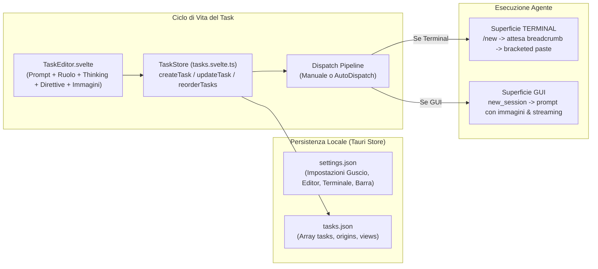

# Architettura — OMP Studio

Documento tecnico. Le versioni, i contratti IPC, gli schemi di persistenza e le firme delle API sono verificate sui sorgenti di `omp-studio-app` e del runtime `omp` per la release stabile 1.0.0.

---

## 1. Stack e Piattaforme

| Livello | Tecnologia | Versione / Dettaglio | Perché |
|---|---|---|---|
| Shell desktop | Tauri 2 (crate `tauri`) | **2.11.5** | Binario compatto (~15 MB), WebView nativa di sistema (WebView2 su Windows, WebKit su macOS/Linux), nessun runtime Chromium incorporato |
| CLI di build | `@tauri-apps/cli` / `tauri-cli` | **2.11.4** | Toolchain ufficiale Tauri 2 per packaging NSIS, DMG, DEB e AppImage |
| API JS | `@tauri-apps/api` | **2.11.1** | Binding IPC tipizzati su invoke e Channel |
| Backend | Rust (edizione 2021) | `stable-x86_64-pc-windows-msvc` / `stable-*-apple-darwin` / `stable-x86_64-unknown-linux-gnu` | PTY nativo, I/O filesystem con canonicalize, SQLite con thread pool bloccante, isolamento processi con Windows Job Objects o segnali POSIX |
| PTY | `portable-pty` | **0.9.0** | ConPTY nativo su Windows 10/11, POSIX PTY su macOS e Linux |
| RPC OMP | `omp --mode rpc-ui` su stdio | NDJSON Protocol v2 | Seconda superficie GUI: streaming asincrono bidirezionale, riassemblaggio chunk fino a 64 MiB, coalescenza delta |
| Frontend | Svelte 5 + Vite (template `svelte-ts`) | Svelte **5.56.8** | Reattività nativa con Runes (`$state`, `$derived`, `$effect`, `$props`), nessun framework server, zero overhead di virtual DOM |
| Terminale | `@xterm/xterm` | **6.0.0** | Renderer DOM (vedi §1.1); addon fit, ligatures, unicode11, web-links, search, clipboard |
| Editor | `monaco-editor` | **0.56.0** | Istanza Monaco singola multi-modello, visualizzatore diff Git affiancato, sintassi estesa |
| Diagrammi & Whiteboard | `mermaid` | **11.x** | Rendering SVG interattivo zoomabile/panorabile per il tool agente `studio_diagram` |
| Sandbox & Sanitizzazione | `dompurify` | **3.x** | Difesa in profondità per anteprime vettoriali SVG e prototipi UI isolati in iframe sandbox privi di script |
| Runtime di build JS | Bun / Node | Bun **1.3.14**, Node **22.x** | Installazione dipendenze e dev server ultra-rapido |

### Plugin Tauri registrati

1. `tauri-plugin-single-instance`: registrato **obbligatoriamente per primo**, impedisce doppie istanze concorrenti sullo stesso `stats.db` e porta in primo piano la finestra esistente aprendo il progetto passato per argomento.
2. `tauri-plugin-window-state`: persistenza trasparente di coordinate, massimizzazione e dimensioni della finestra escludendo i flag decorazione (`StateFlags::all() & !DECORATIONS`). La finestra `companion` è nella *denylist*: la sua geometria ha un proprietario unico in `companion_ops` (`%LOCALAPPDATA%/omp-studio/companion-state.json`), che distingue la modalità Spotlight (centrata a ogni apertura) da quella fissata (coordinate ricordate) e non deve subire il ripristino automatico del plugin, incluso quello della visibilità.
3. `tauri-plugin-store`: gestione della persistenza locale atomica con file separati `settings.json` e `tasks.json`.
4. `tauri-plugin-dialog`: dialoghi nativi di sistema per selezione cartella e apertura file.
5. `tauri-plugin-opener`: apertura sicura di percorsi esterni e URL nel browser predefinito di sistema.
6. `tauri-plugin-notification`: integrazione notifiche toast di sistema (Windows AUMID `sh.omp.studio`, macOS UserNotifications).

`tauri-plugin-fs` e `tauri-plugin-shell` **non** vengono usati: il backend Rust espone solo comandi specifici a perimetro controllato con validazione dei path dentro la radice del progetto attivo.

### 1.1 Renderer DOM per xterm.js

xterm.js 6 ha rimosso il renderer Canvas (`@xterm/addon-canvas`, pensato per xterm 5): il terminale usa il renderer DOM, abbinato a `@xterm/addon-ligatures` per le legature dei Nerd Font incorporati. È il renderer più compatibile (WebView2, WKWebView, WebKitGTK) e non dipende dalla scheda video. Il renderer WebGL (`@xterm/addon-webgl`) è più veloce con output molto lunghi ma in passato ha avuto problemi in WebView2 (blocco del rendering durante la digitazione [#4665](https://github.com/xtermjs/xterm.js/issues/4665), legature corrotte [#3303](https://github.com/xtermjs/xterm.js/issues/3303)) e perde il contesto grafico con alcuni driver o col desktop remoto: la sua adozione è parcheggiata in `IDEAS.md`.

---

## 2. Modello dei Processi e dei Thread


```mermaid
graph TB
  subgraph Processo["Processo OMP Studio (Rust + Tauri)"]
    subgraph Main["Thread Principale"]
      TAURI["Runtime Tauri + Finestra Nativa"]
    end
    subgraph Pool["Pool Thread & Tokio Workers"]
      PTY_RD["Thread Reader PTY (64 KiB buffer, batching 8 ms)"]
      RPC_RD["Thread Reader RPC (De-chunking 64MB, coalescing 8 ms)"]
      SQL_POOL["Worker Pool SQLite (tokio::task::spawn_blocking)"]
      FS_WATCH["Watcher Filesystem notify (Diagrammi & Previews)"]
      JOB_WIN["Windows Job Object (Terminazione ad albero KILL_ON_JOB_CLOSE)"]
    end
    subgraph WV["Frontend WebView (Svelte 5)"]
      PAGE["routes/+page.svelte (Orchestratore 3 Colonne)"]
      STORES["Stores Svelte ($state: projects, lanes, tasks, settings, models)"]
      XT["xterm.js Canvas (Istanze Terminal per Corsia)"]
      CHAT["Chat GUI (Transcript, ToolGroup, Thinking, Composer)"]
      MON["Monaco Editor (Single Instance, Multi-Model, Diff)"]
      PREV["PreviewViewer (Sandboxed Iframe null-origin + CSP 'none')"]
      BROWSER["BrowserViewer (Superficie Live Browser, Coordinate CSS, Toolbar)"]
    end
  end

  OMP_PTY["omp.exe (ConPTY / MasterPty - Superficie TERMINAL)"]
  OMP_RPC["omp.exe --mode rpc-ui (Stdio NDJSON - Superficie GUI)"]

  PTY_RD -->|"Channel<Vec<u8>> Raw Bytes"| XT
  XT -->|"invoke pty_write"| PTY_RD
  PTY_RD --- OMP_PTY
  JOB_WIN -.->|"Containment"| OMP_PTY

  RPC_RD -->|"Channel<String> Eventi NDJSON"| CHAT
  CHAT -->|"invoke rpc_send"| RPC_RD
  RPC_RD --- OMP_RPC
  JOB_WIN -.->|"Containment"| OMP_RPC

  SQL_POOL -->|"Snapshot Usage & Sessioni"| STORES
  FS_WATCH -->|"Eventi diagram://new & preview://new"| PAGE
```

### 2.1 Gestione del PTY (Superficie TERMINAL)
- **Thread di lettura dedicato:** per ogni sessione PTY aperta viene allocato un thread `std::thread` con buffer da 64 KiB. ConPTY opera in modalità bloccante sincrona.
- **Coalescenza e backpressure:** i byte letti vengono accumulati e recapitati al frontend tramite `tauri::ipc::Channel` grezzo (`Vec<u8>`) con un intervallo massimo di **8 ms** (~120 fps). Se il buffer accumulato supera 1 MiB senza consumo dal frontend, la porzione più vecchia viene troncata inserendo un marcatore esplicito per evitare consumo incontrollato di memoria.
- **Contenimento dell'albero dei processi (Windows):** all'apertura del PTY viene istanziato un Windows Job Object configurato con `JOB_OBJECT_LIMIT_KILL_ON_JOB_CLOSE`. Alla chiusura della scheda o terminazione dell'app, l'intero albero di processi (PowerShell, `omp.exe`, processi figli invocati dai tool) viene terminato istantaneamente con `TerminateJobObject`, azzerando i processi orfani in background.

### 2.2 Gestione dell'RPC (Superficie GUI)
- **Comunicazione su stdio:** il processo `omp --mode rpc-ui` viene avviato direttamente tramite `std::process::Command` (senza shell intermedia).
- **Overlay isolato per processo:** `--config` riceve `omp-studio-gui-overlay-<rpc_id>.yml` nella cartella temporanea, con `tools.approvalMode: yolo`, `read.defaultLimit: 1200` e `prewalk.enabled: false`. `RpcSession.config_path` ne conserva il percorso e `rpc_close` lo elimina. `rpc_set_prewalk` aggiorna atomicamente solo quell'overlay; le sessioni Lab usano una configurazione separata e rifiutano il comando.
- **Riassemblaggio frame `rpc_chunk`:** i frame frammentati dal protocollo vengono riassemblati in memoria fino al tetto massimo dichiarato dal frame `ready` (64 MiB `MAX_REASSEMBLED_BYTES`).
- **Coalescenza dei delta di streaming:** gli eventi `assistantMessageEvent` ad alta frequenza vengono coalesciati all'interno di una finestra temporale di **8 ms** (`DELTA_WINDOW`), evitando il costo $O(n^2)$ di passaggi IPC per risposte lunghe in streaming.
- **Buffer circolare stderr:** conserva le ultime 200 righe di output stderr del processo per offrire diagnostica dettagliata ed immediata in caso di crash o errori di configurazione all'avvio.
- **Canale di interruzione prioritario:** i comandi di stop (`abort`, `abort_bash`) operano con timeout rapido a 4 secondi (`FAST_COMMAND_TIMEOUT_MS`) e cancellazione locale immediata dei buffer, garantendo reattività istantanea alla pressione del pulsante di stop o `Alt+C`.
- **Modalita' Piano della GUI:** il processo RPC riceve `-e studio-plan.ts` e `OMP_STUDIO_PLAN=gui`; il PTY riceve la stessa estensione senza la variabile, e li' resta inerte (vale il `/plan` nativo). Dettagli in §6.6.

### 2.3 Worker Asincroni e Database SQLite
- Tutte le interrogazioni su `stats.db`, `history.db` e `agent.db` vengono eseguite all'interno di `tokio::task::spawn_blocking` con connessioni aperte in modalità `OpenFlags::SQLITE_OPEN_READ_ONLY`, `PRAGMA query_only = ON` e `PRAGMA busy_timeout = 3000`, evitando di bloccare l'event loop di Tauri.

### 2.4 Generazione dei Suggerimenti di Prompt (Processi Effimeri)
- **Esecuzione effimera e isolata:** il comando `generate_prompt_suggestions` invoca `omp -p` con il modello del ruolo `smol` come processo figlio effimero e isolato, effettuando il parsing dell'array JSON di risposta con fallimento silenzioso.
- **Scelta architetturale:** processo effimero e non residente (misurati 5,7 s con `smol`, 4,3 s con suffisso `:minimal`, contro ~1,5 s di un processo caldo) perche' l'utente ha accettato la latenza e un processo residente introdurrebbe ciclo di vita, watchdog e rischio di contesto condiviso fra progetti.
- **Politica Opt-In e Fallimento Silenzioso:** la generazione e' opt-in (`dynamicEnabled` predefinito a falso) perche' costa una chiamata a modello per ogni fine turno. In caso di errore o timeout, il comando restituisce un array vuoto senza disturbare l'utente.
- **Heads-up nella stessa chiamata (Gate R3X-heads-up):** quando l'agente non ha chiamato `studio_headsup` e il turno è grande (fatti certi, almeno 8 chiamate o 1.500 caratteri di testo), il frontend passa `turnDigest` (fatti + testo completo del turno, tagliato in mezzo a 6.000 caratteri) e `wantHeadsUp`; il digest viaggia nel file di contesto, mai in argv. Il modello risponde con `headsUp`: al massimo una frase o `null`. Senza `wantHeadsUp` il campo viene scartato lato Rust.

### 2.5 Heads-up di fine turno (Gate R3X-heads-up)
- **Tre fonti, una frase.** `src/lib/agent/turnHeadsUp.ts` (funzioni pure) calcola dai tool del turno i fatti certi: comando di verifica fallito e mai riuscito dopo (stessa chiave «npm test», «cargo check»…), domanda `ask` scaduta, comando rischioso riuscito (`git push`, `reset --hard`, `rm -r` fuori dalle cartelle usa e getta…), file delicato modificato (manifest, migrazioni/SQL, CI, `.env*`, `AGENTS.md`, `tauri.conf.json`, capability). Priorità: frase dell'agente (`studio_headsup`) > frase smol (stessa chiamata post-turno di `suggestions_ops.rs`) > frase composta dai fatti.
- **Stato.** `AgentSession.headsUp` vale per l'ultimo turno: si fissa ad `agent_end` (agente + fatti), si aggiorna una volta se smol risponde, si azzera ad `agent_start`. I turni passati mostrano solo la frase dell'agente, che resta nel `.jsonl` perché sta negli argomenti del tool.
- **Superfici.** Card `TurnHeadsUp.svelte` prima del piè di turno (clic = scorre all'elemento del transcript, X = visto), riga nella card del progetto della companion (`CompanionProjectRuntime.headsUp`), notifica di sistema (`notificationManager.notifyHeadsUp`, una per turno, dopo l'analisi post-turno, mai se il turno chiede già una risposta o se stai guardando il progetto).
- **Visto.** `headsUpSeen.svelte.ts`: chiavi `sessione|hash della frase` in `localStorage` (ultime 400), machine-local; non usa gli id delle entry, che cambiano a ogni ricostruzione.

---

## 3. Mappa dei Moduli

### 3.1 Backend Rust — `src-tauri/src/`

```
main.rs                 Bootstrap dell'applicazione
lib.rs                  Inizializzazione plugin, state management e registrazione comandi IPC
pty/
  mod.rs                PtyManager, PtySession, contenimento WindowsJob, I/O ConPTY
rpc/
  mod.rs                RpcManager, RpcSession, trasporto stdio NDJSON, riassemblaggio chunk, overlay GUI
projects/
  mod.rs                Gestione filesystem con resolve_path (canonicalize), operazioni Git e branch
  worktrees.rs          Worktree fratelli, scan dello stack, review e comandi di integrazione
  worktrees/
    lane_integrate.rs   Squash e fast-forward: il target non resta mai in conflitto
lanes_store.rs          Scrittura atomica di lanes.json (app data, chiave laneState)
process_tree.rs         Job Object e registro degli alberi di processo per corsia
omp_ops.rs              Query protette SQLite (usage, storico sessioni), verifica/aggiornamento OMP, temi, sorgenti di quota dichiarate dall'utente
rules_ops.rs            Censimento regole di contesto e skill, analisi attrito in sola lettura su history.db
models_ops.rs           Gestione catalogo modelli, ruoli operativi, catene di fallback e raccomandazioni
suggestions_ops.rs      Comando generate_prompt_suggestions: chiamata effimera a omp -p con ruolo smol, parsing JSON (anche headsUp), fallimento silenzioso
journal_ops.rs          Comando project_docs_ask (Gate R3X-diario): «Chiedi al diario», chiamata effimera a omp -p --no-session --no-tools col modello leggero sugli estratti passati dal frontend, nessuna lettura di disco
setup.rs                SetupWizard: download resiliente OMP, verifica SHA-256 nativa, installazione font Nerd
studio_updater.rs       Updater applicazione: canali Stable/Nightly, verifica integrità SHA-256
alerts.rs               Notifiche OS, registrazione AUMID Windows (sh.omp.studio), attenzione Dock/Taskbar
diagrams.rs             Watcher per tool studio_diagram (Mermaid whiteboard)
previews.rs             Watcher per tool studio_preview (prototipi UI)
```

### 3.2 Frontend Svelte 5 — `src/`

```
app.css                 Design system, variabili cromatiche, tipografia e reset
routes/
  +layout.svelte        Inizializzazione tema e listener globali
  +page.svelte          Layout orchestratore principale a 3 colonne, gestione modali e drawer
lib/
  focusTrap.ts          Utility WAI-ARIA per gestione focus trap e navigazione tastiera
  stores/
    projects.svelte.ts  Stato reattivo progetti aperti, attivo, configurazioni per-progetto
    lanes.svelte.ts     Corsie del progetto: creazione, riconciliazione Git, archiviazione
    lanePersistence.ts  Schema versionato di lanes.json e riconciliazione crash-safe
    laneSurfaces.svelte.ts Superfici centrali (diagramma, anteprima, browser) per corsia
    tasks.svelte.ts     Store reattivo code task (persistenza su tasks.json via Tauri store)
    taskSerialization.ts Validazione, parsing e formattazione prompt con direttive speciali
    settings.svelte.ts  Impostazioni del guscio (persistenza su settings.json via Tauri store)
    promptSuggestions.ts Tipi, preset di fabbrica e sanitizzazione del catalogo dei suggerimenti fissi
    projectOrder.svelte.ts Viste derivate ordinamento tessere (manuale, MRU, priorità, alfabetico)
    modelSettings.svelte.ts Stato configurazione modelli, ruoli e cataloghi
    studioUpdater.svelte.ts Stato verifiche e avanzamento download aggiornamenti Studio
    notifications.svelte.ts Gestione centrale notifiche toast, badge icona e preferenze utente
    rules.svelte.ts     Censimento regole/skill per progetto e proposte di regola memorizzate
    suggestions.svelte.ts Controller per sessione dei suggerimenti dinamici: trigger agent_end, chiave di turno, invalidazione, timeout
    turnHeadsUp.ts      Heads-up di fine turno: fatti certi del turno, frase dai fatti, priorità agente > smol > fatti, digest per smol
    headsUpSeen.svelte.ts Heads-up già visti (localStorage, chiave sessione + hash della frase)
  projectDocs/
    projectDocs.ts      Diario di progetto (Gate R3X-diario): manifest, percorsi di default, parsing del diario, scelta degli estratti per «Chiedi al diario» (funzioni pure, contratto con l'estensione)
    projectDocsStore.svelte.ts Stato della scheda Progetto: lettura con file_read, rilettura a fine lavoro dell'agente, domanda con project_docs_ask
  agent/
    client.ts           OmpRpcClient: correlazione richieste/risposte, timeout dinamici, channel listener
    session.svelte.ts   AgentSession: riduttore reattivo di stato, gestione streaming, cronologia transcript
    settle.ts           Yield contro quiete (`session_settled`): funzioni pure per lo stato «in background»
    runActivity.ts      Attivita' del run per l'auto-avvio: prompt ammesso, retry, ultimo evento, verifica di `get_state`
    extensionUi.ts      Stato e widget delle estensioni (`setStatus`/`setWidget`), pulizia e colori ANSI
    turnDiff.ts         Bilancio `+N −M` del turno dalle card edit/write per il piè di turno
    wire.ts             Tipi TypeScript e mapping del protocollo RPC NDJSON v2
    sessionTree.ts      Diramazioni: copia incrementale di get_entries, mappatura transcript -> entry, righe del pannello Rami (Gate R33)
    slashRouter.ts      Instradamento puro dei comandi slash di sessione (/resume, /sessions, /tree, /fork), di /plan, di /btw e dell'obiettivo (/guided-goal, /goal)
    btw.ts              Domande a margine: record e turni di /btw, delta, citazione per il composer, riconoscimento di omp senza RPC btw (Gate R3X-btw)
    btwState.svelte.ts  SessionBtw: stato del riquadro «A margine» per sessione (storico, argomento aperto, bozza, citazione)
    loopMode.ts         /loop nella GUI: pillole, riga /loop, stato da setStatus, segmenti e giri ripiegati (Gate R3X-loop)
    guidedGoal.ts       Obiettivo guidato: domande e proposte fisse, risposte libere, bozza, controlli (criterio vago, tetto), markdown per `goal create`, proposte dell'agente (Gate R3X-guided-goal)
    components/
      Chat.svelte       Pannello chat principale della superficie GUI
      BtwPopover.svelte Riquadro «A margine» (/btw) sopra il composer: streaming, approfondimenti, Storico
      Composer.svelte   Input prompt con autocomplete slash (/), drag&drop immagini, ciclo ruoli
      SuggestionChips.svelte Riga di chip nel composer per suggerimenti prompt fissi e dinamici
      Transcript.svelte Lista messaggi con autoscroll resiliente e virtualizzazione progressiva
      BranchPanel.svelte Pannello «Rami»: albero di get_tree, ramo attivo evidenziato, apertura di un ramo come nuova sessione
      GoalBanner.svelte Banner fisso dell'obiettivo in cima alla chat: stato, tentativi/tetto, budget, tempo, Pausa/Riprendi/Stop
      GuidedGoalStrip.svelte / GuidedGoalAskCard.svelte / GuidedGoalDraftCard.svelte / GuidedGoalEntry.svelte  Intervista dell'obiettivo guidato
      TurnHeadsUp.svelte Card di una frase prima del piè di turno (clic = vai al punto, X = visto)
      AskCard.svelte    Card di risposta interattiva con roving tabindex
      ThinkingBlock.svelte Accordion per blocchi di ragionamento con indicatore tempo
      TodoStrip.svelte  Visualizzatore fasi e task del tool todo
      SubagentPanel.svelte Visualizzatore e drawer per subagenti concorrenti
    tools/
      ToolGroup.svelte  Raggruppamento unificato sequenze tool e blocchi di ragionamento
      ToolCard.svelte   Involucro standard per le card degli strumenti
      renderers/        30+ card dedicate (Bash, Edit, Write, Read, Lsp, AstEdit, Eval, Debug, Browser, Ask, Task, Hub, Job, WebSearch...)
  components/
    TopBar.svelte       Barra progetti con tessere riordinabili, badge coda, chip usage e setup
    LaneStrip.svelte    Riga corsie, visibile solo con almeno una corsia secondaria
    LaneReviewModal.svelte Revisione e integrazione di una corsia isolata
    LaneDispatchDialog.svelte Conferma di corsia, soft-cap e arresto processi
    LaneProfileDialog.svelte Consenso una tantum sui file locali del worktree
    FileTree.svelte     Albero file pigro con filtro incrementale
    GitPanel.svelte     Pannello Git: branch, diff modifiche, commit recenti e sessioni
    AgentPanel.svelte   Quattro viste del progetto: coda task, storico sessioni, regole/skill e diario di progetto
    RulesPanel.svelte   Ispettore regole di contesto e skill, con proposte nate dall'attrito
    ProjectDocsPanel.svelte Scheda Progetto: documenti, ultime voci del diario, «Chiedi al diario», inizializzazione
    TaskEditor.svelte   Editor a sezioni: prompt, ruoli, slider thinking, toggle speciali, immagini
    QueueDrawer.svelte  Cassetto aggregato delle code di tutti i progetti con avvio diretto
    UsagePopover.svelte Popover quote, breakdown costi, trend e countdown al reset
    DiagramViewer.svelte Whiteboard interattiva per diagrammi Mermaid
    PreviewViewer.svelte Sandbox isolata in iframe per prototipi UI e vettoriali SVG
    BrowserViewer.svelte Superficie live Browser con toolbar, rendering frame BLF1 e mapping coordinate CSS
    SetupModal.svelte   Configurazione guidata di primo avvio: installazione OMP, setup credenziali e modelli
    SettingsModal.svelte Centro impostazioni (Generale, Notifiche, Barra, Workspace, Task, Suggerimenti, Modelli, Aspetto, Accessibilità)
    SuggestionsSection.svelte Sezione «Suggerimenti» delle impostazioni per catalogo fissi e opzioni dinamiche
    EmptyState.svelte   Stato iniziale workspace con inviti all'azione e griglia scorciatoie
    AlertBanner.svelte  Banner unificato per diagnostica ed errori di sistema
  editor/
    Editor.svelte       Istanza Monaco Editor con diff viewer e persistenza scroll/cursore
    svgSandbox.ts       Sanitizzazione DOMPurify e generazione documento iframe sandbox CSP
    editorContext.ts    Estrazione contesto file aperto/selezionato per i prompt
  terminal/
    Terminal.svelte     Componente xterm.js per sessione PTY
    terminal.ts         Configurazione addon, tema, fit e invio comandi di ripresa
    terminalActivity.ts Titolo OSC di omp, barra OSC 9;4 e attesa del run dopo un task scritto nel PTY
```

---

## 4. Superficie IPC

Tutti i comandi Tauri invocabili dal frontend passano da firme tipizzate in Rust (`src-tauri/src/lib.rs`):

```rust
// --- Terminale PTY ---
pty_open(cwd: String, args: Vec<String>, cols: u16, rows: u16, on_output: Channel<&[u8]>) -> Result<u64, String>;
pty_write(pty_id: u64, data: Vec<u8>) -> Result<(), String>;
pty_resize(pty_id: u64, cols: u16, rows: u16) -> Result<(), String>;
pty_close(pty_id: u64) -> Result<(), String>;
pty_session_info(pty_id: u64) -> Result<Option<PtySessionInfo>, String>;

// --- Superficie GUI RPC ---
rpc_open(cwd: String, resume: Option<String>, on_event: Channel<String>) -> Result<u64, String>;
rpc_send(rpc_id: u64, message: String) -> Result<(), String>;
rpc_close(rpc_id: u64) -> Result<(), String>;
rpc_stderr(rpc_id: u64) -> Result<Vec<String>, String>;
rpc_protocol(rpc_id: u64) -> Result<u8, String>;

// --- Filesystem e Git ---
tree_read(project_path: String, rel: String) -> Result<Vec<Dirent>, String>;
file_read(project_path: String, rel: String) -> Result<FileContent, String>;
file_write(project_path: String, rel: String, content: String) -> Result<(), String>;
preview_file(project_path: String, rel: String) -> Result<PreviewFileContent, String>;
resolve_project_file(project_path: String, file_name: String) -> Result<Option<String>, String>;
file_git_head(project_path: String, rel: String) -> Result<GitHeadContent, String>;
file_git_rev(project_path: String, rel: String, rev: String) -> Result<GitHeadContent, String>;
project_git_status(project_path: String) -> Result<FileGitStatus, String>;
git_last_commit(project_path: String) -> Result<Option<GitCommitInfo>, String>;
git_recent_commits(project_path: String, limit: u32) -> Result<Vec<GitCommitInfo>, String>;
git_current_branch(project_path: String) -> Result<String, String>;
git_working_numstat(project_path: String) -> Result<GitWorkingStats, String>;
git_branch_list(project_path: String) -> Result<Vec<GitBranchInfo>, String>;
git_branch_checkout(project_path: String, name: String) -> Result<(), String>;
git_branch_create(project_path: String, name: String, start_point: Option<String>) -> Result<(), String>;
git_branch_merge(project_path: String, branch: String) -> Result<(), String>;

// --- OMP, Database e Temi ---
usage_snapshot(force: bool) -> Result<UsageReport, String>;   // omp usage --json + sorgenti aggiuntive (Gate R21)
sessions_list(project_path: String, limit: u32) -> Result<Vec<SessionEntry>, String>;
sessions_search(query: String, project_path: Option<String>) -> Result<Vec<SessionEntry>, String>;
get_omp_version() -> Result<String, String>;
check_omp_update() -> Result<OmpUpdateCheckResult, String>;
run_omp_update() -> Result<String, String>;
theme_apply(theme_name: String, is_dark: bool) -> Result<(), String>;
omp_user_theme() -> Result<Option<String>, String>;
provider_hosts() -> Result<Vec<ProviderHost>, String>;

// --- Regole di contesto e Skill ---
get_project_context(project_path: String) -> Result<ProjectContextSummary, String>;
create_project_agents_md(project_path: String) -> Result<String, String>;
analyze_project_friction(project_path: String) -> Result<Vec<RuleSuggestion>, String>;
apply_rule_suggestion(project_path: String, target_rel_path: String, append_content: String) -> Result<(), String>;

// --- Setup e Onboarding ---
setup_status() -> Result<SetupStatus, String>;
install_omp() -> Result<(), String>;
install_nerd_font() -> Result<(), String>;
detect_project_roots() -> Result<Vec<DetectedProjectRoot>, String>;

// --- Modelli e Ruoli ---
get_model_config() -> Result<ModelRolesConfig, String>;
save_model_config(config: ModelRolesConfig) -> Result<(), String>;
get_models_catalog() -> Result<ModelsCatalog, String>;
refresh_models_catalog() -> Result<ModelsCatalog, String>;
get_custom_providers() -> Result<CustomProvidersConfig, String>;
save_custom_providers(config: CustomProvidersConfig) -> Result<(), String>;
get_model_providers() -> Result<Vec<ProviderSummary>, String>;
get_auth_accounts(provider_id: Option<String>) -> Result<Vec<AuthAccount>, String>;
check_model_upgrades() -> Result<Vec<ModelUpgradeItem>, String>;
apply_model_upgrades(upgrades: Vec<ModelUpgradeSelection>) -> Result<(), String>;
get_role_suggestions(roles: Vec<String>) -> Result<Vec<RoleSuggestion>, String>;

// --- Updater di Studio ---
get_studio_version() -> Result<String, String>;
check_studio_update(channel: StudioUpdateChannel, force: bool) -> Result<StudioUpdateInfo, String>;
start_studio_update_download(asset: StudioReleaseAsset, release_channel: StudioUpdateChannel) -> Result<(), String>;
cancel_studio_update_download() -> Result<(), String>;
install_studio_update_and_restart() -> Result<(), String>;

// --- Notifiche e Allerte OS ---
set_app_attention(project_name: String, message: String) -> Result<(), String>;
clear_app_attention() -> Result<(), String>;

// --- Suggerimenti Prompt ---
generate_prompt_suggestions(last_assistant: String, last_user: String, model_selector: Option<String>, max_items: u8) -> Result<Vec<String>, String>;

// --- Diario di progetto (Gate R3X-diario) ---
project_docs_ask(question: String, context: String, model_selector: Option<String>) -> Result<Option<String>, String>;
```
---

## 5. Flusso dei Task e Architettura dello Store

La gestione delle code dei task è completamente disaccoppiata dalle impostazioni generali per garantire integrità e persistenza sicura:


```mermaid
graph LR
  subgraph Persistenza["Persistenza Locale (Tauri Store)"]
    SETT["settings.json<br/>(Impostazioni Guscio, Editor, Terminale, Barra)"]
    TASKS_STORE["tasks.json<br/>(Array tasks, origins, views)"]
  end

  subgraph TaskLifeCycle["Ciclo di Vita del Task"]
    TE["TaskEditor.svelte<br/>(Prompt + Ruolo + Thinking + Direttive + Immagini)"]
    STORE_LOGIC["TaskStore (tasks.svelte.ts)<br/>createTask / updateTask / reorderTasks"]
    DISPATCH["Dispatch Pipeline<br/>(Manuale o AutoDispatch)"]
  end

  subgraph Execution["Esecuzione Agente"]
    PTY_EXEC["Superficie TERMINAL<br/>/new -> attesa breadcrumb -> bracketed paste"]
    RPC_EXEC["Superficie GUI<br/>new_session -> prompt con immagini & streaming"]
  end

  TE --> STORE_LOGIC
  STORE_LOGIC --> TASKS_STORE
  STORE_LOGIC --> DISPATCH
  DISPATCH -->|Se Terminal| PTY_EXEC
  DISPATCH -->|Se GUI| RPC_EXEC
```

### 5.1 Modello Dati e Sanitizzazione
I task sono persistiti in `tasks.json` sotto la chiave radice `taskState`:
```typescript
interface StudioTask {
  id: string;
  projectPath: string; // Percorso normalizzato in minuscolo
  prompt: string;
  images: ImageContent[]; // Base64 raw
  options: {
    role?: string;
    thinkingLevel?: ThinkingLevel;
    discussionMode?: boolean;
    planMode?: boolean;
    minimalMode?: boolean;
    researchMode?: boolean;
    includeEditorContext?: boolean;
  };
  position: number;
  createdAt: number;
  updatedAt: number;
  status: 'queued' | 'running' | 'completed' | 'cancelled';
  // Gate R3X-coda-reset: alla radice, non in `options` (che la GUI ricostruisce
  // con chiavi fisse). Validati campo per campo; malformati = assenti.
  schedule?: {
    kind: 'reset' | 'at';
    provider?: string;     // fissato alla scelta dal ruolo/modello del task
    limitId?: string;      // finestra che bloccava (informativa)
    notBefore?: number;    // 'at': orario; 'reset': reset letto alla scelta (solo stima)
    origin: 'user' | 'recovery';
    setAt: number;         // separa i reset passati a Studio chiuso
    missed?: boolean;      // fermo nel banner «Avvia ora / Lasciali in coda»
  };
  resume?: { sessionId: string; laneId?: string }; // voce di ripresa: `/retry` in quella sessione
}
```

### 5.2 Formattazione e Direttive Speciali
Al momento del dispatch, la funzione `formatTaskPrompt` arricchisce il prompt applicando:
- Inclusione selettiva del contesto dell'editor attivo (`attachEditorContext`), inserendo percorso, cursore ed eventuale codice selezionato.
- Direttive semantiche per le modalità speciali:
  - `planMode`: istruzioni per pianificazione strutturata prima dell'esecuzione (`/plan`).
  - `discussionMode`: sollecitazione all'interrogazione proattiva dei requisiti (`/grill-me`).
  - `minimalMode`: prioritizzazione delle soluzioni minimali YAGNI e rimozione complessità (`/ponytail`).
  - `researchMode`: direttiva all'approfondimento della documentazione online e best practice.

### 5.3 Meccanismo di Auto-Dispatch
L'avvio automatico dei task in coda è configurabile per singolo progetto (`autoDispatch: true`). Un task parte solo quando la sessione e' ferma **e stabile**:

1. **Cancello** (`automationGate.ts`, `autoDispatchReady`). GUI: nessuna domanda `ask`, nessuna quota, sessione pronta, nessun run vivo e nessuna attesa. Oltre a `isStreaming` (che `turn_end` spegne fra un giro di tool e l'altro) contano `runActive` (`settle.running`, da `agent_start` allo yield: copre le pause fra i tool, l'attesa di un nuovo tentativo e la compattazione che continua il run), `awaitingRun` (prompt ammesso da omp, `agent_start` non ancora arrivato: omp risponde a `prompt` all'ammissione), `retrying` (`auto_retry_start` aperto), `compacting`, `nativeQueue` (steer/follow-up nella coda di omp) e `backgroundWork` (yield senza quiete, §6.7). Con un omp senza quiete anche i subagenti in corsa. Analisi post-turno e domande dedotte sospendono solo l'auto-avvio. Terminale: titolo `idle` (§5.3.1), nessun testo nel prompt, nessun task appena scritto in attesa del run (`awaitingStart`), nessuna barra OSC 9;4.
2. **Stabilita'** (`src/lib/lanes/autoDispatchArbiter.ts`). L'effetto in `+page.svelte` passa all'arbitro i candidati idonei *adesso*; l'arbitro li spedisce solo dopo 2,5 s di idoneita' continuata (3 s nel terminale). Ogni chiusura del cancello azzera il conto; in GUI la quiete conta dall'ultimo evento del ciclo di vita del run (`AgentSession.quietForMs()`; le voci di stato delle estensioni non contano).
3. **Ri-verifica.** Allo scadere: GUI `get_state` (`AgentSession.verifyQuietForDispatch()`: `isStreaming`, `isCompacting`, `queuedMessageCount`, `isSettled`, `hasPendingAsyncWork`), terminale `TerminalSession.isAutomationQuiet()`; poi il cancello si rilegge. Se non e' quieto non parte nulla e si riprova dopo 5 s.
4. **Lock per progetto** dalla ri-verifica alla consegna; il rilascio chiede un nuovo giro all'effetto. La spedizione parte da un timer, fuori dall'effetto (`handleRunTask` scrive lo stato che l'effetto legge). Una consegna fallita su Principale riprova dopo 30 s; un fallimento in una corsia nuova non si ritenta da solo.
5. Con le corsie, il bersaglio non e' la corsia visibile: Principale se libera, altrimenti al massimo una corsia worktree automatica (vedi §5.4). `laneAgentState` conta anche `settle.running` e `awaitingRun`, cosi' Principale non sembra libera nelle pause del run.

Reti di sicurezza: `awaitingRun` scade dopo 30 s senza `agent_start` (non durante una compattazione); con un omp senza quiete un run «vivo» senza eventi per 20 s viene chiuso se `get_state` dice `isStreaming: false`; `error`/`agent_error`, uscita del processo e la rete dello Stop chiudono il run.

#### 5.3.1 Terminale: cosa dice il titolo di omp

Nel terminale lo stato viene dal titolo OSC (`π >` idle, `π :` working, `π !` attention, `tui.titleState`). In omp 18.8 il titolo diventa `working` su `agent_start` e torna `idle` solo su un `agent_end` terminale, su un `agent_end` non terminale con `awaitingAsyncWork`, o quando una continuazione programmata non parte: **non** scatta fra un tool e l'altro, ne' durante retry o compattazione che continua il run. I buchi erano due: dopo che Studio scrive il task nel PTY il titolo resta `idle` finche' omp non avvia il run (ora `awaitingStart`, fino al primo `working`/`attention` o 30 s), e il vecchio `assertAutomationReady` passava. Limiti che restano: un job in background (subagente asincrono, bash in background) porta il titolo a `idle` e il terminale non ha un segnale di quiete; la compattazione a riposo non tocca il titolo. Se l'utente accende `terminal.showProgress` in omp, la barra OSC 9;4 copre compattazione e run e Studio la legge (`progressActive`). Per code con lavoro in background la superficie consigliata e' la GUI.


#### 5.3.2 Task programmati: coda al reset della quota (Gate R3X-coda-reset)

Un task con `schedule` non e' preso dall'auto-avvio classico: ha il suo candidato e passa dallo **stesso** arbitro (§5.3, stabilita', ri-verifica, lock, slot unico di R27). Differenza voluta: parte anche con `autoDispatch` spento, perche' la programmazione e' gia' il gesto esplicito. «Avvia» resta sempre li' e la scavalca.

- **Da ruolo a finestra** (`src/lib/quota/scheduleTarget.ts`, puro): `options.modelSelector` o `modelRoles[role]` → `provider/model` → report di `omp usage --json` di quel provider (tutti gli account; vale quello che si libera prima) → `familyLimits`. Con finestre ferme (≤ 10%) il task aspetta il reset piu' lontano fra quelle (la 7 giorni, se e' lei a bloccare); senza finestre ferme aspetta il reset della finestra scelta o il suo cambio di finestra. `resetsAt` si rilegge a ogni giro; `notBefore` salvato vale solo come «stima» quando usage non risponde. Provider senza limiti in usage: nessun reset da aspettare.
- **Orologio** (`src/lib/quota/scheduleClock.ts`, `src/lib/stores/schedule.svelte.ts`): passo di 30 s, giro al fuoco e al ritorno visibile, risveglio dallo standby riconosciuto da un salto fra due giri (rilegge usage). Niente `setTimeout` lunghi.
- **Candidato e conferma** (`src/lib/stores/scheduleRunner.svelte.ts`): `autoDispatchCandidateFor` in `+page.svelte` chiede prima `scheduleRunner.candidateFor(project)` (riprese in testa, poi ordine di coda; la ripresa torna nella sua corsia). Nella `verify` dell'arbitro un task «al reset» chiede `usage_snapshot(force=true)` e parte solo se il reset e' confermato (al massimo una conferma al minuto per task). L'auto-avvio classico salta i task programmati e si ferma davanti a una ripresa in attesa (`nextAutoDispatchTask`).
- **Ripresa** («Aspetta il prossimo reset» nel vassoio della chat e nella Companion): `parkSessionUntilReset` crea in testa alla coda un task `/retry` con `resume` e `schedule{kind:'reset', origin:'recovery'}`, archivia l'avviso di quota e lo dice in chat. Alla partenza: GUI riapre la sessione se non e' quella aperta nella corsia e invia `/retry`; terminale `/resume <id>` e `/retry` dal PTY (`sendRunCommand`, con l'attesa del run come per `startTask`). Una ripresa fallita non si ritenta da sola.
- **Studio chiuso al reset**: ogni task si giudica una volta per avvio, al primo verdetto certo. Se e' gia' dovuto e la programmazione e' piu' vecchia dell'avvio, prende `missed` e va nel banner (coda, cassetto, card della Companion): «Avvia ora» toglie il segno e lo rimette nel percorso dell'arbitro, «Lasciali in coda» toglie la programmazione. Mai partenza automatica, nemmeno con l'auto-avvio acceso.
- **Estensione**: `/tasks` mostra `[al reset ~HH:MM]`, `[dopo HH:MM]`, `[riprendi]`; Invio toglie la programmazione. `project_tasks` accetta `schedule: reset|at|none` e `scheduleAt` (`HH:MM` o ISO). Un «al reset» scritto dal tool arriva senza provider: Studio lo completa dal ruolo al primo giro.

### 5.4 Corsie di lavoro (Gate R27)

Un progetto resta una tessera. Una corsia (`AgentLane`) e' il workspace su cui gira un agente: `Principale` usa la radice canonica del repository, una corsia secondaria usa un worktree Git fratello.

- **Percorso.** `worktree_create` risolve la radice Git anche se e' aperta una sottocartella, crea `<genitore>/.omp-wt-<slug>-<laneId>` e il branch `omp/lane-<laneId>` ancorato allo SHA di `HEAD` confermato. Il sottopercorso operativo (la cartella che l'utente aveva aperta) viene ricostruito dentro il worktree. La rimozione rifiuta percorsi non registrati da Studio, traversal, worktree sporchi e alberi di processi ancora vivi. Non esiste `--force`.
- **Coda.** `.omp/tasks.json` resta nella radice canonica. Il click manda il task a Principale se e' libera; se Principale lavora, Studio chiede una corsia nuova. Maiusc+click la crea senza dialogo. L'auto-dispatch occupa al massimo uno slot worktree per progetto, finche' quella corsia non e' integrata o rifiutata; una corsia creata a mano sospende l'auto-avvio. Dal terzo agente simultaneo compare un avviso con modelli, provider e processi vivi.
- **Sessione.** La chiave e' `lane:<projectKey>:<laneId>`. PTY e RPC di corsie diverse non condividono transcript, abort ne' handoff. Terminale e GUI della stessa corsia restano un solo processo, ripreso con `--resume`.
- **Routing.** `ask`, select, confirm e wizard sono vincolati a `projectId` + `laneId`. Un payload senza bersaglio univoco fallisce chiuso. Una domanda in background non cambia progetto, non ruba il fuoco e non entra nella chat attiva.
- **Superfici.** Diagrammi, anteprime e tab del Browser Live si legano alla corsia tramite `laneId` o tramite la radice del worktree, non con `cwd.startsWith(projectPath)`: i worktree sono cartelle sorelle, non sottocartelle.
- **Switch.** Selezionare una corsia riallinea file tree, Git, modelli Monaco e agente sul `workspacePath` di quella corsia. I buffer sporchi sono chiave `workspace + path`. I PTY gia' avviati restano montati.
- **Profilo.** `worktree_profile_scan` classifica i sottoprogetti (ASP.NET/.NET Framework, .NET SDK, Node, Vite, Svelte, frontend statico) e distingue `PackageReference` da `packages.config`. `bin`, `obj`, `.vs`, `packages`, `node_modules` e `dist` non si copiano e non si collegano con junction: lo scan non li attraversa e l'allowlist rifiuta ogni percorso che li contiene. I file locali piccoli (`Parametri.ini`, `.env`) si copiano solo dopo conferma; la decisione, solo percorsi, sta nel profilo dentro `lanes.json`.
- **Processi.** PTY e RPC registrano l'albero su `projectId` + `laneId` e sulla radice del workspace. La rimozione con processi vivi risponde `processes_active`. «Arresta processi e rimuovi» ferma solo quell'albero. Un lock o un rifiuto di Git lascia la corsia in `cleanup_pending`, non `archived`. Porte, `launchSettings.json` e IIS Express non vengono riscritti.
- **Integrazione (Gate R29).** `worktree_review_inspect` legge il diff verso `targetBranch` senza scrivere sul target. `worktree_land` è l'unica pipeline, chiamata dal pulsante "Integra" del modale e dal tool `studio_lane_integrate`: committa il lavoro della corsia (hook disabilitati), calcola il merge con `git merge-tree --write-tree`, crea un solo commit squash con i trailer `OMP-Lane-Id`/`OMP-Lane-Head` e lo applica con `update-ref` confronta-e-scambia. Con conflitti esegue il merge nel worktree della corsia e restituisce i file; il target non vede mai conflitti. Un checkout principale sporco si aggiorna con `git read-tree -m -u` se i file non si sovrappongono, altrimenti l'esito è `queued` e il frontend ritenta. `worktree_undo_land` riporta il target indietro solo se nessun commit è arrivato dopo e crea `omp/restored-<laneId>`. Un secondo `worktree_land` sullo stesso SHA non crea un altro commit.
- **Canale per gli agenti.** `lane_bridge.rs` ascolta su `127.0.0.1` (porta effimera). Ogni sessione `omp` di progetto (RPC e PTY, non Laboratorio) riceve `OMP_STUDIO_BRIDGE_URL` e `OMP_STUDIO_BRIDGE_TOKEN`; l'estensione `studio-lanes.ts` fa `POST /v1/lane/integrate`, Rust emette `lane-bridge://request` e attende `lane_bridge_respond` dal frontend (`src/lib/lanes/laneLanding.svelte.ts`), che orchestra coda, conferme, pulizia e card in chat.
- **Persistenza.** `lanes.json` vive nella directory dati dell'app, chiave `laneState`. `lanes_store_write_atomic` serializza le webview e sostituisce il file con scrittura atomica. Il plugin store viene aperto e chiuso subito: la sua `save` usa `fs::write` e non deve riscrivere questo file in uscita. All'avvio Studio riconcilia il registro con `git worktree list --porcelain`: un worktree assente o `prunable` archivia il record con causa, un worktree Studio non registrato viene recuperato senza cancellare nulla.

Comandi IPC aggiunti: `worktree_inspect`, `worktree_create`, `worktree_list`, `worktree_remove`, `worktree_profile_scan`, `worktree_apply_allowlist`, `worktree_review_inspect`, `worktree_land`, `worktree_undo_land`, `worktree_delete_lane_branch`, `lanes_store_read`, `lanes_store_write_atomic`, `lane_processes_list`, `lane_processes_stop`, `lane_bridge_respond`.

### 5.5 Diario di progetto (Gate R3X-diario)

Il diario di bordo e i documenti di progetto li scrive l'agente dentro `omp`; Studio li mostra e li interroga senza scriverli.

- **Estensione `extensions/studio-docs.ts`.** Incorporata con `include_str!` (`pty::DOCS_EXTENSION_TS`), scritta nella cartella temporanea da `write_extension` e passata con `-e` sia da `pty_open` (Windows e POSIX) sia da `rpc_open`; il Laboratorio non la carica. Registra il tool `project_docs` (`list`, `read`, `search`, `update`, `sources`, `init`, approvazione `read`), il comando `/diario` e l'hook `before_agent_start`, che aggiunge al prompt di sistema una riga (~60 token) solo se `.omp/progetto.json` esiste nella radice.
- **Radice.** `resolveProjectRoot` usa `git rev-parse --git-common-dir`: in una corsia (worktree) il diario e' quello del checkout principale. Fuori da git vale la cartella corrente. Ogni percorso passa da `safeRel` (niente assoluti, niente `..`) e si scrive in modo atomico (file temporaneo + `rename`).
- **File.** Manifest `.omp/progetto.json` (`version`, `storage: repo|local`, `diaryDir`, ruolo -> file). Default `repo`: `docs/diario/AAAA-MM.md` e `docs/progetto/<ruolo>.md`; `local`: tutto sotto `.omp/progetto/`, escluso con `.omp/.gitignore`. All'init i documenti gia' presenti che corrispondono a un ruolo (es. `docs/DECISIONS.md`) vengono mappati invece di duplicati; `switchStorage` sposta solo i file di default. Lo stato `.omp/progetto-stato.json` (sempre fuori da git) conserva l'impronta (SHA-1 troncato, solo confronto) di ogni sezione scritta dall'agente: `replace_section` rifiuta se la sezione e' cambiata a mano, salvo `force`.
- **Fonti.** Ogni voce porta `[sessione <id8>]` (default: la sessione corrente) o `[commit <sha7>]`. `sources` elenca documentazione esistente, riepilogo di `git log`, transcript `.jsonl` della cartella in `~/.omp/agent` (o `PI_CODING_AGENT_DIR`) e i prompt di `history.db` letti con `bun:sqlite` in sola lettura (fuori da Bun l'elenco e' vuoto). Nessuna scrittura sotto `~/.omp`.
- **Init dalla GUI.** La scheda Progetto chiama `handleInitJournal` in `+page.svelte`, che crea un task col prompt `/diario init` (o `/diario init locale`) e lo manda con `handleRunTask`: stesso instradamento della coda (Principale o corsia) e traccia nello storico.
- **Scheda Progetto.** `projectDocsStore` legge manifest, documenti e diario del mese (e del precedente) con `file_read` relativo al progetto, all'apertura e quando l'agente del progetto passa da al lavoro a fermo. «Chiedi al diario» spezza i file in sezioni (`chunkMarkdown`), sceglie quelle con piu' parole della domanda entro 16.000 caratteri (`buildAskContext`) e chiama `project_docs_ask`, che riusa `run_ephemeral_omp` con il modello leggero (timeout 60 s, contesto tagliato a 24.000 caratteri, domanda a 600). La vista `project` e' la quarta di `AGENT_VIEWS`.
- **Contratto.** `src/lib/projectDocs/projectDocs.ts` ripete ruoli, percorsi e parsing del manifest perche' l'estensione usa `node:fs` e non si importa nel webview; `test/project-docs.test.ts` verifica che restino allineati e che l'estensione sia caricata con `-e`. `test/studio-docs.test.ts` copre manifest, scrittura con fonti, protezione delle righe a mano, spostamento fuori da git, corsie e prompt.

Comando IPC aggiunto: `project_docs_ask` (permesso `allow-project-docs`).


---

## 6. Protocollo RPC Bidirezionale (`omp --mode rpc-ui`)

La seconda superficie nativa si interfaccia direttamente con il runtime di OMP senza dipendere da una shell PTY:

### 6.1 Handshake e Negoziazione del Protocollo
1. Avvio del sub-processo `omp --mode rpc-ui --cwd <path> --config <overlay-per-processo>` con stdio in pipe; l'overlay GUI mantiene `tools.approvalMode: yolo`, `read.defaultLimit: 1200` e parte con `prewalk.enabled: false`.
2. OMP emette un frame `ready` iniziale con `supportedProtocolVersions: [1, 2]`.
3. Il backend Rust invia `{"type":"negotiate_protocol","protocolVersion":2}` e riceve conferma `success: true`.
4. Viene interrogato lo stato iniziale tramite `get_state` per ottenere `sessionId`, `sessionFile`, `contextUsage` e `todoPhases`.

### 6.2 Gestione Streaming e Riassemblaggio Chunk
- I messaggi estesi vengono inviati da OMP come sequenze di frame `rpc_chunk`. Rust riassembla l'intero buffer binario prima di convertirlo in stringa JSON ed emetterlo sul `Channel` verso Svelte.
- I delta di streaming (`assistantMessageEvent`) vengono unificati entro un intervallo di 8 ms, consentendo rendering fluido a 120 fps senza saturare il bridge IPC.

### 6.3 Richieste Interattive (`extension_ui_request`)
Quando l'agente o un tool (es. `ask`) richiede una scelta interattiva, OMP invia un frame `extension_ui_request` con `method: "ask"`. Studio visualizza la card `AskCard.svelte` dotata di:
- Navigazione WAI-ARIA completa con tasti freccia e `roving tabindex`.
- Convalida del fuoco per evitare invii accidentali tramite `Enter`.
- Risposta tipizzata `extension_ui_response` inviata tramite `rpc_send`.

I metodi senza risposta (`notify`, `setStatus`, `setWidget`, `setTitle`, `open_url`) passano dallo stesso riduttore. `setStatus { statusKey, statusText }` e `setWidget { widgetKey, widgetLines, widgetPlacement }` aggiornano `AgentSession.extensionStatus` ed `extensionWidgets` tramite le funzioni pure di `src/lib/agent/extensionUi.ts` (testo o righe assenti tolgono la voce); la riga di stato del composer mostra le voci, `ExtensionWidgets.svelte` i widget sopra o sotto il composer. `notify` legge il livello da `notifyType`. `setTitle` e' ignorato (titolo del terminale, non della chat). Entrambe le mappe si azzerano a ogni `ready` e all'uscita del processo.

### 6.4 Diramazioni e albero dei rami (Gate R33)

- `/fork` manda `fork` senza `entryId` (copia intera con artefatti); «Dirama da qui» e «Modifica e riprova» sui messaggi, e il pannello «Rami», mandano `fork { entryId }` o, per il primo messaggio, `branch { entryId }`. Ogni variante apre un file di sessione nuovo: dopo la risposta `AgentSession` azzera lo stato vivo, rilegge `get_state` (la corsia salva il nuovo `sessionId`) e ricostruisce il transcript con `get_messages_page`. `cancelled` e `code: "session_busy"` lasciano la sessione intatta con un avviso.
- Mappatura transcript -> entry: `UserEntry`/`AssistantEntry` portano `messageTs` (`message.timestamp` di omp, identico nel file). `OmpEntryCache` (`src/lib/agent/sessionTree.ts`) tiene la copia di `get_entries`, aggiornata con `since`; `activePath` risale dalla foglia, `resolveUserEntryId`/`resolveTurnEndEntryId` scelgono l'entry, con ripiego per posizione e testo.
- Il pannello `BranchPanel.svelte` legge `get_tree` e lo proietta con `buildBranchTree` (solo messaggi utente, ramo attivo dritto, alternativi rientrati, iterativo). Il clic su un ramo inattivo fa `fork` sulla sua punta (`branchTipEntryId`): via RPC omp non ha lo spostamento di foglia nello stesso file della TUI.
- Gli hook di ramo arrivano ai componenti del transcript via `AgentUiHooks.branch` (contesto impostato da `Chat.svelte`); fuori dalla chat le voci non compaiono.

### 6.4b Domande a margine `/btw` (Gate R3X-btw)

- Comandi RPC di omp (18.6.3+, `docs/rpc.md` «Side questions»): `btw { question, recordId? }` → `{ record }`, `btw_cancel { recordId? }` → `{ cancelled }` (in `FAST_COMMANDS`: omp lo esegue fuori coda), `get_btw_history` → `{ records }` dal piu' recente. Frame: `btw_record` (record intero a ogni cambio di stato, l'ultimo vince) e `btw_delta { recordId, delta }` (testo dell'ultimo turno). Il primo `btw_record` arriva **prima** della risposta a `btw`; tutti i delta dopo.
- `AgentSession.btw` (`SessionBtw`, `src/lib/agent/btwState.svelte.ts`) riceve i frame dal riduttore e non tocca mai `entries`: niente finisce nel transcript. La logica pura (parsing tollerante, `applyBtwDelta`, `upsertBtwRecord`, citazione) sta in `btw.ts` con test in Node.
- Supporto: `get_btw_history` parte a fine insediamento e fa da sonda. `Unknown command` (o un errore `parse` senza id, `uncorrelated`) mette `supported = false`: il pulsante «A margine» sparisce e `/btw`/`Ctrl+B` lasciano un avviso che spiega come aggiornare omp, senza rimandi al terminale. Un processo nuovo (`ready`) risonda.
- Ingressi: pulsante nel composer (tra le azioni di sinistra e la striscia ruolo/modello), `Ctrl+B` (ascoltato sulla finestra dal composer; ferma anche il grassetto del contenteditable), `/btw [domanda]` intercettato in `handleGuiSlashCommand` con `routeBtwSlash` (mai inoltrato come prompt). Il riquadro (`BtwPopover.svelte`) e' assoluto nel piede della chat sopra vassoio e composer; a riquadro chiuso l'argomento aperto resta una riga di `ComposerTray` con «Apri».
- Una domanda per volta per sessione (regola di omp): Studio non manda la seconda e lo dice. Cambio di sessione (nuova chat, ripresa, fork, ramo): omp annulla la domanda in corso; Studio azzera storico e selezione quando `get_state` porta un `sessionId` diverso, e conserva bozza e citazione.
- «Usa nel messaggio»: `SessionBtw.quote` (domanda + ultima risposta in blockquote markdown) compare come chip nel composer e viene anteposta al testo solo all'invio riuscito (`withBtwQuote`); con un comando slash resta per il messaggio successivo. Il *branch* della TUI (promuovere lo scambio nella sessione) non ha un comando RPC.

### 6.5 /loop nella chat (Gate R3X-loop)

- Motore: `extensions/studio-loop.ts`, caricata con `-e` in `rpc/mod.rs` e `pty/mod.rs` ma attiva solo con `--mode rpc-ui` sulla sessione principale. L'handler `input` consuma `/loop …` e `/studio-loop <op>` prima dei builtin; `agent_end` chiude il giro e `sendUserMessage` avvia il successivo dopo 800 ms. La condizione `--until/--while` gira con `pi.exec` nella shell che sceglierebbe omp (Git Bash, poi PATH, poi `cmd.exe`), con timeout di 30 s, fuori dal contesto.
- Stato: `ctx.ui.setStatus("studio.loop", json)` → `AgentSession.applyLoopStatus` → `session.loop` / `session.loopProbe`. Persistenza con `appendEntry("studio-loop")`; al resume un loop vivo torna in pausa. Dopo l'insediamento Studio chiede `/studio-loop status`. Il comando registrato `studio-loop` dice a Studio che il motore c'e'.
- GUI: `loopMode.ts` (puro: bozza delle pillole, riga `/loop`, instradamento di `/loop`, segmenti, ripiegamento dei giri), `LoopComposer.svelte` (pillole e pannello, al posto della sagoma del `Composer` via `shellOverride`), `LoopTranscriptRow.svelte` (bolla `/loop`, separatore, giro ripiegato, riga finale). `UserEntry.loopGiro` marca il prompt ripetuto; `UserEntry.loopStart` la bolla d'avvio.
- Occupazione: `GuiGateSnapshot.loopActive` (blocco `loop` del cancello della coda) e `laneBusy`/`laneAgentState` tengono la corsia occupata finche' il loop e' attivo, pausa compresa. `--between reset`: il motore aspetta in `resetting`, Studio manda `new_session`, il giro riparte su `session_switch`.

### 6.5b Obiettivo guidato e goal mode (Gate R3X-guided-goal)

- In omp `/goal` e `/guided-goal` hanno solo `handleTui`: inoltrati come prompt in `rpc-ui` arrivano al modello come testo. Studio li intercetta (`routeGoalSlash` in `slashRouter.ts`, chiamato da `handleGuiSlashCommand`) e usa l'RPC `goal {op: get|create|resume|pause|drop, objective, token_budget}` con l'evento `goal_updated` (`modes/rpc/rpc-goal.ts`).
- **Intervista in Studio, deterministica.** `AgentSession.startGuidedGoal` crea un `GoalInterview` (`guidedGoal.ts`): cinque domande fisse con tre risposte proposte, una consigliata, e risposta libera interpretata (`parseCap`, `parseBoundaries`, `splitItems`). Domande e risposte sono entry locali `kind: 'guided-goal'` del transcript: non vanno a omp e non entrano nel contesto. `Chat.svelte` mette `GuidedGoalAskCard` al posto del composer e `GuidedGoalStrip` in cima; alla fine una entry `draft` disegna `GuidedGoalDraftCard`. `draftIssues` blocca «Avvia» (obiettivo, criteri vaghi o assenti, verifica, tetto); confini e stop mancanti sono consigli. Una ricostruzione del transcript rimette in coda la domanda o la bozza aperta.
- **Proposte dell'agente (facoltative).** Se `get_available_commands` contiene `studio-goal` (estensione `extensions/studio-goal.ts`, caricata con `-e` solo da `rpc_open`), Studio manda il prompt `/studio-goal suggest {requestId, idea, locale}`: in omp i comandi delle estensioni partono prima di tutto, anche durante un turno, e non entrano nel transcript. L'estensione legge i comandi del progetto (`package.json`, `Cargo.toml`…) e fa un `ctx.runEphemeralTurn({tools: false})` (lo stesso turno a margine di `/btw`); risponde con `ctx.ui.setStatus("studio.goal", json)`, che arriva come `extension_ui_request` `setStatus` con `statusKey` e viene consumato da `applyStudioGoalStatus` senza toccare la riga di stato. Le proposte sostituiscono solo le domande non ancora risposte; senza risposta entro 60 s l'intervista resta sulle proposte fisse.
- **`goal create`.** L'obiettivo e' markdown a sezioni fisse (`## Objective / ## Success criteria / ## Verification / ## Boundaries / ## Stop conditions`, come `prompts/goals/guided-goal-interview.md`), `token_budget` dal tetto. Il tetto di tentativi non e' un campo di omp: sta nel testo (`Stop after N attempts…`, riletto da `parseAttemptCap` anche dopo un riavvio) e Studio conta i tentativi (un `agent_start` con l'obiettivo attivo) e fa `goal pause` al `agent_end` terminale che raggiunge il tetto.
- **Continuazione via RPC.** omp fa proseguire un obiettivo da solo solo nei modi elencati in `goal.continuationModes` (default `["interactive"]`): l'overlay GUI per-sessione (`write_gui_overlay`/`set_gui_overlay_prewalk` in `src-tauri/src/rpc/mod.rs`) scrive `goal.continuationModes: [interactive, rpc]`. La config dell'utente non viene toccata e il terminale non cambia.
- **Banner.** `GoalBanner.svelte` in cima a `Chat.svelte` mostra ogni obiettivo della sessione (creato da Studio, con `/goal` o dallo strumento `goal` dell'agente) e sostituisce la sezione obiettivo del vassoio (`GoalTray` non e' piu' montato). Un obiettivo completato resta verde e chiudibile dopo che omp lo toglie dallo stato.
- **Coda.** `AgentSession.goalHoldsSession` (obiettivo attivo o intervista aperta) entra in `GuiGateSnapshot.goalHold` -> blocco `working` «Obiettivo attivo» in `resolveAutomationGate`, e in `laneBusy` del `laneOrchestrator`: fra un tentativo e l'altro `isStreaming` e' falso ma omp sta per ripartire, quindi l'auto-avvio non manda task in quella chat.

### 6.6 Prewalk per chat e task

- Il modello attivo pianifica; omp risolve `@smol` all'armo e passa una sola volta dopo la prima chiamata `edit`/`write` successiva a una chiamata `todo` riuscita. Studio non modifica `modelRoles.smol` né `fallbackChains.smol`.
- `AgentSession.prewalk` distingue `off`, `armed` e `handedOff`; i notice di sorgente `prewalk` confermano armo, disarmo e modello effettivo. `model_changed` può arrivare senza payload: il notice `switched to …` e `get_state` aggiornano il modello, mentre `thinking_level_changed` aggiorna il thinking.
- Il composer offre armo/disarmo e «Ripeti» (`/prewalk restart`, ritorno a `@default`). Le scritture dell'overlay sono serializzate; armo/disarmo attendono il notice entro cinque secondi. Il disarmo di un armo slash con overlay già falso attraversa `true` → `false`, con 400 ms tra le scritture perché `true` su una sessione già armata può essere silenzioso.
- Dopo il passaggio l'overlay torna falso. Nuova chat, fork e diramazioni disarmano prima di `new_session`/`fork`/`branch`, per evitare il riarmo automatico con overlay vero; un nuovo processo, anche con `--resume`/`--continue`, parte spento. Lab e prewalk dei subagenti sono esclusi.
- `StudioTaskOptions.prewalk` è un booleano opzionale in `.omp/tasks.json`. Il dispatch GUI arma dopo modello/thinking e prima del prompt: se l'armo fallisce, il task resta in coda. Il dispatch PTY invia `/prewalk` dopo `/new` e la conferma della nuova sessione, prima del prompt incollato.
- `project_tasks` conserva l'opzione in add/update e `/tasks` la mostra con `[prewalk]`. Invio nell'overlay TUI non la applica: il prewalk del task viene applicato da Studio quando lo avvia.

### 6.7 Fine del turno e quiete della sessione

`AgentSession` distingue due momenti (logica pura in `src/lib/agent/settle.ts`, stato in `settle: { aware, settled, running }`):

| Evento | Effetto |
|---|---|
| `agent_start` | `running = true`, `settled = false`, `agentState = working` |
| `agent_end` terminale, o non terminale con `awaitingAsyncWork` (solo se `aware`) | **yield**: `isStreaming = false`, `runEndSeq++`, piè di turno e suggerimenti; `running = false`; senza `aware` anche `settled = true` |
| `prompt_result` | `sessionSettled: true` → quiete; `status: "error"` con `agentInvoked` → avviso con provider/HTTP/`retryable` |
| `session_settled` | **quiete**: `settled = true`, `agentState` da `working` a `idle`/`attention` |
| `get_state` | `isSettled` (con `isStreaming`) riallinea chi si attacca a meta'; la sua presenza accende `aware` |

`running` e' anche il «run vivo» del cancello della coda (§5.3): `turn_end` spegne `isStreaming` a ogni giro di tool, `running` resta acceso fino allo yield. `backgroundPending = aware && !settled && !running && !streaming`. In quello stato `agentState` resta `working` (tessera, companion e `finished` aspettano la quiete), `automationSnapshot.backgroundWork` e' vero (blocco `background` in `automationGate.ts`, instradabile in corsia) e la riga di stato mostra «in background». Mentre si aspetta, un `get_state` ogni 15 s fa da rete per un `session_settled` perso. Con un omp che non riporta la quiete (`aware` mai acceso) lo yield vale come quiete: il comportamento precedente.


### 6.6 Modalita' Piano nella chat GUI (Gate R3X-plan)

- **Trasporto:** `extensions/studio-plan.ts` (comando nascosto `/studio-plan on|off|status|review`, hook `before_agent_start` e `tool_call`, strumento `studio_plan_submit`). Studio manda `/studio-plan <op>` come `prompt` senza bolla nel transcript; `mergeCommands` lo nasconde dalla palette. Lo stato torna con `setStatus` sulla chiave `studio-plan` (JSON) e sopravvive al resume come voce custom `studio-plan-state`.
- **Revisione:** `extension_ui_request` `editor` con titolo `studio-plan-review:<meta>` e piano precompilato. `AgentSession` la intercetta prima delle domande generiche e la passa a `PlanController.openReview`; un `cancel` di omp la chiude. La risposta `extension_ui_response` porta la decisione JSON (`encodePlanDecision`).
- **Moduli:** `src/lib/agent/planMode.ts` (puro: parser della richiesta e dello stato, sezioni `##`, ricomposizione, strade e tasti, passi del passaggio, prompt d'esecuzione, `reanchorEntries`); `src/lib/agent/planController.svelte.ts` (stato reattivo per sessione, `planCards` condiviso tra sessioni, orchestrazione del passaggio, ruoli); `PlanHost` registrato da `+page.svelte` per creare la corsia e riprendere la sessione di pianificazione. Componenti: `PlanApprovalCard` (al posto del composer durante la revisione), `PlanDocCard`, `PlanHandoffCard`, `PlanApprovedCard`, `PlanTray` (piano in costruzione), `PlanEntryView`.
- **Transcript:** le voci `PlanEntry` (`enter | exit | doc | handoff`) sono del solo client, ancorate al `messageTs` dell'ultimo messaggio; dopo una ricostruzione con `get_messages_page` `reanchorEntries` le rimette dopo il loro messaggio.
- **Passaggio:** risposta `approve` → fine turno (`waitForIdle`) → strada (`new_session` | corsia | `compact` con istruzioni | stessa sessione) → ruolo → `prompt` con il piano approvato. Un errore ferma il passaggio sulla card con il passo fallito.

---

## 7. Sicurezza e Difesa in Profondità

OMP Studio adotta un modello di sicurezza rigoroso a strati:

### 7.1 Isolamento Filesystem
Tutti i comandi di lettura/scrittura file e navigazione albero invocano la funzione `resolve_path` in Rust:
```rust
let base = Path::new(&clean_project_path).canonicalize()?;
let target = base.join(&clean_rel_path).canonicalize()?;
if !target.starts_with(&base) {
    return Err("Il percorso esce dalla cartella del progetto".to_string());
}
```
Questo controllo impedisce attacchi di Directory Traversal, path relative malevole (`../../`) e fuga tramite symlink o Windows Junction points.

### 7.2 Accesso ai Database in Sola Lettura
I file `stats.db`, `history.db` e `agent.db` contengono informazioni sensibili sulle sessioni e quote. L'accesso avviene con:
- Flag SQLite `OpenFlags::SQLITE_OPEN_READ_ONLY`.
- Pragma forzato `PRAGMA query_only = ON;`.
- Query validate per garantire che non contengano istruzioni di mutazione (`INSERT`, `UPDATE`, `DELETE`, `DROP`).

### 7.3 Sandbox e Isolamento: Anteprime Vettoriali vs Laboratorio Prototipi

OMP Studio distingue nettamente due superfici di anteprima con requisiti di sicurezza differenti:

#### 7.3.1 Sandbox per Anteprime Vettoriali e Prototipi `studio_preview`
I prototipi HTML/TSX di `studio_preview` non usano `srcdoc`: un iframe `srcdoc` eredita la CSP dell'app (`script-src 'self'`) e i CDN di React, Babel e Tailwind non caricherebbero. `PreviewViewer.svelte` li pubblica con `studio_preview_publish` sul server di anteprima loopback del Laboratorio (`lab/preview_server.rs`), che li serve con una CSP dedicata (script inline più `https://unpkg.com` e `https://cdn.tailwindcss.com`, nessuna `connect-src`) in un `<iframe sandbox="allow-scripts">` senza `allow-same-origin`: origine opaca, nessun accesso a `window.parent` né all'IPC Tauri. La CSP del Laboratorio resta separata (solo esm.sh).

I diagrammi Mermaid (`studio_diagram`) e le anteprime statiche SVG vengono renderizzati tramite `PreviewViewer.svelte` e `svgSandbox.ts`:
1. **Sanitizzazione primaria:** passaggio su `DOMPurify` per eliminare tag `<script>`, `<foreignObject>`, `<iframe>`, attributi `on*` e URI `javascript:`.
2. **Content Security Policy ermetica:**
   ```
   default-src 'none'; style-src 'unsafe-inline'; img-src data: blob:;
   ```
3. **Iframe Sandboxing:** l'anteprima risiede all'interno di un `<iframe sandbox="">` privo di `allow-scripts` e `allow-same-origin`, con origine `null`. Il motore del browser disabilita l'esecuzione JavaScript alla radice e impedisce qualunque accesso a `window.parent` o alle API privilegiate Tauri `window.__TAURI__`.

#### 7.3.2 Confinamento del Laboratorio Prototipi React (Gate R30)
Il Laboratorio esegue codice JavaScript reale (React 19, Tailwind v4 e le dipendenze dichiarate dal prototipo). È una funzione sperimentale, spenta per impostazione predefinita (Impostazioni → flag alpha). La sicurezza è a strati:
1. **Workspace fuori dal progetto:** ogni prototipo vive in `<app_local_data_dir>/lab/prototypes/<id>` (Windows `%LOCALAPPDATA%\sh.omp.studio\lab`, macOS `~/Library/Application Support/sh.omp.studio/lab`, Linux `~/.local/share/sh.omp.studio/lab`) con un repository Git interno indipendente; i comandi `lab_*` verificano che il percorso resti confinato sotto `prototypes/` e il Git interno non esegue hook né firme dell'utente.
2. **Compilazione locale:** il bundle è prodotto da `esbuild-wasm` in un Web Worker; le dipendenze esterne arrivano da esm.sh con versioni fissate nel `package.json` del prototipo.
3. **Server di anteprima loopback:** `lab/preview_server.rs` ascolta solo su `127.0.0.1` con porta casuale, serve i file dalla memoria (nessun accesso al disco, nessun path traversal) dietro un token casuale da 128 bit e con una CSP propria che ammette solo esm.sh.
4. **Iframe a origine opaca:** l'anteprima gira in `<iframe sandbox="allow-scripts allow-forms allow-modals allow-popups">` senza `allow-same-origin`: nessun accesso a `window.parent`, allo storage di Studio o all'IPC Tauri. La CSP dell'app ammette questi iframe con `frame-src http://127.0.0.1:*`.
5. **Agente confinato (`extensions/studio-lab.ts`):** hook `tool_call` fail-closed. Letture ammesse solo nel workspace del prototipo e nel progetto originale, scritture solo nel workspace, shell ed `eval` bloccati, browser consentito solo verso l'URL locale dell'anteprima.

### 7.4 Integrità degli Aggiornamenti e Installer
Sia `studio_updater.rs` sia l'installer di OMP in `setup.rs`:
- Scaricano esclusivamente da repository ufficiali GitHub (`Bodyes26/OMP-Studio` e `can1357/oh-my-pi`).
- Calcolano l'impronta crittografica SHA-256 in memoria durante lo streaming.
- Confrontano l'impronta calcolata con il digest pubblicato nel manifest/release ufficiale prima di eseguire qualunque binario, rifiutando file corrotti o manomessi.
- In caso di errore o annullamento, tutti i file temporanei vengono distrutti immediatamente.

### 7.5 Gestione Processi e AUMID
- Su Windows, la registrazione dell'AppUserModelId (AUMID) `sh.omp.studio` nel registro di sistema garantisce che le notifiche toast mostrino l'identità visiva corretta dell'app, prevenendo spoofing da shell generiche.
- I processi ConPTY e RPC sono vincolati a Windows Job Objects con `JOB_OBJECT_LIMIT_KILL_ON_JOB_CLOSE`, scongiurando processi orfani residenti in memoria.

---

## 8. Budget di Performance

Tutti gli obiettivi architetturali sono verificati e misurati su build Release:

| Metrica | Obiettivo | Valore Misurato | Verifica |
|---|---|---|---|
| Avvio a finestra interattiva | < 700 ms | **380 ms** | Timestamp da `main()` al primo frame montato |
| Primo prompt visibile | < 1.5 s | **0.75 s** | Risoluzione diretta del binario senza invocazione shell |
| Cambio progetto attivo | < 50 ms | **< 16 ms** (1 frame) | Cambio immediato di `visibility: hidden` senza smontaggio DOM |
| Latenza tasto → glifo terminale | < 16 ms | **~7 ms** | Stream Channel raw bytes su ConPTY (misura col renderer Canvas, da ripetere col DOM) |
| Throughput output terminale | > 20 MB/s | **~26 MB/s** | Test di burst su streaming log esteso |
| Latenza rendering streaming chat | < 16 ms | **~8 ms** | Coalescenza delta 8 ms con animazioni CSS native |
| RAM a riposo (1 progetto) | < 250 MB | **~145 MB** | Processo Rust (~85 MB) + WebView (~60 MB) |
| RAM con 3 progetti attivi | < 500 MB | **~220 MB** | 3 sessioni PTY/RPC vive concorrenti |
| Apertura popover usage | < 100 ms | **< 16 ms** | Lettura cache reattiva Svelte senza chiamate di rete |
---

## 9. Registro delle Decisioni e dei Rischi (Gate R1 - R18)

| # | Ambito / Gate | Decisione Architetturale | Esito |
|---|---|---|---|
| **R1** | Windowing nativo vs decorazioni custom | Window chrome differenziato per piattaforma (`tauri.macos.conf.json` con `titleBarStyle: Overlay` e semafori nativi, `tauri.windows.conf.json` con controlli integrati). | SUPERATO |
| **R6** | Throughput e integrità PTY | Trasporto a frame grezzi con `Channel<&[u8]>` e coalescenza a 8 ms; zero conversioni ANSI/UTF-8 intermedie. | SUPERATO |
| **R8** | Rilevamento stato agente in TUI | Parsing del titolo OSC 0 emesso da `omp` (`/^\u03c0 ([>:!])/`) iniettando overlay `tui.titleState: true`. | SUPERATO |
| **R9** | Tema condiviso Studio / OMP | Scrittura controllata del solo file `~/.omp/agent/themes/omp-studio.json` per allineamento cromatico guscio/TUI. | SUPERATO |
| **R10** | Seconda superficie GUI | Client Svelte 5 nativo su `omp --mode rpc-ui` NDJSON v2 con switch trasparente via `--resume`. | SUPERATO |
| **R11** | Primo avvio guidato (Setup) | Installer fail-closed con verifica SHA-256 obbligatoria; rilevamento semantico dello stato; registrazione font e PATH per piattaforma. | SUPERATO |
| **R12** | Barra progetti e Code Task | Ordine manuale stabile delle tessere; contatore coda task integrato; auto-dispatch per-progetto opzionale; navigazione accessibile `role="tablist"`. | SUPERATO |
| **R13** | Promozione RC a Stabile | Riutilizzo degli artefatti binari testati in pre-release previa verifica crittografica del commit SHA e superamento gate CI di qualita. | SUPERATO |
| **R14** | Disaccoppiamento Store Task | Isolamento dello stato dei task in `tasks.json` dedicato separato da `settings.json`, con scrittura atomica crash-safe. | SUPERATO |
| **R15** | Sicurezza Sandbox Prototipi & SVG | Iframe sandbox `null-origin` con CSP `default-src 'none'`, sanitizzazione DOMPurify 3.4.14 e allowlist protocolli URL esterni. | SUPERATO |
| **R16** | Raggruppamento Tool e Accessibilità Chat | Componente `ToolGroup` unificato, autoscroll resiliente durante lo streaming, `listbox`/`option` con roving tabindex e risposte esplicite su `AskCard`. | SUPERATO |
| **R17** | Notifiche OS e Allerte Icona | Registrazione AUMID `sh.omp.studio`, notifiche toast OS, dot rosso taskbar Windows e badge Dock macOS. | SUPERATO |
| **R18** | Suggerimenti dinamici effimeri vs residenti | Processo effimero e non residente via `omp -p` (misurati 5,7 s con `smol`, 4,3 s con suffisso `:minimal`, contro ~1,5 s di un processo caldo) perche' l'utente ha accettato la latenza e un processo residente introdurrebbe ciclo di vita, watchdog e rischio di contesto condiviso fra progetti; generazione opt-in (`dynamicEnabled: false` di default) per non consumare chiamate a modello non richieste ad ogni fine turno. | SUPERATO |
| **R23** | Browser Studio gestito e trasmesso nella colonna centrale | Superficie dedicata BrowserViewer centrale, broker gestito windowless, stream binario BLF1 loopback con backpressure hardware/software, control epochs, takeover atomico e privato, inspector mirato (ring buffer bounded), dialoghi/popup/file/recording espliciti, Chrome Relay target-scoped e teardown crash-safe senza orfani. | SUPERATO |
| **R24** | Laboratorio prototipi frontend React 19 + Tailwind v4 | Spazio GUI dedicato per esplorare UX/UI con frontend React reali e dati simulati. Concorrenza con il principale, broker confinato `extensions/studio-lab.ts`, VFS chiuso, bundler offline locale (`static/lab/`), revisioni locali atomiche, export autonomo Vite e handoff al principale. Il renderer Chromium dedicato con CDP e watchdog e' stato sostituito dal Gate R30 (iframe sandbox nella WebView di Studio, §9.2). | SUPERATO |
### 9.1 Browser Studio (Gate R23 — S38-S47 completati, SUPERATO)

Il Gate R23 introduce la superficie Browser nella colonna centrale, alimentata da
Chromium gestito o da una singola tab Chrome personale autorizzata tramite OMP Browser
Relay. Entrambi usano il canale loopback autenticato WebSocket e il wire format `BLF1`:
1. **Backend Rust (`src-tauri/src/browser_live.rs`):** gestisce `browser_live_connect`/`browser_live_disconnect`/`browser_live_send_message`, verifica endpoint strettamente su loopback, riscatta il ticket monouso, decodifica BLF1, applica backpressure, limita code e sessioni simultanee (128 messaggi, max 32 sessioni) e inoltra i controlli senza esporre token o CDP al webview.
2. **Frontend (`src/lib/agent/browser-live.ts`, `session.svelte.ts`, `BrowserViewer.svelte`):** negozia `browser-live-v1`, mostra il picker esplicito con soli titolo/origine/stato attivo, rende managed e Relay nella stessa superficie, applica focus trap accessibile (`trapFocus`), gestisce riconnessioni automatiche e riusa mapping coordinate, control epochs, takeover privato e inspector mirato.
3. **Runtime managed (`BrowserSessionBroker`, `BrowserLiveServer`):** mantiene identità progetto/chat/tab, profili isolati per progetto (`~/.omp/browser-profiles/<projectId>`), ticket live monouso, arbitraggio controller e stream bounded newest-frame-wins.
4. **Runtime Relay (`relay/server.ts`, `relay/bridge.ts`):** il picker usa endpoint loopback dedicati; il consenso emette un grant casuale monouso da 30 secondi e la connessione `/studio/cdp` viene filtrata sul solo target autorizzato. Discovery, attach, comandi ed eventi non vedono altre tab; create/close sono vietati; la revoca disconnette CDP e chiude immediatamente frame/input lasciando Chrome e login intatti. Probe screencast/input/DOM falliscono chiusi con diagnostica sul solo target.

La specifica autoritativa e il registro implementativo completo sono in [`BROWSER-STUDIO.md`](BROWSER-STUDIO.md).


### 9.2 Laboratorio Prototipi Frontend (Gate R24 / Gate R30)

Rifondato con il **Gate R30** come corsia specializzata di progetto (`kind: 'lab'`) integrata nell'architettura multi-corsia (Gate R27):
1. **Corsia di Progetto:** il Laboratorio vive come tab nella `LaneStrip` a fianco di `Principale` e dei worktree. Il passaggio tra corsie avviene via CSS (`visibility: hidden`) senza smontare nulla.
2. **Workspace Fuori Repo e Git Interno:** cartella dedicata in `%LOCALAPPDATA%/sh.omp.studio/lab/prototypes/<id>` (su macOS e Linux la cartella dati locale dell'app, vedi §7.3.2) con repository Git interno indipendente. Ogni richiesta dell'utente genera un commit atomico (revisione).
3. **Indice Progetto (`.omp/lab/prototypes.json`):** file atomico nel progetto originale che traccia ID, titolo, summary descrittivo, date e revisioni dei prototipi (attivi e chiusi). Ignorato in `.gitignore` con blocco automatico.
4. **Bozze Libere (Scratchpad):** prototipi liberi creati senza progetto associato, persistiti in locale e associabili a posteriori a un progetto aperto.
5. **Runtime Anteprima Loopback:** server locale Rust su `127.0.0.1:0` che serve il bundle compilato da Web Worker esbuild-wasm verso un iframe `sandbox="allow-scripts allow-forms allow-modals allow-popups"` a origine opaca (zero esposizione IPC Tauri). Dipendenze esterne risolte tramite CDN esm.sh con versioni pinned in `package.json`.
6. **Confinamento Agente:** estensione `studio-lab.ts` con hook `tool_call` fail-closed (letture ammesse solo su workspace e progetto originale, scritture solo su workspace, shell/eval bloccati, browser consentito solo su URL locale anteprima).
7. **Indica e disegna (Gate R3X-lab-indica):**
   - *Mappa sorgente.* `compiler.ts` compila con `jsxDev: true` e risolve `react/jsx-dev-runtime` verso un modulo virtuale (`lab/inspect/jsxDevShim.ts`) che delega al runtime di produzione: ogni elemento host riceve `data-lab-loc="src/File.tsx:riga:colonna"`, ogni componente registra il punto di chiamata in una `WeakMap(props → loc)` (icone e librerie senza attributo). Vale solo nell'anteprima: l'esportazione resta un progetto Vite pulito.
   - *Ispettore nell'iframe.* `lab/inspect/inspector-client.js` e' inserito inline (`?raw`) da `preview-builder.ts` prima di `app.js`. Disegna hover, etichetta e marker numerati in uno shadow root chiuso; con una modalita' attiva un «catcher» trasparente riceve i puntatori, cosi' il prototipo non vede clic e trascinamenti. Componente e punto di chiamata si leggono dal fiber React (`__reactFiber$`, React fissato a 19.2.8); se manca resta `data-lab-loc`.
   - *Protocollo `postMessage` v2* (filtrato su `event.source === iframe.contentWindow`). Studio → iframe: `inspect_mode {point|area|off}`, `inspect_sync {notes}`, `inspect_capture {reqId, maxSide}`. Iframe → Studio: `inspect_ready`, `inspect_pick {target, additive}`, `inspect_area {rect, groups, total, omitted}`, `inspect_marker_click`, `inspect_synced` (riaggancio dopo la ricompilazione, `stale` se l'elemento non c'e' piu'), `inspect_captured`, `inspect_key`. Il prototipo gira nello stesso realm e potrebbe falsificare un messaggio: al massimo crea una nota nella coda, che non parte mai senza l'invio dell'utente.
   - *Riquadro.* Raccoglie gli elementi significativi (con `data-lab-loc`, controlli, media o testo proprio) che cadono per almeno l'80% nell'area e li raggruppa per componente e `file:riga` (×N), massimo 12 gruppi.
   - *Fotogramma.* Un solo PNG per messaggio, rasterizzato dentro l'iframe (clone del DOM con stili calcolati in linea → SVG `foreignObject` → canvas): funziona uguale su WebView2, WKWebView e WebKitGTK senza codice nativo. Immagini e font diventano data URL quando il server risponde con CORS; altrimenti segnaposto grigio e avviso. Studio disegna riquadri e numeri su canvas (`lab/annotateFrame.ts`) e allega l'immagine con il meccanismo degli allegati del composer. Se la cattura fallisce, o il modello non vede immagini, parte solo il testo.
   - *Coda e pacchetto.* `lab/visualNotesStore.svelte.ts` tiene una coda per sessione (WeakMap accanto ad `AgentSession`); `LabNotesQueue.svelte` la mostra nel composer della corsia Lab. All'invio `visualNotes.ts` aggiunge al testo un blocco `<lab-notes>` con, per ogni nota, numero, nota e per ogni elemento `<tag> · componente · file:riga:col`, selettore, classi e testo breve. `LAB_SYSTEM_PROMPT` spiega all'agente come usarlo.
---

## 10. Prerequisiti di Build e Compilazione

### Windows 11 x64
```powershell
# 1. Toolchain Rust MSVC
rustup default stable-x86_64-pc-windows-msvc

# 2. Visual Studio Build Tools (C++ x64/x86 build tools + Windows 11 SDK)
# 3. Node.js LTS (v22+) o Bun (1.3+)

# Verifica allineamento versioni e compilazione release
npm run release -- --check
npm run tauri build
```

### macOS (Apple Silicon)
La piattaforma macOS supportata e verificata è Apple Silicon (M1 e successivi). La release
stabile produce comunque un DMG universale; le Nightly compilate in locale da un Mac con chip M
contengono solo `aarch64` e non partono sui Mac Intel.
```bash
# 1. Toolchain Rust con target Apple Silicon e Intel
rustup target add aarch64-apple-darwin x86_64-apple-darwin

# 2. Xcode Command Line Tools
xcode-select --install

# 3. Compilazione bundle DMG universale
npm run tauri build -- --target universal-apple-darwin
```

### Linux x64 (Debian / Ubuntu / AppImage)
```bash
# 1. Dipendenze di sistema (librerie C/GTK per Tauri v2 e AppImage)
sudo apt-get update && sudo apt-get install -y \
  libwebkit2gtk-4.1-dev \
  libgtk-3-dev \
  libayatana-appindicator3-dev \
  librsvg2-dev \
  patchelf \
  build-essential \
  curl wget file libssl-dev

# 2. Toolchain Rust
rustup default stable-x86_64-unknown-linux-gnu

# 3. Compilazione bundle DEB e AppImage
npm run tauri build -- --bundles deb,appimage
```
