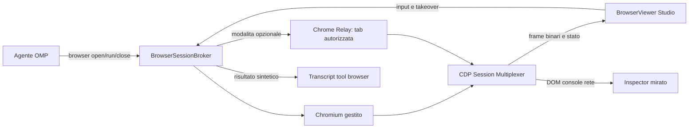

# Browser Studio — Specifica canonica

**Stato:** S38 implementato (contratto `browser-live-v1`); S39-S47 non implementati  
**Gate:** R23  
**Ultimo aggiornamento:** 2026-09-03  
**Owner documentale:** ogni agente che completa uno step S38-S47

Questo documento e la fonte autoritativa per l'implementazione del Browser Studio. Gli agenti assegnati agli step in `docs/PLAN.md` devono leggerlo prima di modificare codice e aggiornarlo al termine del proprio step con i dettagli realmente implementati. Non devono ripetere la ricerca sui competitor ne introdurre una seconda architettura.

## 1. Problema

Il tool `browser` del runtime OMP controlla oggi un processo Chromium/Chrome separato tramite Puppeteer e Chrome DevTools Protocol (CDP). Quando il browser e headed, Windows mostra una finestra desktop esterna. Studio riceve soltanto eventi discreti `tool_execution_start`, `tool_execution_update` e `tool_execution_end`, piu screenshot allegati al risultato.

Il viewer centrale esistente non puo ospitare quella sessione:

- `src/lib/components/PreviewViewer.svelte` renderizza prototipi locali in un iframe `srcdoc` sandboxed;
- `extensions/studio-diagram.ts` genera file statici sotto `proto/` e notifica Studio tramite file JSON;
- `src-tauri/src/previews.rs` osserva le notifiche e apre il prototipo;
- `src/lib/agent/tools/renderers/Browser.svelte` mostra solo riepilogo e screenshot del tool `browser` nel transcript.

`PreviewViewer` non ha navigazione HTTP generale, profilo, cookie, Windows Authentication o un endpoint CDP. Deve restare dedicato ai prototipi statici e non va trasformato in un browser.

## 2. Risultato di prodotto

Quando un agente invoca il tool standard `browser`:

1. il runtime apre o riusa un Chromium gestito senza finestra desktop;
2. Studio passa alla superficie Browser nella colonna centrale;
3. utente e agente vedono e controllano la stessa tab;
4. il primo input umano interrompe atomicamente l'agente;
5. login, password e CAPTCHA possono avvenire in takeover privato;
6. console, rete, elementi e azioni sono ispezionabili senza aprire DevTools completo;
7. quando serve una sessione autenticata personale, l'utente puo collegare una singola tab del proprio Chrome tramite OMP Browser Relay.

Il tool resta `browser`: non introdurre un tool concorrente `studio_browser`.

## 3. Decisioni vincolanti

Le decisioni seguenti sono gia state prese e non vanno riaperte durante gli step:

1. **Superficie distinta.** Creare un BrowserViewer dedicato; non estendere `PreviewViewer`.
2. **Motore predefinito.** Chromium gestito dal runtime OMP, senza finestra desktop, trasmesso dentro Studio.
3. **Coerenza multipiattaforma.** Non usare WebView2/WKWebView/WebKitGTK come motore automatico: cambierebbe comportamento per sistema operativo e non offrirebbe un CDP uniforme.
4. **Niente CEF nel bundle.** Non incorporare Chromium Embedded Framework dentro Tauri: peso, aggiornamenti di sicurezza e duplicazione del runtime non sono giustificati.
5. **Confine runtime/Studio.** Il runtime OMP possiede browser, CDP, profili, tab e broker; Studio possiede presentazione, input utente e inspector. Il CDP grezzo non viene esposto al frontend Svelte.
6. **Trasporto dedicato.** Frame live e input usano un canale locale autenticato separato dal transcript RPC. Gli eventi tool esistenti restano per lifecycle, risultato e fallback.
7. **Profilo per progetto, tab per chat.** Cookie e storage persistono per progetto; ownership di tab e controllo appartengono alla chat.
8. **Controllo esclusivo.** Agente e utente non inviano input contemporaneamente. Il primo input umano incrementa il control epoch e invalida le azioni agente obsolete.
9. **Ritorno esplicito.** Dopo il takeover l'agente riprende solo tramite “Restituisci controllo”.
10. **Takeover privato.** Durante input sensibile Studio continua a mostrare localmente la pagina, ma agente, transcript, registrazione, DOM, console e rete non ricevono dati.
11. **Origini.** Navigazione top-level automatica per `localhost` e `127.0.0.1`; nuova origine remota solo dopo consenso per progetto. Un redirect non autorizzato sospende l'agente.
12. **Chrome personale opzionale.** Collegare una tab scelta tramite OMP Relay; non controllare direttamente l'intero profilo e non copiarne i database.
13. **Inspector mirato.** Element picker, Console, Network, Actions, viewport, screenshot e registrazione; non incorporare Chrome DevTools completo.
14. **Fallback compatibile.** Runtime o Studio privi della capability live continuano a usare il renderer screenshot attuale.
15. **Nessun servizio cloud.** Broker, stream, profili e artefatti restano locali.

## 4. Riferimenti verificati

La ricerca e gia stata completata. Gli step non devono ripeterla.

### T3 Code

Pattern principale adottato:

- Chromium embedded;
- CDP e runtime Playwright iniettato;
- profili persistenti isolati;
- toolkit MCP browser;
- control epochs;
- input umano attendibile che interrompe l'agente.

Fonti:

- <https://github.com/pingdotgg/t3code/blob/main/apps/desktop/src/preview/BrowserSession.ts>
- <https://github.com/pingdotgg/t3code/blob/main/apps/desktop/src/preview/Manager.ts>
- <https://github.com/pingdotgg/t3code/blob/main/apps/desktop/src/preview/PickPreload.ts>
- <https://github.com/pingdotgg/t3code/blob/main/apps/server/src/mcp/toolkits/preview/tools.ts>

T3 Code e Electron: OMP Studio adotta control epochs, isolamento e UX, non la sua topologia `<webview>`.

### Cursor

Pattern adottato: sessione persistente per workspace e policy per origine.

- <https://cursor.com/docs/agent/tools/browser>

### Claude

Pattern adottato: browser pulito per sviluppo, Chrome personale opzionale e takeover manuale per login/CAPTCHA.

- <https://code.claude.com/docs/en/chrome>
- <https://platform.claude.com/docs/en/agents-and-tools/tool-use/browser-use-tool>

### Hermes

Pattern adottato: broker autenticato, separazione driver/supervisor/controller e trattamento esplicito di dialoghi e frame cross-origin.

- <https://github.com/NousResearch/hermes-agent/blob/main/website/docs/user-guide/features/browser.md>
- <https://github.com/NousResearch/hermes-agent/blob/main/website/docs/developer-guide/browser-supervisor.md>
- <https://github.com/NousResearch/hermes-agent/blob/main/gateway/browser_control_broker.py>

### Codex

Pattern adottato: policy per origine, capability granulari e takeover senza raccolta di credenziali.

- <https://github.com/openai/codex/blob/main/codex-rs/app-server-protocol/src/protocol/v2/browser_use_config.rs>
- <https://openai.com/index/operator-system-card/>
- <https://developers.openai.com/api/docs/guides/tools-computer-use>

### Anti-pattern

Cline lancia Chrome esterno o Chromium headless senza superficie live integrata; OpenHands mostra snapshot ma non offre takeover completo. Questi modelli non soddisfano il requisito.

- <https://github.com/cline/cline/blob/main/apps/vscode/src/services/browser/BrowserSession.ts>
- <https://github.com/OpenHands/OpenHands/blob/main/src/stores/browser-store.ts>

## 5. Confine dei repository

`omp-studio-app` contiene UI, backend Tauri, estensioni e questa specifica. Il browser tool, il tab supervisor e il Relay appartengono al runtime upstream `can1357/oh-my-pi`.

Il sorgente upstream non e presente in questo workspace. Gli step runtime richiedono un checkout separato del repository OMP e devono produrre un commit/PR upstream identificabile. Non vendorizzare il runtime dentro `omp-studio-app`, non modificare `%LOCALAPPDATA%/omp/omp.exe` e non salvare una copia del sorgente sotto `ricerca/`.

Checkout usato da S38: `../oh-my-pi-upstream`, fratello di `omp-studio-app` e fuori dal repository. I test di Studio lo cercano li, oppure al percorso indicato da `OMP_UPSTREAM_ROOT`; se manca, il confronto della fixture condivisa viene saltato e dichiarato come tale, mai simulato con uno shim Studio-only.

Ogni cambio di protocollo deve essere documentato qui prima di essere consumato da Studio. La compatibilita tra release viene negoziata tramite capability, non tramite assunzioni sulla versione installata.

## 6. Architettura target



### 6.1 Responsabilita del runtime OMP

- lifecycle Chromium e target CDP;
- profili persistenti per progetto;
- ownership delle tab per chat;
- serializzazione e cancellazione delle azioni;
- control epochs;
- stream con backpressure;
- gating del takeover privato;
- policy delle origini lato agente;
- popup, dialoghi, download e upload;
- connessione a una tab Chrome Relay autorizzata;
- sanitizzazione dei dati prima di renderli disponibili all'agente.

### 6.2 Responsabilita di Studio

- apertura automatica della superficie Browser;
- rendering dei frame;
- mapping input pannello → pixel CSS viewport;
- toolbar, viewport e tab;
- stato agente/utente/privato;
- richieste di consenso per origini remote;
- inspector e selezione elementi;
- visualizzazione console, rete, azioni e download;
- canale privato locale che non alimenta transcript o modello.

## 7. Modello di dominio

Identificatori obbligatori:

```typescript
interface BrowserSessionIdentity {
  projectId: string;
  chatSessionId: string;
  browserSessionId: string;
  tabId: string;
}

type BrowserMode = "managed" | "chrome-relay";
type BrowserController = "agent" | "user" | "private-user";
```

Stato minimo della tab:

```typescript
interface BrowserTabState extends BrowserSessionIdentity {
  mode: BrowserMode;
  controller: BrowserController;
  controlEpoch: number;
  url: string;
  title: string;
  loading: boolean;
  originPermission: "local" | "granted" | "pending" | "denied";
  viewport: {
    width: number;
    height: number;
    deviceScaleFactor: number;
  };
  streamState: "detached" | "connecting" | "live" | "private" | "failed";
}
```

I nomi sono stati confermati in S38 e implementati identici nei due repository
(`src/lib/agent/browser-live.ts` in Studio,
`packages/coding-agent/src/modes/rpc/browser-live.ts` nel runtime), con
l'aggiunta di `BrowserOriginPermission`, `BrowserViewport` e dei parser severi
`parseBrowserSessionIdentity` e `parseBrowserTabState`: un valore fuori
dall'enum fa scartare il frame invece di degradare a un default. Gli
scostamenti sono elencati nella sezione 18.

## 8. Protocollo live

### 8.1 Handshake — implementato in S38

L'handshake estende quello gia esistente (`ready` → `negotiate_protocol`) senza
sostituirlo. Il frame `ready` guadagna un campo **opzionale** `capabilities`:

```json
{
  "type": "ready",
  "protocolVersion": 1,
  "supportedProtocolVersions": [1, 2],
  "maxFrameBytes": 1048576,
  "maxReassembledFrameBytes": 67108864,
  "capabilities": [
    {
      "name": "browser-live",
      "version": 1,
      "transports": ["local-websocket"],
      "features": ["binary-frames", "control-epochs", "private-takeover", "inspector", "chrome-relay"]
    }
  ]
}
```

Il runtime annuncia `browser-live` **soltanto** quando un provider e registrato
(`registerBrowserLiveProvider`). Finche il broker di S39/S40 non esiste il campo
e assente e il frame e byte-per-byte quello che i client precedenti gia
leggono.

Studio, sul frame `ready`, calcola l'intersezione in locale e manda
`negotiate_capabilities` solo se qualcosa e realmente negoziabile:

```json
{ "id": "s3", "type": "negotiate_capabilities", "capabilities": [ /* offerta di Studio */ ] }
```

La risposta e autorevole:

```json
{ "id": "s3", "type": "response", "command": "negotiate_capabilities", "success": true,
  "data": { "accepted": [ /* intersezione */ ] } }
```

Regole dell'intersezione, identiche riga per riga nei due repository:

- nome e versione devono coincidere esattamente;
- almeno un trasporto deve essere condiviso, altrimenti la capability e
  scartata (transports mancanti = inutilizzabile);
- le feature sono l'intersezione, e un'intersezione vuota resta valida;
- l'ordine del risultato e quello dell'offerente, mai quello del richiedente;
- nomi ignoti, versioni diverse e voci malformate cadono in silenzio.

Il ticket monouso non viaggia in un evento: Studio lo chiede esplicitamente con
`browser_live_ticket`, che senza negoziazione fallisce con
`BROWSER_LIVE_NOT_NEGOTIATED` e, negoziato ma senza provider, con
`BROWSER_LIVE_UNAVAILABLE`.

```typescript
interface BrowserLiveTicket {
  ticketId: string;
  token: string;          // segreto monouso, mai in log, transcript o artifact
  endpoint: string;       // ws:// su 127.0.0.1, localhost o [::1]
  transport: "local-websocket";
  identity: BrowserSessionIdentity;
  runtimePid: number;
  issuedAtMs: number;
  expiresAtMs: number;    // TTL 30 s
}
```

Il ticket e a **presentazione singola**: il primo tentativo di riscatto consuma
il token qualunque sia l'esito, quindi un token trapelato non e riproducibile
ne utilizzabile per sondare identita. Gli esiti sono `TICKET_INVALID`,
`TICKET_EXPIRED`, `TICKET_ALREADY_REDEEMED`, `TICKET_IDENTITY_MISMATCH`.
Endpoint non loopback vengono rifiutati sia all'emissione sia prima della
connessione (`ENDPOINT_NOT_LOOPBACK`). Il server non ascolta su interfacce di
rete esterne.

Studio non inventa mai `projectId`: l'identita e quella ricevuta dal runtime
con `browser_live_tab_state`, e viene rispedita invariata nella richiesta di
ticket.

### 8.2 Separazione dei canali

- RPC OMP: start/update/end del tool, errori, risultato persistibile e fallback.
- Canale live: frame binari, stato effimero, input, takeover e inspector.
- Canale privato: stesso trasporto locale autenticato, ma subscriber agente, transcript e recorder sono disabilitati dal broker.

Non inserire frame base64 ad alta frequenza nel JSON RPC.

Lifecycle definito in S38 e trasportato dal canale RPC (nessun frame binario,
nessun segreto):

```typescript
type BrowserLiveEventType = "browser_live_tab_state" | "browser_live_closed";
type BrowserLiveCloseReason = "closed" | "session-ended" | "runtime-shutdown" | "revoked" | "failed";
```

`browser_live_tab_state` porta un `BrowserTabState` completo;
`browser_live_closed` porta identita e motivo. Studio scarta entrambi finche
`browser-live` non e negoziato: e il fail-closed, non una svista.

### 8.3 Frame

Ogni frame include metadati equivalenti a:

```typescript
interface BrowserFrameMeta {
  sequence: number;
  browserSessionId: string;
  tabId: string;
  timestampMs: number;
  viewportWidth: number;
  viewportHeight: number;
  deviceScaleFactor: number;
  scrollX: number;
  scrollY: number;
  controlEpoch: number;
  privacy: "normal" | "private";
  mimeType: "image/jpeg" | "image/png";
}
```

La coda adotta `newest frame wins`: un client lento non deve accumulare frame obsoleti. Lo screenshot richiesto dal tool viene acquisito direttamente dal browser al viewport dichiarato, non dal canvas ridimensionato di Studio.

### 8.4 Fallback non negoziato — verificato in S38

Quando `browser-live` non e negoziato — runtime precedente, Studio precedente,
versione o trasporto non condivisi — nulla cambia rispetto a oggi:

- il tool resta `browser` e il suo ciclo di vita resta
  `tool_execution_start` / `tool_execution_update` / `tool_execution_end`;
- `src/lib/agent/tools/renderers/Browser.svelte` continua a disegnare
  `result.details.screenshots` e i blocchi immagine del risultato;
- Studio non manda `negotiate_capabilities`, non chiede ticket e non apre
  nessun endpoint.

### 8.5 Codici di errore

`BROWSER_LIVE_UNAVAILABLE`, `BROWSER_LIVE_NOT_NEGOTIATED`, `TICKET_INVALID`,
`TICKET_EXPIRED`, `TICKET_ALREADY_REDEEMED`, `TICKET_IDENTITY_MISMATCH`,
`ENDPOINT_NOT_LOOPBACK`, `SESSION_NOT_FOUND`, `TAB_NOT_FOUND`,
`CONTROL_INTERRUPTED`, `PRIVATE_TAKEOVER_ACTIVE`, `ORIGIN_NOT_ALLOWED`.

L'elenco e pinnato nella fixture condivisa: aggiungere un codice senza
aggiornarla fa fallire i test dei due repository.

## 9. Profili, processi e tab

Profilo persistente fuori dal repository:

```text
%LOCALAPPDATA%/omp-studio/browser-profiles/<project-id>/
```

Equivalenti platform-specific vanno usati su macOS e Linux.

Persistono per progetto:

- cookie;
- localStorage;
- IndexedDB;
- service worker;
- permessi approvati.

Non persistono come stato globale:

- control epoch;
- controller;
- registrazioni;
- ownership agente;
- tab di chat chiuse.

Le tab sono indirizzate da `chatSessionId + tabName`, anche se il tool continua a esporre il nome ergonomico `main`. Due chat non possono controllare la stessa tab per collisione di nome.

Il browser viene avviato lazy, senza finestra desktop, e terminato dopo inattivita preservando il profilo. Il password manager del browser gestito resta disabilitato. Studio offre cancellazione esplicita dei dati browser del progetto.

## 10. Control epochs

Ogni azione agente acquisisce l'epoch corrente e lo verifica prima e dopo ogni comando significativo. Le chiamate CDP passano dal broker; un client Puppeteer non deve avere un percorso alternativo che aggiri il controllo.

Primo input umano:

```text
request_takeover(expectedEpoch, bufferedInput)
```

Transizione atomica:

1. verificare `expectedEpoch`;
2. incrementare l'epoch;
3. bloccare nuovi comandi agente;
4. cancellare o chiudere in sicurezza il comando attivo;
5. restituire `CONTROL_INTERRUPTED` all'agente;
6. inoltrare una sola volta l'input umano bufferizzato;
7. impostare controller `user`.

Il pannello deve mostrare sempre chi controlla la tab. Il ritorno all'agente richiede un comando esplicito e produce un nuovo snapshot semantico prima della ripresa.

## 11. Takeover privato

Attivazione:

- focus su campo password;
- CAPTCHA riconosciuto;
- richiesta login/credenziali del tool;
- pulsante manuale.

Durante il takeover privato:

- il BrowserViewer continua a ricevere frame su canale locale;
- l'agente non riceve frame, DOM, accessibility tree, console, rete o screenshot;
- nessuna immagine entra nel transcript;
- registrazione e buffer diagnostici vengono sospesi e ripuliti;
- il tool vede soltanto `PRIVATE_TAKEOVER_ACTIVE`;
- la riattivazione e manuale.

La modalita privata non deve rendere cieco l'utente e non deve affidarsi solo a mascherare i tasti.

## 12. Origini e sicurezza

La policy governa la navigazione top-level dell'agente, non blocca indiscriminatamente CDN e risorse secondarie necessarie all'applicazione.

- `http://localhost:*` e `http://127.0.0.1:*`: consentiti automaticamente;
- origini remote: consenso una tantum per progetto;
- redirect top-level verso origine non autorizzata: sospensione prima di proseguire;
- grant revocabili dalle impostazioni del progetto;
- header `Authorization`, cookie, token e valori sensibili sempre redatti;
- body di rete disponibile solo su richiesta e con limiti di dimensione;
- URL, titoli e testo pagina sono input non attendibili e non vanno promossi a istruzioni di sistema.

Il frontend Svelte non riceve segreti del broker ne un endpoint CDP utilizzabile liberamente. Ticket e capability falliscono chiusi alla disconnessione.

## 13. BrowserViewer

La colonna centrale espone superfici distinte `Browser`, `Preview` e `File`. `browser open` seleziona automaticamente Browser senza distruggere lo stato delle altre superfici.

Toolbar minima:

- back, forward, reload;
- URL e stato caricamento;
- selettore tab;
- modalita `Browser Studio` / `Chrome personale`;
- viewport responsive e device scale factor;
- stato `Agente`, `Utente`, `Privato`;
- `Prendi controllo` / `Restituisci controllo`;
- element picker;
- screenshot;
- registrazione;
- apertura inspector.

La superficie live mostra cursore e click dell'agente. Input mouse, tastiera, scroll, drag e touch vengono convertiti in coordinate CSS del viewport usando i metadati del frame confermato, non le dimensioni visive del canvas.

## 14. Inspector mirato

### Element picker

Produce contesto strutturato:

```text
tag, role, accessibleName, text, selector, boundingBox,
computedStyles rilevanti, componente React se disponibile,
screenshot ritagliato
```

Il contesto puo essere allegato al prompt senza ricopia manuale.

### Console

- ring buffer limitato;
- errori e warning deduplicati;
- stack trace;
- valori sensibili redatti;
- invio selettivo al prompt.

### Network

- URL, metodo, stato, durata e tipo risorsa;
- body solo su richiesta;
- header sensibili redatti;
- filtri per errori e richieste lente;
- invio selettivo al prompt.

### Actions

Timeline condivisa di navigazioni, azioni agente, takeover, privacy, dialoghi, download e cambio tab.

## 15. Dialoghi, popup e file

- `alert`, `confirm`, `prompt`, `beforeunload`: evento esplicito e risposta tracciata;
- popup: nuova tab della stessa chat;
- download: artifact associato alla chat, con conferma per origine remota;
- upload: file scelto dall'utente o gia autorizzato, senza accesso libero al filesystem;
- clipboard, geolocalizzazione e notifiche: capability e permessi distinti;
- recording: artifact video locale con stato e percorso espliciti.

## 16. Chrome personale tramite Relay

Flusso vincolante:

1. l'utente sceglie `Usa il mio Chrome`;
2. Studio mostra le tab collegabili tramite l'estensione Relay;
3. l'utente autorizza una tab specifica;
4. il Relay emette un ticket monouso legato a progetto, chat e target;
5. Studio mostra la stessa tab tramite stream;
6. control epochs e takeover privato restano attivi;
7. `Disconnetti` revoca immediatamente il target.

Non copiare il profilo, non aprire il database cookie e non concedere accesso implicito alle altre tab. La tab originale puo restare visibile o in background nel Chrome dell'utente, ma Studio non apre una nuova finestra esterna.

## 17. Compatibilita e verifica end-to-end

La feature e completa solo quando sono osservati almeno questi scenari:

1. managed mode non apre finestre browser desktop;
2. `browser open/run/close` controlla la stessa tab mostrata in Studio;
3. resize e DPI scaling non spostano i click;
4. il primo input umano interrompe l'azione agente e viene applicato una volta sola;
5. durante takeover privato l'utente vede la pagina ma transcript e modello non ricevono dati;
6. profili di due progetti non condividono cookie o storage;
7. tab omonime di due chat non collidono;
8. redirect remoto non autorizzato sospende l'agente;
9. dialoghi, popup, download e upload hanno stati espliciti;
10. Console, Network e picker derivano dalla stessa tab e dallo stesso viewport;
11. Chrome Relay controlla soltanto la tab autorizzata;
12. runtime/Studio senza `browser-live-v1` mantengono il renderer screenshot attuale;
13. crash o chiusura Studio revocano ticket e non lasciano processi orfani;
14. smoke reale su Windows e almeno una verifica sulle altre piattaforme supportate.

Stato per S38 (contratto). Lo scenario 12 e osservato, non solo dedotto:

- `omp.exe` installato (runtime precedente) emette
  `{"type":"ready","protocolVersion":1,"supportedProtocolVersions":[1,2],"maxFrameBytes":1048576,"maxReassembledFrameBytes":67108864}`,
  senza `capabilities`: Studio non manda `negotiate_capabilities` e resta sul
  renderer screenshot;
- il runtime compilato dal branch S38 (`bun src/cli.ts --mode rpc-ui`) emette lo
  stesso frame byte per byte, risponde a `negotiate_capabilities` con
  `{"accepted":[]}` e rifiuta `browser_live_ticket` con
  `BROWSER_LIVE_NOT_NEGOTIATED`, perche nessun provider e registrato prima di
  S39;
- test di contratto verdi nei due repository: 267 test in Studio
  (`test/browser-live-contract.test.ts`, incluso il confronto byte a byte della
  fixture con il checkout runtime) e 38 test nel runtime
  (`packages/coding-agent/test/browser-live-contract.test.ts`), piu `tsgo
  --noEmit` e `biome check` sui file toccati;
- suite RPC preesistenti del runtime rieseguite: unico fallimento e il test
  Fireworks dipendente dalla rete, che fallisce identico anche sul commit base
  `311b390`.

La combinazione "runtime nuovo con provider registrato + Studio nuovo" e
coperta dai test con provider iniettato: diventa osservabile end-to-end con
S39/S40. Gli scenari 1-11 e 13-14 restano aperti.

### ContrattiImmobili

Per componenti serviti localmente, Browser Studio naviga verso il server di sviluppo. Per l'app completa, le regole del progetto restano vincolanti: l'agente non pubblica o avvia autonomamente IIS. L'utente rende disponibile l'URL; Browser Studio lo verifica. Se Windows Authentication non funziona nel profilo gestito, si usa una tab Chrome personale autorizzata tramite Relay.

## 18. Registro implementativo

Ogni step aggiunge una voce senza riscrivere la storia:

| Data | Step | Repository/commit | Contratto effettivo | Scostamenti e decisioni |
|---|---|---|---|---|
| 2026-09-02 | Pianificazione | `omp-studio-app` | Gate R23 e task S38-S47 | Specifica iniziale; nessun codice implementato |
| 2026-09-03 | S38 | `oh-my-pi` (checkout `../oh-my-pi-upstream`, branch `feat/s38-browser-live-v1-contract`, commit `e0e1a9d` su base `311b390`) + `omp-studio-app` (working tree, non committato al momento della stesura) | `browser-live-v1`: `capabilities` opzionale nel frame `ready`, comandi `negotiate_capabilities` e `browser_live_ticket`, identita `projectId/chatSessionId/browserSessionId/tabId`, `BrowserTabState`, `BrowserFrameMeta`, eventi `browser_live_tab_state` e `browser_live_closed`, 12 codici di errore, ticket loopback monouso con TTL 30 s. Fixture condivisa `browser-live-v1.json` identica nei due repository. | Capability annunciata solo con provider registrato (nessuno in S38); ticket come risposta e non come evento; presentazione singola del token; checkout upstream spostato fuori da `ricerca/`; nessuna PR upstream (branch locale). Dettaglio in `DECISIONS.md`, voce "S38 — Scostamenti". |

Uno step non e concluso finche questa tabella, le sezioni tecniche interessate e `docs/PLAN.md` non riflettono il comportamento effettivo. Se il codice rende una parte della specifica non valida, aggiornare prima la decisione in `docs/DECISIONS.md`; non lasciare documentazione aspirazionale presentata come implementata.

## 19. Sequenza dei task

| Step | Ambito | Dipende da | Deliverable principale |
|---|---|---|---|
| S38 | Contratto `browser-live-v1` | Gate R23 | Schema versionato e fixture compatibilita |
| S39 | Runtime broker e Chromium gestito | S38 | Sessioni/profili/tab senza finestra |
| S40 | Stream live e backpressure | S39 | Frame binari e stato tab |
| S41 | BrowserViewer centrale | S40 | Superficie live e toolbar |
| S42 | Control epochs e takeover privato | S41 | Arbitraggio completo agente/utente |
| S43 | Origini, capability e redazione | S42 | Confini di sicurezza fail-closed |
| S44 | Inspector mirato | S43 | Picker, Console, Network, Actions |
| S45 | Dialoghi, popup, file e recording | S44 | Edge case browser espliciti |
| S46 | Chrome Relay su tab scelta | S45 | Sessione personale opzionale |
| S47 | Hardening e verifica multipiattaforma | S46 | Matrice E2E, recovery e docs finali |

Gli step sono strettamente sequenziali. Ogni task in `.omp/tasks.json` deve citare questo documento e aggiornare il registro implementativo prima di essere marcato completato.
