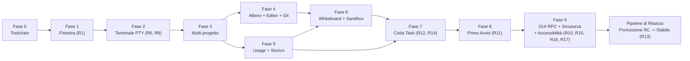

# OMP Studio — Piano di lavoro

Documento operativo. Traccia l'evoluzione del prodotto, il piano di stabilizzazione della 1.2.1 e i criteri di accettazione necessari prima di ogni release stabile.

**Leggere prima:** `PRODUCT.md` (visione e perimetro), `DESIGN.md` (sistema visivo e token), `ARCHITECTURE.md` (architettura tecnica).

---

## Piano di stabilizzazione 1.2.1 — audit NO-GO

**Stato:** pianificato. La pubblicazione stabile resta bloccata finche tutti i P0 e P1 sono chiusi, la matrice di verifica e verde e il secondo audit non rileva blocker.

Le fasi 0-9 piu sotto restano come storico dell'implementazione. Le loro spunte non sostituiscono i gate correnti: le dichiarazioni non piu vere vengono riallineate nello step S30.

### Metodo di esecuzione

- Un solo step e attivo alla volta. Ogni step termina con il proprio test comportamentale mirato prima di passare al successivo.
- `Main` mantiene ownership dei file condivisi e integra ogni risultato. Uno step marcato `Subagente` puo essere implementato in worktree isolato; il subagente non esegue suite globali.
- Gli step che condividono `setup.rs`, `session.svelte.ts`, `TopBar.svelte`, `AskCard.svelte`, `tauri.conf.json` o i workflow sono sempre serializzati.
- Nessuna failure viene trasformata in default distruttivo, warning ignorato o fallback implicito.
- Nessun bump, commit, push o tag durante la remediation. Changelog, decisione di pubblicazione e pipeline arrivano solo dopo la chiusura tecnica completa.

### Definition of done per step

1. La causa radice e corretta senza alias, shim o percorso legacy rimasto attivo.
2. Tutti i caller coinvolti sono migrati.
3. Esiste un test solo quando protegge un contratto osservabile o una regressione plausibile.
4. Il test mirato e lo smoke del percorso modificato passano.
5. Errori, rollback e stato persistito sono verificati, non solo il percorso felice.
6. Il diff non introduce nuovi warning, permessi o dipendenze non giustificati.

### Fase A — P0: integrita, dati e pipeline

- [x] **S01 — Installer OMP fail-closed** (`Main`, review sicurezza)
  Intervenire in `src-tauri/src/setup.rs` e `SetupModal.svelte`: rendere obbligatorio un digest attendibile prima dell'installazione, scaricare nello stesso filesystem della destinazione, verificare SHA-256, sostituire atomicamente e avviare OMP solo dopo la verifica. La UI deve distinguere download, verifica e installazione.
  **Accettazione:** hash assente, manifest irraggiungibile, mismatch e asset inatteso non modificano l'eseguibile esistente; hash valido installa e avvia; test per tutti e quattro i casi.

- [x] **S02 — Configurazioni lossless e atomiche** (`Main`, review sicurezza)
  Rifattorizzare `src-tauri/src/models_ops.rs`: distinguere file assente da errore di lettura, rifiutare YAML/JSON invalido, preservare campi sconosciuti, serializzare una sola volta e sostituire con temp file, flush e rename atomico. Applicare lo stesso contratto ai provider custom e impedire write concorrenti.
  **Accettazione:** config invalida o illeggibile resta byte-per-byte invariata; campi estranei sopravvivono; una failure di replace conserva il file precedente; test di concorrenza e rollback.

- [x] **S03 — Smoke test realmente multipiattaforma** (`Subagente`)
  Rendere esplicita la piattaforma nei helper di `test/context-menu-and-tree.test.ts` e coprire semantica Windows case-insensitive e POSIX case-sensitive senza dipendere dal runner.
  **Accettazione:** lo stesso test passa su macOS, Windows e Linux; il job `resolve` della release non fallisce prima della build.

**Gate A:** S01-S03 completati; relativi test Rust/TS verdi; nessun percorso fail-open o test dipendente da `process.platform`.

### Fase B — P1: confini di sicurezza

- [x] **S04 — Rimuovere `cmd /C` dai launcher Windows** (`Subagente`, review sicurezza)
  In `src-tauri/src/external.rs` avviare editor e terminali direttamente con argomenti strutturati. Non concatenare mai path in un linguaggio shell.
  **Accettazione:** cartelle contenenti spazio, `&`, `|`, `^`, parentesi e Unicode vengono aperte letteralmente; nessun comando aggiuntivo viene interpretato.

- [x] **S05 — Confinare Apply Rule contro symlink** (`Subagente`, review sicurezza)
  Riutilizzare il resolver canonico di `projects` in `rules_ops.rs`; rifiutare symlink foglia e target canonici fuori dalla root.
  **Accettazione:** traversal e symlink esterno falliscono senza modificare il target; file regolare interno continua a funzionare.

- [x] **S06 — Allowlist dei protocolli esterni** (`Main`)
  Centralizzare l'apertura URL della sessione agente: consentire automaticamente solo `https:` e `http:`; bloccare URI malformati e richiedere un flusso esplicito per qualunque schema aggiuntivo realmente necessario.
  **Accettazione:** `file:`, `javascript:`, `data:` e custom scheme non vengono aperti da eventi RPC; URL web validi restano funzionanti.

- [x] **S07 — Chiudere le vulnerabilita runtime frontend** (`Subagente`, review sicurezza)
  Aggiornare DOMPurify e le dipendenze che ne fissano copie vulnerabili, rigenerare il lockfile e valutare separatamente gli advisory non raggiungibili nella build Tauri statica.
  **Accettazione:** nessun advisory high/moderate raggiungibile nel runtime distribuito; i test di sanitizzazione SVG/HTML/Mermaid continuano a passare.

**Gate B:** test ostili su path, symlink, URL e sanitizzazione verdi; `bun audit` senza vulnerabilita high/moderate applicabili al runtime.

### Fase C — setup e adattamento piattaforma

- [x] **S08 — Window chrome nativo su macOS** (`Subagente UI`, integrazione `Main`)
  Rendere la shell platform-aware: controlli custom minimize/maximize/close solo su Windows; traffic light, drag region, fullscreen e double-click titlebar conformi a macOS. Usare configurazione Tauri specifica per piattaforma invece di un unico `decorations: false`.
  **Accettazione:** screenshot e smoke reali su entrambe le piattaforme; nessun controllo Windows su macOS; snap/maximize Windows e fullscreen macOS funzionanti.

- [x] **S09 — Attendere l'idratazione dei progetti** (`Main`)
  Esporre uno stato/promise `ready` dallo store progetti e serializzare `checkSetupContract` dopo il caricamento persistito.
  **Accettazione:** un utente con progetti salvati non vede mai il setup per uno stato vuoto transitorio; primo avvio reale continua ad aprirlo.

- [x] **S10 — Copy e percorsi setup per piattaforma** (`Subagente UI`)
  Eliminare `%LOCALAPPDATA%` dal testo macOS e derivare copy e destinazioni dallo stato restituito dal backend, senza stringhe di percorso duplicate nel frontend.
  **Accettazione:** ogni piattaforma mostra il percorso effettivo; nessun riferimento Windows compare su macOS.

- [x] **S11 — Installazione font nativa per piattaforma** (`Main`)
  Separare Windows e macOS: su macOS usare la directory font utente e il meccanismo di registrazione supportato dal sistema, senza `~/.local/share/fonts` o `fc-cache`.
  **Accettazione:** font disponibile in una nuova sessione dell'app senza logout; failure di registrazione e mostrata e non dichiarata come successo.

- [x] **S12 — PATH OMP sicuro nelle shell Unix** (`Main`)
  Rendere `~/.omp/bin` utilizzabile anche nei terminali esterni supportati, con modifica idempotente e delimitata dei profili shell oppure con un meccanismo nativo meno invasivo. Non alterare righe utente esistenti.
  **Accettazione:** nuova shell zsh trova `omp`; seconda esecuzione non duplica il blocco; rollback documentato e testato con HOME temporanea.

- [x] **S13 — Fallback editor basato sull'exit status** (`Subagente`)
  Considerare riuscito `open -a` solo dopo un exit code positivo; provare il fallback successivo su errore reale.
  **Accettazione:** app assente attiva il fallback; app presente apre la directory una sola volta.

**Gate C:** setup pulito e setup di ritorno provati su macOS; smoke equivalente Windows in CI; nessuna mutazione del profilo utente usato dai test.

### Fase D — interazioni Ask e protocollo RPC

- [x] **S14 — Vietare risposte Ask implicite** (`Subagente Agent UI`)
  Spostare formattazione e validazione in un modulo di dominio importabile; nessuna domanda senza scelta e nessun `Other` vuoto puo avanzare o essere inviato.
  **Accettazione:** Next/Confirm/Submit riflettono la validita; zero fallback alla prima opzione; multi-question e custom answer coperti.

- [x] **S15 — Queue delle risposte request-scoped** (`Main`)
  Associare ogni risposta accodata all'ID della richiesta e cambiare stato solo dopo conferma RPC. Su errore ripristinare richiesta, selezioni e focus; non riutilizzare mai la risposta con un evento successivo.
  **Accettazione:** failure sulla prima risposta non auto-risponde la seconda; retry esplicito invia gli stessi dati una sola volta.

**Gate D:** test end-to-end del wizard con domande parziali, `Other`, failure RPC, retry e nuova richiesta.

### Fase E — release engineering e trust degli installer

- [ ] **S16 — Firma e notarizzazione macOS** (`Main`, prerequisito esterno — workflow e verifiche configurati)
  Integrare Developer ID, hardened runtime, notarizzazione e stapling nel workflow. I secret devono essere solo GitHub Actions secrets e mai scritti nel repository.
  **Accettazione:** `codesign --verify --deep --strict`, `spctl --assess` e verifica notarizzazione passano sul DMG scaricato. Richiede certificato/account Apple disponibili.

- [ ] **S17 — Firma Authenticode Windows** (`Main`, prerequisito esterno — workflow e verifiche configurati)
  Integrare firma timestamped dell'installer NSIS e verifica post-upload.
  **Accettazione:** `Get-AuthenticodeSignature` restituisce `Valid` sull'asset pubblicato. Richiede certificato di code signing disponibile.

- [x] **S18 — Gate CI completi prima del packaging** (`Subagente workflow`, integrazione `Main`)
  Aggiungere al workflow typecheck, smoke TS, test Rust, Clippy, audit dipendenze, version check e diff hygiene prima dei job di build. Evitare duplicazioni tra Nightly, RC e stable tramite script condivisi gia presenti o un unico job riusabile.
  **Accettazione:** ogni gate viene fatto fallire intenzionalmente in una prova controllata e impedisce la pubblicazione.

- [x] **S19 — Pin delle GitHub Actions a SHA** (`Subagente workflow`)
  Sostituire tag mobili con commit SHA verificati, mantenendo il numero di versione in commento per leggibilita.
  **Accettazione:** nessun `uses:` di terze parti resta su tag o branch mobile.

- [x] **S20 — Ridurre CSP e capability Tauri** (`Main`, review sicurezza)
  Inventariare codice che richiede `unsafe-inline`, `unsafe-eval`, opener e core permissions; rimuovere cio che non e indispensabile e restringere scope/comandi. Mantenere il test di copertura ACL.
  **Accettazione:** app completa funzionante con policy minima documentata; test ACL verde; nessun allargamento wildcard.

**Gate E:** pipeline produce installer firmati verificabili e non pubblica se un gate precedente fallisce.

### Fase F — correttezza filesystem e durabilita

- [x] **S21 — Rinomina case-only su macOS** (`Subagente`)
  Gestire filesystem case-insensitive con rename in due passi tramite nome temporaneo collision-safe e rollback.
  **Accettazione:** `foo` → `Foo` funziona su APFS predefinito; collisioni reali falliscono; nessun file temporaneo resta dopo errore.

- [x] **S22 — Persistenza task crash-safe su Windows** (`Subagente Rust`)
  Sostituire il fallback remove-then-rename con una primitive di replace sicura o una strategia con backup e rollback nello stesso filesystem.
  **Accettazione:** failure in ogni punto conserva almeno una copia valida della coda; test fault-injection dove possibile.

- [x] **S23 — Errori resume tipizzati** (`Main`)
  Verificare il contratto OMP disponibile e centralizzare la classificazione degli errori. Preferire code/eventi strutturati; se OMP espone solo stderr, isolare un parser versionato e testato invece del confronto letterale nel componente.
  **Accettazione:** variazioni innocue di quoting, prefisso e whitespace non rompono il recupero; errori diversi non vengono confusi con sessione assente.

- [x] **S24 — Target `contenteditable` annidati** (`Subagente frontend`)
  Rilevare l'editing tramite `closest()` e percorso evento, mantenendo il menu nativo per qualsiasi discendente editabile.
  **Accettazione:** click destro su testo e child element annidato conserva cut/copy/paste nativi; aree non editabili usano il menu Studio.

**Gate F:** suite filesystem e menu contestuale verde su piattaforme supportate.

### Fase G — accessibilita e performance

- [x] **S25 — Semantica e tastiera Ask** (`Subagente accessibilita`)
  Implementare `listbox/option` coerenti, `aria-selected`, `aria-multiselectable` quando serve e roving tabindex; in alternativa usare controlli radio/checkbox nativi mantenendo il layout visuale.
  **Accettazione:** Arrow, Home, End, Space/Enter e annunci screen reader funzionano; una sola opzione e nel tab order.

- [x] **S26 — Tablist dei progetti** (`Subagente accessibilita`)
  Applicare `tablist/tab/tabpanel`, `aria-selected`, relazione al pannello e navigazione roving senza rompere drag, reorder e shortcut.
  **Accettazione:** switch completo solo tastiera, focus visibile e ordine coerente dopo riordino.

- [x] **S27 — File tree accessibile** (`Subagente accessibilita`)
  Implementare `tree/treeitem/group`, livelli, espansione, selezione, roving tabindex e tasti Arrow/Home/End/Enter. Preservare lazy loading e menu contestuale.
  **Accettazione:** navigazione completa senza mouse su albero profondo; focus stabile dopo rename, delete e refresh.

- [x] **S28 — Code splitting delle superfici pesanti** (`Subagente performance`)
  Misurare i chunk, caricare Monaco, Mermaid e worker solo all'apertura delle rispettive superfici e rimuovere preload involontari.
  **Accettazione:** Monaco/Mermaid assenti dal percorso iniziale; nessun chunk iniziale non-worker supera 1 MiB senza giustificazione; editor e diagrammi restano funzionali.

**Gate G:** audit tastiera/screen reader sui tre widget e confronto bundle prima/dopo allegato alla review.

### Fase H — test, lint e documentazione

- [x] **S29 — Test Ask contro codice di produzione** (`Subagente test`)
  Estrarre helper puri usati dal componente e importarli nei test; eliminare copie del comportamento dentro `test/ask-tool.test.ts`.
  **Accettazione:** la regressione della risposta implicita fa fallire il test; nessuna implementazione duplicata.

- [x] **S30 — Riallineare gate e architettura documentata** (`Subagente documentazione`)
  Correggere `PLAN.md` e `ARCHITECTURE.md` affinche decorazioni finestra, CSP, setup, accessibilita e gate riflettano il codice verificato, distinguendo storico e stato corrente.
  **Accettazione:** nessuna voce `SUPERATO` o `[x]` contraddice configurazione o test correnti.

- [x] **S31 — Clippy a zero warning** (`Subagente meccanico`, integrazione `Main`)
  Correggere i 16 finding senza `allow` generici e senza cambiare semantica o drop order non verificato.
  **Accettazione:** `cargo clippy --all-targets -- -D warnings` passa.

- [x] **S32 — Diff hygiene** (`Subagente meccanico`)
  Rimuovere il trailing whitespace rilevato e impedire recidive nel gate CI.
  **Accettazione:** `git diff --check v1.2.0..HEAD` e il diff della remediation passano.

- [x] **S33 — Compatibilita automatica del contratto setup** (`Main`)
  Versionare fixture/contratto OMP e aggiungere uno smoke che valida la minima e la corrente versione supportata, inclusi asset name, setup status e chiavi di configurazione.
  **Accettazione:** una variazione incompatibile dell'output o della config OMP fallisce prima del packaging con errore diagnostico.

**Gate H:** typecheck, lint, test e documentazione coerenti; zero warning ignorati.

### Fase I — verifica, candidate e stable

- [ ] **S34 — Matrice multipiattaforma completa** (`Main`)
  Eseguire su macOS arm64 locale e Windows x64 CI: setup pulito e di ritorno, topbar/windowing, Ask failure/retry, file operations, editor/terminal opener, updater, resume, firme e installazione reale.
  **Accettazione:** evidenza per ogni scenario; nessuno skip salvo test che mutano intenzionalmente un profilo temporaneo.

- [ ] **S35 — Secondo audit finding-per-finding** (`Main` + reviewer)
  Rieseguire sicurezza, accessibilita, performance, packaging e regressioni usando questa lista come matrice di tracciabilita.
  **Accettazione:** zero P0/P1, nessun finding chiuso solo per inferenza, ogni chiusura punta a test o smoke osservato.

- [ ] **S36 — Changelog utente finale** (`Main`)
  Aggiungere sotto `[Unreleased]` voci italiane concise per sicurezza del setup, affidabilita configurazione, integrazione macOS/Windows, Ask, accessibilita e performance.
  **Accettazione:** descrive cosa cambia per l'utente, non file o dettagli interni; nessuna voce duplicata.

- [ ] **S37 — Pubblicazione controllata 1.2.1** (`Main`, decisione utente obbligatoria)
  Chiedere tramite `ask` la strategia prevista dalle regole di progetto. Prima validare una Nightly/RC multipiattaforma dello stesso commit; poi eseguire bump con `npm run release -- 1.2.1`, commit, tag, push e promozione/verifica degli asset firmati.
  **Accettazione:** tag stable e candidate puntano allo stesso commit; release contiene DMG universale notarizzato, EXE x64 firmato, checksum e note corrette.

### Matrice finale obbligatoria

```text
npx svelte-check --tsconfig ./tsconfig.json
bun run build
npm run test:smoke
cargo test --manifest-path src-tauri/Cargo.toml
cargo clippy --manifest-path src-tauri/Cargo.toml --all-targets -- -D warnings
bun audit
npm run release -- --check
git diff --check
```

Oltre ai comandi, la verifica richiede l'avvio dell'app reale e l'esercizio delle superfici modificate. Un rendering browser senza IPC Tauri non vale come smoke desktop.

---

## 0. Stato di avanzamento e prerequisiti verificati

| Elemento | Stato | Dettagli |
|---|---|---|
| `omp` | **18.x / 17.x** | Eseguibile nativo in `%LOCALAPPDATA%\omp\omp.exe` o PATH di sistema |
| WebView2 Runtime / WebKit | Presente | Windows 11 x64 (WebView2 148+) e macOS (WebKit WKWebView) |
| Toolchain Rust | Installata | `stable-x86_64-pc-windows-msvc` / `stable-aarch64-apple-darwin` (Tauri 2.11.5) |
| Runtime JS & Build | Installati | Node v22.x, Bun 1.3.14, npm 11.x |
| Dati `omp` disponibili | Verificati | `stats.db`, `history.db` (FTS5), `agent.db` (quote snapshot) |
| Protocollo RPC OMP | Verificato | `omp --mode rpc-ui` (NDJSON Protocol v2, chunking, streaming) |
| Piattaforme supportate | Verificate | Windows 11 x64 (NSIS `.exe`) e macOS universale (`.dmg`) |

---

## Fase 0 — Toolchain e scheletro

**Obiettivo:** finestra Tauri funzionante con token di design, font locali e configurazione CSP ermetica.

- [x] Configurazione toolchain Rust e Tauri 2 con template Svelte 5 (`svelte-ts`).
- [x] Registrazione plugin nell'ordine corretto (`single-instance` per primo, poi `store`, `dialog`, `window-state`, `opener`, `notification`).
- [x] Implementazione `src/app.css` con token cromatici a contrasto WCAG AA, font monospazio `StudioMonoNF-Regular.woff2` e Inter incorporati.
- [x] CSP restrittiva in `tauri.conf.json`.

---

## Fase 1 — Finestra e windowing nativo (Gate R1)

**Obiettivo:** garantire affidabilità assoluta del windowing, ridimensionamento e snap layout.

- [x] **Gate R1 eseguito:** la configurazione senza decorazioni (`decorations: false`) presentava difetti di snap layout e resize diagonale (`tauri #8519`).
- [x] **Decisione applicata:** mantenuta la finestra con decorazioni native di sistema (`"decorations": true`), spostando la topbar progetti appena sotto la barra di sistema.
- [x] Attivato `tauri-plugin-window-state` per la persistenza di coordinate e massimizzazione.

---

## Fase 2 — Terminale PTY e trasporto ad alte prestazioni (Gate R6, R8)

**Obiettivo:** la TUI di `omp` gira dentro l'app indistinguibile dal terminale nativo, senza ritardi né perdite di frame.

- [x] Backend PTY in Rust con `portable-pty` 0.9.0 (ConPTY su Windows, POSIX su macOS).
- [x] Thread di lettura dedicato da 64 KiB con coalescenza a **8 ms** (~120 fps) e trasporto su `tauri::ipc::Channel` con byte grezzi (`Vec<u8>`).
- [x] Frontend con `@xterm/xterm` 6.0.0 e `@xterm/addon-canvas` 0.7.0 (renderer Canvas stabile con pieno supporto legature tipografiche e glifi Nerd Font).
- [x] **Gate R8 superato:** rilevamento dello stato dell'agente tramite OSC 0 (`/^\u03c0 ([>:!])/`) con overlay generato `tui.titleState: true`.
- [x] **Gate R6 superato:** throughput misurato a oltre **26 MB/s** senza perdita di frame o byte.

---

## Fase 3 — Multi-progetto e TopBar reattiva

**Obiettivo:** gestione di workspace multi-progetto, switch istantaneo non animato e persistenza di processo.

- [x] Registry progetti in Rust con calcolo colore identità dall'hash del percorso.
- [x] `PtyManager` multi-sessione: le sessioni PTY dei progetti non attivi restano montate e nascoste (`visibility: hidden`), prevenendo perdite di stato o de-sincronizzazioni di `FitAddon`.
- [x] Barra dei progetti con ordine manuale stabile (`fixed`), supporto MRU, priorità task e alfabetico.
- [x] Indicatore attivo non invasivo in `--brand`, badge contatore dei task in coda con quattro stili configurabili.
- [x] Persistenza layout e dimensioni colonne per-progetto in `settings.json`.

---

## Fase 4 — Albero file, Git panel ed Editor Monaco

**Obiettivo:** ispezione, diff e modifica del codice sul posto senza uscire dall'applicazione.

- [x] `tree_read` pigro con `resolve_path` in Rust (validazione `canonicalize` per bloccare directory traversal fuori radice).
- [x] Pannello Git: visualizzazione branch, file modificati con conteggio righe, commit recenti e visualizzazione diff affiancato nell'editor.
- [x] Monaco Editor 0.56.0: istanza singola multi-modello con diff editor, syntax highlighting esteso (.sql, .yaml, .toml, .py, .csproj, script di shell) e persistenza della posizione cursore/scroll per file.

---

## Fase 5 — Quote AI, usage e storico sessioni

**Obiettivo:** monitoraggio in tempo reale dei consumi e ripresa rapida delle sessioni.

- [x] Query protette SQLite su `stats.db`, `history.db` e `agent.db` aperte in sola lettura effettiva (`PRAGMA query_only = ON`, `OpenFlags::SQLITE_OPEN_READONLY`) su `tokio::task::spawn_blocking`.
- [x] Chip topbar e popover consumi: visualizzazione quote peggiori, countdown al reset, trend 24h, stima velocità (tok/s) e gestione resiliente degli stati offline.
- [x] Storico sessioni unificato con ricerca full-text FTS5 e ripresa in-place nello stesso PTY tramite `/resume <sessionId>`.
- [x] Gestione avanzata dei modelli e ruoli (`Ctrl+Alt+M`): catalogo modelli, slider reasoning a gradini, raccomandazione intelligente Tier 1/Zero-Cost e catene di fallback.

---

## Fase 6 — Whiteboard diagrammi, sandbox prototipi e rifinitura

**Obiettivo:** strumenti visuali contestuali per l'agente e chat temporanea.

- [x] Chat temporanea scratchpad con `omp --no-session` (`Ctrl+Alt+S`).
- [x] Tool `studio_diagram`: rendering automatico e interattivo di diagrammi Mermaid nella colonna centrale.
- [x] Tool `studio_preview`: anteprima live di componenti e prototipi UI HTML/SVG con switch responsivo del viewport (Desktop, Tablet, Mobile).
- [x] Set di scorciatoie globali su modificatore sicuro `Ctrl+Alt`.

---

## Fase 7 — Coda task persistente, TaskEditor avanzato e Auto-Dispatch (Gate R12, R14)

**Obiettivo:** pianificazione e accodamento dei prompt per progetto con opzioni avanzate ed esecuzione coordinata.

- [x] Disaccoppiamento dello stato dei task su `tasks.json` dedicato via Tauri store (`Gate R14`).
- [x] `TaskEditor.svelte`: composer a sezioni con textarea ad auto-dimensionamento, selezione del profilo di ruolo (`smol`, `default`, `slow`, `plan`), slider del thinking effort, toggle per direttive speciali (Piano, Discussione `/grill-me`, Minimale `/ponytail`, Ricerca Online) e supporto allegati visivi (screenshot da clipboard o drag & drop).
- [x] Autocompletamento contestuale dei comandi slash (`/`) e censimento automatico delle skill dell'agente.
- [x] Vista aggregata delle code di tutti i progetti (`QueueDrawer.svelte`, `Ctrl+Alt+T`) con avvio diretto.
- [x] Meccanismo di auto-dispatch per singolo progetto con lock anti-race e convalida delle condizioni di prontezza dell'agente (`Gate R12`).

---

## Fase 8 — Primo avvio guidato (Gate R11)

**Obiettivo:** onboarding completo a zero attrito senza uscire dall'applicazione.

- [x] Rilevamento semantico dello stato (`setup_status`): verifica binario, credenziali provider attive, modello predefinito e cartella progetti.
- [x] Download e installazione automatica di `omp` con calcolo e verifica nativa dell'impronta crittografica SHA-256 da GitHub Releases.
- [x] Configurazione automatica di Git Bash come shell predefinita (`shellPath`).
- [x] Installazione del font monospazio Nerd nel profilo utente Windows/macOS.
- [x] Wizard nativo di configurazione `omp setup` ospitato all'interno di una scheda terminale PTY dedicata nel modal, sincronizzando automaticamente il tema scelto con il guscio di Studio.
- [x] Rilevamento automatico della cartella radice con maggior numero di repository Git.

---

## Fase 9 — Seconda superficie nativa GUI via RPC, accessibilità e sicurezza (Gate R10, R15, R16, R17)

**Obiettivo:** chat nativa Svelte 5 con streaming fluido, accessibilità WCAG AA, isolamento sandbox e notifiche OS.

- [x] **Seconda superficie GUI (`Gate R10`):** integrazione di `omp --mode rpc-ui` su stdio NDJSON Protocol v2; riassemblaggio frame fino a 64 MiB; coalescenza delta di streaming a 8 ms; handoff di sessione trasparente via `--resume`.
- [x] **Raggruppamento semantico e transcript (`Gate R16`):** componente `ToolGroup` che unifica sequenze di tool e blocchi di ragionamento (`thinking`); 30+ card renderer specializzate; cronometro live tabulare; autoscroll fluido ancorato in fondo.
- [x] **Accessibilità completa:** chiusura criticità audit Impeccable, conformità WCAG AA per contrasti (>= 4.5:1), etichette `aria-label`, gestione focus trap con `roving tabindex` su `AskCard` e annunci `aria-live`.
- [x] **Difesa in profondità sandbox SVG/HTML (`Gate R15`):** rendering in `<iframe>` con `sandbox=""` privo di script, origine `null`, CSP `default-src 'none'` e sanitizzazione DOMPurify.
- [x] **Notifiche OS e avvisi di stato (`Gate R17`):** registrazione AUMID Windows `sh.omp.studio`, toast nativi OS, pallino rosso/flash su taskbar Windows e badge numerico/bounce su Dock macOS.
- [x] **Contenimento processi:** Windows Job Objects (`JOB_OBJECT_LIMIT_KILL_ON_JOB_CLOSE`) per terminazione ad albero deterministica all'uscita.

---

## Ordine dei lavori e dipendenze



---

## Pipeline di Rilascio — Promozione da Release Candidate (RC) a Stabile (Gate R13)

Per azzerare il rischio di discrepanze tra il codice testato e quello distribuito agli utenti finali, il processo di rilascio adotta la promozione diretta degli stessi artefatti binari già validati in pre-release, invece di ricompilare da zero al momento del rilascio stabile.

### Principi operativi

1. **Allineamento rigido dei 4 file di versione.** Prima di qualunque operazione di bump o pubblicazione, `npm run release -- --check` valida che `package.json`, `src-tauri/tauri.conf.json`, `src-tauri/Cargo.toml` e `src-tauri/Cargo.lock` dichiarino esattamente la stessa versione. Qualsiasi disallineamento blocca la pipeline.
2. **Verifica crittografica di consistenza del commit.** Quando viene creato un tag stabile (`vX.Y.Z`) o avviato il workflow di release indicando una Release Candidate sorgente (`vX.Y.Z-rc.N`), il workflow `.github/workflows/release.yml` confronta i commit SHA dei due tag:
   - Se i commit coincidono, gli artefatti testati della RC (NSIS `.exe` per Windows e DMG universale per macOS) vengono riutilizzati direttamente nella release stabile, calcolando i checksum `SHA256SUMS.txt`.
   - Se i commit divergono, il workflow fallisce bloccando il rilascio con errore esplicito, impedendo che modifiche non testate vengano spacciate per la RC validata.
3. **Workflow Nightly locale e rapido.** Il comando `npm run nightly` (`scripts/publish-nightly.mjs`) compila in locale per il sistema operativo in uso, aggiorna `nightly.json` e la prerelease GitHub associata al tag mobile `nightly`, senza chiudere la sezione `[Unreleased]` del changelog.
4. **Fallback controllato.** In assenza di RC o impostando `force_rebuild: true`, il workflow esegue la compilazione multipiattaforma completa e pubblica con le note estratte dall'annotazione del tag o da `CHANGELOG.md`.

---

## Piano Browser Studio — Gate R23

**Stato:** pianificato. Gli step sono strettamente sequenziali e fanno riferimento
alla specifica canonica [`BROWSER-STUDIO.md`](BROWSER-STUDIO.md). Il sorgente
upstream `can1357/oh-my-pi` non e presente in questo workspace: gli step runtime
richiedono un checkout separato e un commit/PR identificabile; il runtime non va
vendorizzato in `omp-studio-app`.

**Regola documentale per ogni step:** prima di lavorare leggere
`BROWSER-STUDIO.md`; al termine aggiornare le sezioni interessate, aggiungere una
riga al registro implementativo, registrare eventuali scostamenti in
`DECISIONS.md` e aggiornare questo piano. La documentazione deve descrivere il
comportamento osservato, non quello ancora aspirazionale.

- [x] **S38 — Contratto versionato `browser-live-v1`** (`Main`, runtime OMP + Studio)
  Definire capability negotiation, identita progetto/chat/sessione/tab, messaggi
  di stato, errori, token monouso e fixture di compatibilita. Il contratto deve
  preservare `tool_execution_start/update/end` e il renderer screenshot quando
  una parte non supporta il live.
  **Accettazione:** schema e fixture sono consumati da entrambi i repository;
  combinazioni runtime/Studio vecchie e nuove falliscono chiuse o degradano al
  comportamento attuale senza tentare endpoint non negoziati.
  **Fatto:** `src/lib/agent/browser-live.ts` (Studio) e
  `packages/coding-agent/src/modes/rpc/browser-live.ts` (runtime, checkout
  separato `../oh-my-pi-upstream`, branch `feat/s38-browser-live-v1-contract`)
  implementano lo stesso algoritmo di intersezione; il frame `ready` porta le
  capability solo con un provider registrato, `negotiate_capabilities` e
  `browser_live_ticket` falliscono chiusi senza negoziazione e la fixture
  `test/fixtures/browser-live-v1.json` e byte a byte identica nei due
  repository, con confronto verificato dai test di Studio. Scostamenti in
  `DECISIONS.md`, dettaglio tecnico nelle sezioni 5, 7, 8 e 18 di
  `BROWSER-STUDIO.md`.

- [ ] **S39 — BrowserSessionBroker e Chromium gestito** (`Main`, runtime OMP)
  Implementare lifecycle lazy, profilo persistente per progetto, tab indirizzate
  da chat e nome, CDP posseduto dal broker e terminazione senza processi orfani.
  Managed mode non deve creare finestre desktop ne esporre il CDP al client.
  **Accettazione:** due progetti non condividono storage, due chat con tab `main`
  non collidono, close/crash revocano sessioni e il browser puo essere riaperto
  conservando i dati del solo progetto.

- [ ] **S40 — Stream live binario e backpressure** (`Main`, runtime OMP + Studio backend)
  Esporre un canale loopback autenticato con frame CDP, metadati viewport/DPI,
  ack e politica `newest frame wins`; separare lo stream dal transcript RPC.
  **Accettazione:** una tab dinamica resta fluida senza crescita non limitata di
  memoria, un client lento non accumula frame obsoleti e gli screenshot tool
  mantengono le dimensioni reali del viewport.

- [ ] **S41 — BrowserViewer nella colonna centrale** (`Subagente UI`, integrazione `Main`)
  Aggiungere la superficie Browser distinta da Preview/File, apertura automatica
  su `browser open`, toolbar, tab, URL, viewport e rendering live con mapping
  input in pixel CSS. Non implementare ancora takeover o inspector avanzato.
  **Accettazione:** la stessa tab guidata dall'agente e visibile in Studio; resize,
  scroll e DPI scaling non disallineano coordinate e screenshot; PreviewViewer
  conserva sandbox e comportamento precedenti.

- [ ] **S42 — Control epochs e takeover privato** (`Main`, review concorrenza e sicurezza)
  Rendere esclusivi i controller agente/utente, bufferizzare il primo input umano,
  invalidare atomicamente l'epoch agente, restituire `CONTROL_INTERRUPTED` e
  richiedere rilascio esplicito. In modalita privata solo il BrowserViewer locale
  continua a ricevere frame.
  **Accettazione:** il primo click umano viene applicato una sola volta, nessun
  comando con epoch obsoleto raggiunge CDP e durante login privato transcript,
  recorder, DOM, console e rete non ricevono dati.

- [ ] **S43 — Origini, capability e redazione dati** (`Main`, security review)
  Applicare policy top-level loopback/remoto, consenso persistente per progetto,
  sospensione sui redirect non autorizzati, ticket fail-closed e redazione di
  cookie, authorization header, token, titoli e contenuti non attendibili.
  **Accettazione:** locale funziona senza prompt, ogni nuova origine remota
  richiede consenso, la revoca e immediata e nessun segreto compare in eventi,
  log, errori o artifact.

- [ ] **S44 — Inspector mirato** (`Subagente UI + runtime`, integrazione `Main`)
  Implementare element picker con contesto strutturato, Console e Network a ring
  buffer, timeline Actions, invio selettivo al prompt, screenshot e diagnostica
  derivati dalla stessa tab/viewport.
  **Accettazione:** un elemento selezionato produce ruolo, nome accessibile,
  selector, bounding box e ritaglio coerenti; console/rete sono filtrabili,
  limitate e redatte; nessun Chrome DevTools completo viene incorporato.

- [ ] **S45 — Dialoghi, popup, file e registrazione** (`Main`)
  Gestire `alert`, `confirm`, `prompt`, `beforeunload`, nuove tab della chat,
  download come artifact, upload autorizzati, clipboard/permessi e recording
  locale con stati espliciti.
  **Accettazione:** nessun dialogo blocca il supervisor senza stato visibile,
  popup e file rispettano ownership e origini, upload non concede accesso libero
  al filesystem e ogni registrazione ha lifecycle e percorso verificabili.

- [ ] **S46 — Chrome Relay su tab autorizzata** (`Main`, runtime OMP + Studio)
  Collegare una tab scelta del Chrome personale tramite ticket monouso, mostrarla
  nella stessa UI live e riusare control epochs, privacy e inspector senza
  copiare il profilo o enumerare implicitamente altre tab.
  **Accettazione:** soltanto il target autorizzato e controllabile, disconnect
  revoca subito stream e input, login/SSO restano disponibili e Studio non apre
  una nuova finestra Chrome.

- [ ] **S47 — Hardening e matrice end-to-end multipiattaforma** (`Main` + reviewer)
  Coprire recovery, concorrenza multi-chat/progetto, performance, compatibilita,
  ContrattiImmobili su IIS/Windows Authentication e smoke sulle piattaforme
  supportate; eliminare scaffold e aggiornare definitivamente architettura,
  decisioni, prodotto e changelog.
  **Accettazione:** tutti i 14 scenari di `BROWSER-STUDIO.md` sono osservati o
  coperti da test comportamentali, il Gate R23 passa a SUPERATO e i documenti non
  descrivono moduli o garanzie non presenti nel codice.

**Gate Browser Studio:** S38-S47 completati in ordine, compatibilita verificata con
runtime precedente, nessuna finestra esterna in managed mode e nessuna perdita di
isolamento o dati durante takeover.

---

## Cosa NON entra in questo piano

In linea con i principi di `PRODUCT.md`:
- Nessun debugger generico, compilatore esterno o pipeline di build complessa nell'app.
- Nessun marketplace di estensioni terze o plugin arbitrari.
- Nessun servizio cloud, server remoto obbligatorio o telemetria esterna: il funzionamento è al 100% locale e privato.
- Nessuna emulazione di modelli o prompt custom hardcoded: Studio è un guscio ergonomico e sicuro che dialoga esclusivamente con il runtime ufficiale di `omp`.
