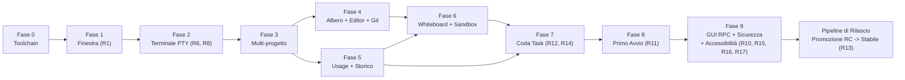

# OMP Studio — Piano di lavoro

Documento operativo. Traccia l'evoluzione e lo stato di avanzamento delle fasi architetturali fino alla versione stabile 1.0.0, con criteri di accettazione verificati.

**Leggere prima:** `PRODUCT.md` (visione e perimetro), `DESIGN.md` (sistema visivo e token), `ARCHITECTURE.md` (architettura tecnica).

---

## 0. Stato di avanzamento e prerequisiti verificati

| Elemento | Stato | Dettagli |
|---|---|---|
| `omp` | **18.x / 17.x** | Eseguibile nativo in `%LOCALAPPDATA%\omp\omp.exe` o PATH di sistema |
| WebView2 Runtime / WebKit | Presente | Windows 11 x64 (WebView2 148+) e macOS (WebKit WKWebView) |
| Toolchain Rust | Installata | `stable-x86_64-pc-windows-msvc` / `stable-aarch64-apple-darwin` (Tauri 2.11.5) |
| Runtime JS & Build | Installati | Node v22.x, Bun 1.3.14, npm 11.x |
| Dati `omp` disponibili | Verificati | `stats.db`, `history.db` (FTS5), `agent.db` (quote snapshot) |
| Protocollo RPC OMP | Verificato | `omp --mode rpc-ui` (NDJSON Protocol v2, chunking, streaming) |
| Piattaforme supportate | Verificate | Windows 11 x64 (NSIS `.exe`) e macOS universale (`.dmg`) |

---

## Fase 0 — Toolchain e scheletro

**Obiettivo:** finestra Tauri funzionante con token di design, font locali e configurazione CSP ermetica.

- [x] Configurazione toolchain Rust e Tauri 2 con template Svelte 5 (`svelte-ts`).
- [x] Registrazione plugin nell'ordine corretto (`single-instance` per primo, poi `store`, `dialog`, `window-state`, `opener`, `notification`).
- [x] Implementazione `src/app.css` con token cromatici a contrasto WCAG AA, font monospazio `StudioMonoNF-Regular.woff2` e Inter incorporati.
- [x] CSP restrittiva in `tauri.conf.json`.

---

## Fase 1 — Finestra e windowing nativo (Gate R1)

**Obiettivo:** garantire affidabilità assoluta del windowing, ridimensionamento e snap layout.

- [x] **Gate R1 eseguito:** la configurazione senza decorazioni (`decorations: false`) presentava difetti di snap layout e resize diagonale (`tauri #8519`).
- [x] **Decisione applicata:** mantenuta la finestra con decorazioni native di sistema (`"decorations": true`), spostando la topbar progetti appena sotto la barra di sistema.
- [x] Attivato `tauri-plugin-window-state` per la persistenza di coordinate e massimizzazione.

---

## Fase 2 — Terminale PTY e trasporto ad alte prestazioni (Gate R6, R8)

**Obiettivo:** la TUI di `omp` gira dentro l'app indistinguibile dal terminale nativo, senza ritardi né perdite di frame.

- [x] Backend PTY in Rust con `portable-pty` 0.9.0 (ConPTY su Windows, POSIX su macOS).
- [x] Thread di lettura dedicato da 64 KiB con coalescenza a **8 ms** (~120 fps) e trasporto su `tauri::ipc::Channel` con byte grezzi (`Vec<u8>`).
- [x] Frontend con `@xterm/xterm` 6.0.0 e `@xterm/addon-canvas` 0.7.0 (renderer Canvas stabile con pieno supporto legature tipografiche e glifi Nerd Font).
- [x] **Gate R8 superato:** rilevamento dello stato dell'agente tramite OSC 0 (`/^\u03c0 ([>:!])/`) con overlay generato `tui.titleState: true`.
- [x] **Gate R6 superato:** throughput misurato a oltre **26 MB/s** senza perdita di frame o byte.

---

## Fase 3 — Multi-progetto e TopBar reattiva

**Obiettivo:** gestione di workspace multi-progetto, switch istantaneo non animato e persistenza di processo.

- [x] Registry progetti in Rust con calcolo colore identità dall'hash del percorso.
- [x] `PtyManager` multi-sessione: le sessioni PTY dei progetti non attivi restano montate e nascoste (`visibility: hidden`), prevenendo perdite di stato o de-sincronizzazioni di `FitAddon`.
- [x] Barra dei progetti con ordine manuale stabile (`fixed`), supporto MRU, priorità task e alfabetico.
- [x] Indicatore attivo non invasivo in `--brand`, badge contatore dei task in coda con quattro stili configurabili.
- [x] Persistenza layout e dimensioni colonne per-progetto in `settings.json`.

---

## Fase 4 — Albero file, Git panel ed Editor Monaco

**Obiettivo:** ispezione, diff e modifica del codice sul posto senza uscire dall'applicazione.

- [x] `tree_read` pigro con `resolve_path` in Rust (validazione `canonicalize` per bloccare directory traversal fuori radice).
- [x] Pannello Git: visualizzazione branch, file modificati con conteggio righe, commit recenti e visualizzazione diff affiancato nell'editor.
- [x] Monaco Editor 0.56.0: istanza singola multi-modello con diff editor, syntax highlighting esteso (.sql, .yaml, .toml, .py, .csproj, script di shell) e persistenza della posizione cursore/scroll per file.

---

## Fase 5 — Quote AI, usage e storico sessioni

**Obiettivo:** monitoraggio in tempo reale dei consumi e ripresa rapida delle sessioni.

- [x] Query protette SQLite su `stats.db`, `history.db` e `agent.db` aperte in sola lettura effettiva (`PRAGMA query_only = ON`, `OpenFlags::SQLITE_OPEN_READONLY`) su `tokio::task::spawn_blocking`.
- [x] Chip topbar e popover consumi: visualizzazione quote peggiori, countdown al reset, trend 24h, stima velocità (tok/s) e gestione resiliente degli stati offline.
- [x] Storico sessioni unificato con ricerca full-text FTS5 e ripresa in-place nello stesso PTY tramite `/resume <sessionId>`.
- [x] Gestione avanzata dei modelli e ruoli (`Ctrl+Alt+M`): catalogo modelli, slider reasoning a gradini, raccomandazione intelligente Tier 1/Zero-Cost e catene di fallback.

---

## Fase 6 — Whiteboard diagrammi, sandbox prototipi e rifinitura

**Obiettivo:** strumenti visuali contestuali per l'agente e chat temporanea.

- [x] Chat temporanea scratchpad con `omp --no-session` (`Ctrl+Alt+S`).
- [x] Tool `studio_diagram`: rendering automatico e interattivo di diagrammi Mermaid nella colonna centrale.
- [x] Tool `studio_preview`: anteprima live di componenti e prototipi UI HTML/SVG con switch responsivo del viewport (Desktop, Tablet, Mobile).
- [x] Set di scorciatoie globali su modificatore sicuro `Ctrl+Alt`.

---

## Fase 7 — Coda task persistente, TaskEditor avanzato e Auto-Dispatch (Gate R12, R14)

**Obiettivo:** pianificazione e accodamento dei prompt per progetto con opzioni avanzate ed esecuzione coordinata.

- [x] Disaccoppiamento dello stato dei task su `tasks.json` dedicato via Tauri store (`Gate R14`).
- [x] `TaskEditor.svelte`: composer a sezioni con textarea ad auto-dimensionamento, selezione del profilo di ruolo (`smol`, `default`, `slow`, `plan`), slider del thinking effort, toggle per direttive speciali (Piano, Discussione `/grill-me`, Minimale `/ponytail`, Ricerca Online) e supporto allegati visivi (screenshot da clipboard o drag & drop).
- [x] Autocompletamento contestuale dei comandi slash (`/`) e censimento automatico delle skill dell'agente.
- [x] Vista aggregata delle code di tutti i progetti (`QueueDrawer.svelte`, `Ctrl+Alt+T`) con avvio diretto.
- [x] Meccanismo di auto-dispatch per singolo progetto con lock anti-race e convalida delle condizioni di prontezza dell'agente (`Gate R12`).

---

## Fase 8 — Primo avvio guidato (Gate R11)

**Obiettivo:** onboarding completo a zero attrito senza uscire dall'applicazione.

- [x] Rilevamento semantico dello stato (`setup_status`): verifica binario, credenziali provider attive, modello predefinito e cartella progetti.
- [x] Download e installazione automatica di `omp` con calcolo e verifica nativa dell'impronta crittografica SHA-256 da GitHub Releases.
- [x] Configurazione automatica di Git Bash come shell predefinita (`shellPath`).
- [x] Installazione del font monospazio Nerd nel profilo utente Windows/macOS.
- [x] Wizard nativo di configurazione `omp setup` ospitato all'interno di una scheda terminale PTY dedicata nel modal, sincronizzando automaticamente il tema scelto con il guscio di Studio.
- [x] Rilevamento automatico della cartella radice con maggior numero di repository Git.

---

## Fase 9 — Seconda superficie nativa GUI via RPC, accessibilità e sicurezza (Gate R10, R15, R16, R17)

**Obiettivo:** chat nativa Svelte 5 con streaming fluido, accessibilità WCAG AA, isolamento sandbox e notifiche OS.

- [x] **Seconda superficie GUI (`Gate R10`):** integrazione di `omp --mode rpc-ui` su stdio NDJSON Protocol v2; riassemblaggio frame fino a 64 MiB; coalescenza delta di streaming a 8 ms; handoff di sessione trasparente via `--resume`.
- [x] **Raggruppamento semantico e transcript (`Gate R16`):** componente `ToolGroup` che unifica sequenze di tool e blocchi di ragionamento (`thinking`); 30+ card renderer specializzate; cronometro live tabulare; autoscroll fluido ancorato in fondo.
- [x] **Accessibilità completa:** chiusura criticità audit Impeccable, conformità WCAG AA per contrasti (>= 4.5:1), etichette `aria-label`, gestione focus trap con `roving tabindex` su `AskCard` e annunci `aria-live`.
- [x] **Difesa in profondità sandbox SVG/HTML (`Gate R15`):** rendering in `<iframe>` con `sandbox=""` privo di script, origine `null`, CSP `default-src 'none'` e sanitizzazione DOMPurify.
- [x] **Notifiche OS e avvisi di stato (`Gate R17`):** registrazione AUMID Windows `sh.omp.studio`, toast nativi OS, pallino rosso/flash su taskbar Windows e badge numerico/bounce su Dock macOS.
- [x] **Contenimento processi:** Windows Job Objects (`JOB_OBJECT_LIMIT_KILL_ON_JOB_CLOSE`) per terminazione ad albero deterministica all'uscita.

---

## Ordine dei lavori e dipendenze

---

## Pipeline di Rilascio — Promozione da Release Candidate (RC) a Stabile (Gate R13)

Per azzerare il rischio di discrepanze tra il codice testato e quello distribuito agli utenti finali, il processo di rilascio adotta la promozione diretta degli stessi artefatti binari già validati in pre-release, invece di ricompilare da zero al momento del rilascio stabile.

### Principi operativi

1. **Allineamento rigido dei 4 file di versione.** Prima di qualunque operazione di bump o pubblicazione, `npm run release -- --check` valida che `package.json`, `src-tauri/tauri.conf.json`, `src-tauri/Cargo.toml` e `src-tauri/Cargo.lock` dichiarino esattamente la stessa versione. Qualsiasi disallineamento blocca la pipeline.
2. **Verifica crittografica di consistenza del commit.** Quando viene creato un tag stabile (`vX.Y.Z`) o avviato il workflow di release indicando una Release Candidate sorgente (`vX.Y.Z-rc.N`), il workflow `.github/workflows/release.yml` confronta i commit SHA dei due tag:
   - Se i commit coincidono, gli artefatti testati della RC (NSIS `.exe` per Windows e DMG universale per macOS) vengono riutilizzati direttamente nella release stabile, calcolando i checksum `SHA256SUMS.txt`.
   - Se i commit divergono, il workflow fallisce bloccando il rilascio con errore esplicito, impedendo che modifiche non testate vengano spacciate per la RC validata.
3. **Workflow Nightly locale e rapido.** Il comando `npm run nightly` (`scripts/publish-nightly.mjs`) compila in locale per il sistema operativo in uso, aggiorna `nightly.json` e la prerelease GitHub associata al tag mobile `nightly`, senza chiudere la sezione `[Unreleased]` del changelog.
4. **Fallback controllato.** In assenza di RC o impostando `force_rebuild: true`, il workflow esegue la compilazione multipiattaforma completa e pubblica con le note estratte dall'annotazione del tag o da `CHANGELOG.md`.

---

## Cosa NON entra in questo piano

In linea con i principi di `PRODUCT.md`:
- Nessun debugger generico, compilatore esterno o pipeline di build complessa nell'app.
- Nessun marketplace di estensioni terze o plugin arbitrari.
- Nessun servizio cloud, server remoto obbligatorio o telemetria esterna: il funzionamento è al 100% locale e privato.
- Nessuna emulazione di modelli o prompt custom hardcoded: Studio è un guscio ergonomico e sicuro che dialoga esclusivamente con il runtime ufficiale di `omp`.
