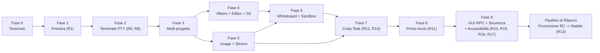

# OMP Studio — Piano di lavoro

Documento operativo. Traccia l'evoluzione del prodotto, il piano di stabilizzazione della 1.2.1 e i criteri di accettazione necessari prima di ogni release stabile.

**Leggere prima:** `PRODUCT.md` (visione e perimetro), `DESIGN.md` (sistema visivo e token), `ARCHITECTURE.md` (architettura tecnica).

---

## Piano di stabilizzazione 1.2.1 — audit NO-GO

**Stato:** pianificato. La pubblicazione stabile resta bloccata finche tutti i P0 e P1 sono chiusi, la matrice di verifica e verde e il secondo audit non rileva blocker.

Le fasi 0-9 piu sotto restano come storico dell'implementazione. Le loro spunte non sostituiscono i gate correnti: le dichiarazioni non piu vere vengono riallineate nello step S30.

### Metodo di esecuzione

- Un solo step e attivo alla volta. Ogni step termina con il proprio test comportamentale mirato prima di passare al successivo.
- `Main` mantiene ownership dei file condivisi e integra ogni risultato. Uno step marcato `Subagente` puo essere implementato in worktree isolato; il subagente non esegue suite globali.
- Gli step che condividono `setup.rs`, `session.svelte.ts`, `TopBar.svelte`, `AskCard.svelte`, `tauri.conf.json` o i workflow sono sempre serializzati.
- Nessuna failure viene trasformata in default distruttivo, warning ignorato o fallback implicito.
- Nessun bump, commit, push o tag durante la remediation. Changelog, decisione di pubblicazione e pipeline arrivano solo dopo la chiusura tecnica completa.

### Definition of done per step

1. La causa radice e corretta senza alias, shim o percorso legacy rimasto attivo.
2. Tutti i caller coinvolti sono migrati.
3. Esiste un test solo quando protegge un contratto osservabile o una regressione plausibile.
4. Il test mirato e lo smoke del percorso modificato passano.
5. Errori, rollback e stato persistito sono verificati, non solo il percorso felice.
6. Il diff non introduce nuovi warning, permessi o dipendenze non giustificati.

### Fase A — P0: integrita, dati e pipeline

- [x] **S01 — Installer OMP fail-closed** (`Main`, review sicurezza)
  Intervenire in `src-tauri/src/setup.rs` e `SetupModal.svelte`: rendere obbligatorio un digest attendibile prima dell'installazione, scaricare nello stesso filesystem della destinazione, verificare SHA-256, sostituire atomicamente e avviare OMP solo dopo la verifica. La UI deve distinguere download, verifica e installazione.
  **Accettazione:** hash assente, manifest irraggiungibile, mismatch e asset inatteso non modificano l'eseguibile esistente; hash valido installa e avvia; test per tutti e quattro i casi.

- [x] **S02 — Configurazioni lossless e atomiche** (`Main`, review sicurezza)
  Rifattorizzare `src-tauri/src/models_ops.rs`: distinguere file assente da errore di lettura, rifiutare YAML/JSON invalido, preservare campi sconosciuti, serializzare una sola volta e sostituire con temp file, flush e rename atomico. Applicare lo stesso contratto ai provider custom e impedire write concorrenti.
  **Accettazione:** config invalida o illeggibile resta byte-per-byte invariata; campi estranei sopravvivono; una failure di replace conserva il file precedente; test di concorrenza e rollback.

- [x] **S03 — Smoke test realmente multipiattaforma** (`Subagente`)
  Rendere esplicita la piattaforma nei helper di `test/context-menu-and-tree.test.ts` e coprire semantica Windows case-insensitive e POSIX case-sensitive senza dipendere dal runner.
  **Accettazione:** lo stesso test passa su macOS, Windows e Linux; il job `resolve` della release non fallisce prima della build.

**Gate A:** S01-S03 completati; relativi test Rust/TS verdi; nessun percorso fail-open o test dipendente da `process.platform`.

### Fase B — P1: confini di sicurezza

- [x] **S04 — Rimuovere `cmd /C` dai launcher Windows** (`Subagente`, review sicurezza)
  In `src-tauri/src/external.rs` avviare editor e terminali direttamente con argomenti strutturati. Non concatenare mai path in un linguaggio shell.
  **Accettazione:** cartelle contenenti spazio, `&`, `|`, `^`, parentesi e Unicode vengono aperte letteralmente; nessun comando aggiuntivo viene interpretato.

- [x] **S05 — Confinare Apply Rule contro symlink** (`Subagente`, review sicurezza)
  Riutilizzare il resolver canonico di `projects` in `rules_ops.rs`; rifiutare symlink foglia e target canonici fuori dalla root.
  **Accettazione:** traversal e symlink esterno falliscono senza modificare il target; file regolare interno continua a funzionare.

- [x] **S06 — Allowlist dei protocolli esterni** (`Main`)
  Centralizzare l'apertura URL della sessione agente: consentire automaticamente solo `https:` e `http:`; bloccare URI malformati e richiedere un flusso esplicito per qualunque schema aggiuntivo realmente necessario.
  **Accettazione:** `file:`, `javascript:`, `data:` e custom scheme non vengono aperti da eventi RPC; URL web validi restano funzionanti.

- [x] **S07 — Chiudere le vulnerabilita runtime frontend** (`Subagente`, review sicurezza)
  Aggiornare DOMPurify e le dipendenze che ne fissano copie vulnerabili, rigenerare il lockfile e valutare separatamente gli advisory non raggiungibili nella build Tauri statica.
  **Accettazione:** nessun advisory high/moderate raggiungibile nel runtime distribuito; i test di sanitizzazione SVG/HTML/Mermaid continuano a passare.

**Gate B:** test ostili su path, symlink, URL e sanitizzazione verdi; `bun audit` senza vulnerabilita high/moderate applicabili al runtime.

### Fase C — setup e adattamento piattaforma

- [x] **S08 — Window chrome nativo su macOS** (`Subagente UI`, integrazione `Main`)
  Rendere la shell platform-aware: controlli custom minimize/maximize/close solo su Windows; traffic light, drag region, fullscreen e double-click titlebar conformi a macOS. Usare configurazione Tauri specifica per piattaforma invece di un unico `decorations: false`.
  **Accettazione:** screenshot e smoke reali su entrambe le piattaforme; nessun controllo Windows su macOS; snap/maximize Windows e fullscreen macOS funzionanti.

- [x] **S09 — Attendere l'idratazione dei progetti** (`Main`)
  Esporre uno stato/promise `ready` dallo store progetti e serializzare `checkSetupContract` dopo il caricamento persistito.
  **Accettazione:** un utente con progetti salvati non vede mai il setup per uno stato vuoto transitorio; primo avvio reale continua ad aprirlo.

- [x] **S10 — Copy e percorsi setup per piattaforma** (`Subagente UI`)
  Eliminare `%LOCALAPPDATA%` dal testo macOS e derivare copy e destinazioni dallo stato restituito dal backend, senza stringhe di percorso duplicate nel frontend.
  **Accettazione:** ogni piattaforma mostra il percorso effettivo; nessun riferimento Windows compare su macOS.

- [x] **S11 — Installazione font nativa per piattaforma** (`Main`)
  Separare Windows e macOS: su macOS usare la directory font utente e il meccanismo di registrazione supportato dal sistema, senza `~/.local/share/fonts` o `fc-cache`.
  **Accettazione:** font disponibile in una nuova sessione dell'app senza logout; failure di registrazione e mostrata e non dichiarata come successo.

- [x] **S12 — PATH OMP sicuro nelle shell Unix** (`Main`)
  Rendere `~/.omp/bin` utilizzabile anche nei terminali esterni supportati, con modifica idempotente e delimitata dei profili shell oppure con un meccanismo nativo meno invasivo. Non alterare righe utente esistenti.
  **Accettazione:** nuova shell zsh trova `omp`; seconda esecuzione non duplica il blocco; rollback documentato e testato con HOME temporanea.

- [x] **S13 — Fallback editor basato sull'exit status** (`Subagente`)
  Considerare riuscito `open -a` solo dopo un exit code positivo; provare il fallback successivo su errore reale.
  **Accettazione:** app assente attiva il fallback; app presente apre la directory una sola volta.

**Gate C:** setup pulito e setup di ritorno provati su macOS; smoke equivalente Windows in CI; nessuna mutazione del profilo utente usato dai test.

### Fase D — interazioni Ask e protocollo RPC

- [x] **S14 — Vietare risposte Ask implicite** (`Subagente Agent UI`)
  Spostare formattazione e validazione in un modulo di dominio importabile; nessuna domanda senza scelta e nessun `Other` vuoto puo avanzare o essere inviato.
  **Accettazione:** Next/Confirm/Submit riflettono la validita; zero fallback alla prima opzione; multi-question e custom answer coperti.

- [x] **S15 — Queue delle risposte request-scoped** (`Main`)
  Associare ogni risposta accodata all'ID della richiesta e cambiare stato solo dopo conferma RPC. Su errore ripristinare richiesta, selezioni e focus; non riutilizzare mai la risposta con un evento successivo.
  **Accettazione:** failure sulla prima risposta non auto-risponde la seconda; retry esplicito invia gli stessi dati una sola volta.

**Gate D:** test end-to-end del wizard con domande parziali, `Other`, failure RPC, retry e nuova richiesta.

### Fase E — release engineering e trust degli installer

- [ ] **S16 — Firma e notarizzazione macOS** (`Main`, prerequisito esterno — workflow e verifiche configurati)
  Integrare Developer ID, hardened runtime, notarizzazione e stapling nel workflow. I secret devono essere solo GitHub Actions secrets e mai scritti nel repository.
  **Accettazione:** `codesign --verify --deep --strict`, `spctl --assess` e verifica notarizzazione passano sul DMG scaricato. Richiede certificato/account Apple disponibili.

- [ ] **S17 — Firma Authenticode Windows** (`Main`, prerequisito esterno — workflow e verifiche configurati)
  Integrare firma timestamped dell'installer NSIS e verifica post-upload.
  **Accettazione:** `Get-AuthenticodeSignature` restituisce `Valid` sull'asset pubblicato. Richiede certificato di code signing disponibile.

- [x] **S18 — Gate CI completi prima del packaging** (`Subagente workflow`, integrazione `Main`)
  Aggiungere al workflow typecheck, smoke TS, test Rust, Clippy, audit dipendenze, version check e diff hygiene prima dei job di build. Evitare duplicazioni tra Nightly, RC e stable tramite script condivisi gia presenti o un unico job riusabile.
  **Accettazione:** ogni gate viene fatto fallire intenzionalmente in una prova controllata e impedisce la pubblicazione.

- [x] **S19 — Pin delle GitHub Actions a SHA** (`Subagente workflow`)
  Sostituire tag mobili con commit SHA verificati, mantenendo il numero di versione in commento per leggibilita.
  **Accettazione:** nessun `uses:` di terze parti resta su tag o branch mobile.

- [x] **S20 — Ridurre CSP e capability Tauri** (`Main`, review sicurezza)
  Inventariare codice che richiede `unsafe-inline`, `unsafe-eval`, opener e core permissions; rimuovere cio che non e indispensabile e restringere scope/comandi. Mantenere il test di copertura ACL.
  **Accettazione:** app completa funzionante con policy minima documentata; test ACL verde; nessun allargamento wildcard.

**Gate E:** pipeline produce installer firmati verificabili e non pubblica se un gate precedente fallisce.

### Fase F — correttezza filesystem e durabilita

- [x] **S21 — Rinomina case-only su macOS** (`Subagente`)
  Gestire filesystem case-insensitive con rename in due passi tramite nome temporaneo collision-safe e rollback.
  **Accettazione:** `foo` → `Foo` funziona su APFS predefinito; collisioni reali falliscono; nessun file temporaneo resta dopo errore.

- [x] **S22 — Persistenza task crash-safe su Windows** (`Subagente Rust`)
  Sostituire il fallback remove-then-rename con una primitive di replace sicura o una strategia con backup e rollback nello stesso filesystem.
  **Accettazione:** failure in ogni punto conserva almeno una copia valida della coda; test fault-injection dove possibile.

- [x] **S23 — Errori resume tipizzati** (`Main`)
  Verificare il contratto OMP disponibile e centralizzare la classificazione degli errori. Preferire code/eventi strutturati; se OMP espone solo stderr, isolare un parser versionato e testato invece del confronto letterale nel componente.
  **Accettazione:** variazioni innocue di quoting, prefisso e whitespace non rompono il recupero; errori diversi non vengono confusi con sessione assente.

- [x] **S24 — Target `contenteditable` annidati** (`Subagente frontend`)
  Rilevare l'editing tramite `closest()` e percorso evento, mantenendo il menu nativo per qualsiasi discendente editabile.
  **Accettazione:** click destro su testo e child element annidato conserva cut/copy/paste nativi; aree non editabili usano il menu Studio.

**Gate F:** suite filesystem e menu contestuale verde su piattaforme supportate.

### Fase G — accessibilita e performance

- [x] **S25 — Semantica e tastiera Ask** (`Subagente accessibilita`)
  Implementare `listbox/option` coerenti, `aria-selected`, `aria-multiselectable` quando serve e roving tabindex; in alternativa usare controlli radio/checkbox nativi mantenendo il layout visuale.
  **Accettazione:** Arrow, Home, End, Space/Enter e annunci screen reader funzionano; una sola opzione e nel tab order.

- [x] **S26 — Tablist dei progetti** (`Subagente accessibilita`)
  Applicare `tablist/tab/tabpanel`, `aria-selected`, relazione al pannello e navigazione roving senza rompere drag, reorder e shortcut.
  **Accettazione:** switch completo solo tastiera, focus visibile e ordine coerente dopo riordino.

- [x] **S27 — File tree accessibile** (`Subagente accessibilita`)
  Implementare `tree/treeitem/group`, livelli, espansione, selezione, roving tabindex e tasti Arrow/Home/End/Enter. Preservare lazy loading e menu contestuale.
  **Accettazione:** navigazione completa senza mouse su albero profondo; focus stabile dopo rename, delete e refresh.

- [x] **S28 — Code splitting delle superfici pesanti** (`Subagente performance`)
  Misurare i chunk, caricare Monaco, Mermaid e worker solo all'apertura delle rispettive superfici e rimuovere preload involontari.
  **Accettazione:** Monaco/Mermaid assenti dal percorso iniziale; nessun chunk iniziale non-worker supera 1 MiB senza giustificazione; editor e diagrammi restano funzionali.

**Gate G:** audit tastiera/screen reader sui tre widget e confronto bundle prima/dopo allegato alla review.

### Fase H — test, lint e documentazione

- [x] **S29 — Test Ask contro codice di produzione** (`Subagente test`)
  Estrarre helper puri usati dal componente e importarli nei test; eliminare copie del comportamento dentro `test/ask-tool.test.ts`.
  **Accettazione:** la regressione della risposta implicita fa fallire il test; nessuna implementazione duplicata.

- [x] **S30 — Riallineare gate e architettura documentata** (`Subagente documentazione`)
  Correggere `PLAN.md` e `ARCHITECTURE.md` affinche decorazioni finestra, CSP, setup, accessibilita e gate riflettano il codice verificato, distinguendo storico e stato corrente.
  **Accettazione:** nessuna voce `SUPERATO` o `[x]` contraddice configurazione o test correnti.

- [x] **S31 — Clippy a zero warning** (`Subagente meccanico`, integrazione `Main`)
  Correggere i 16 finding senza `allow` generici e senza cambiare semantica o drop order non verificato.
  **Accettazione:** `cargo clippy --all-targets -- -D warnings` passa.

- [x] **S32 — Diff hygiene** (`Subagente meccanico`)
  Rimuovere il trailing whitespace rilevato e impedire recidive nel gate CI.
  **Accettazione:** `git diff --check v1.2.0..HEAD` e il diff della remediation passano.

- [x] **S33 — Compatibilita automatica del contratto setup** (`Main`)
  Versionare fixture/contratto OMP e aggiungere uno smoke che valida la minima e la corrente versione supportata, inclusi asset name, setup status e chiavi di configurazione.
  **Accettazione:** una variazione incompatibile dell'output o della config OMP fallisce prima del packaging con errore diagnostico.

**Gate H:** typecheck, lint, test e documentazione coerenti; zero warning ignorati.

### Fase I — verifica, candidate e stable

- [ ] **S34 — Matrice multipiattaforma completa** (`Main`)
  Eseguire su macOS arm64 locale e Windows x64 CI: setup pulito e di ritorno, topbar/windowing, Ask failure/retry, file operations, editor/terminal opener, updater, resume, firme e installazione reale.
  **Accettazione:** evidenza per ogni scenario; nessuno skip salvo test che mutano intenzionalmente un profilo temporaneo.

- [ ] **S35 — Secondo audit finding-per-finding** (`Main` + reviewer)
  Rieseguire sicurezza, accessibilita, performance, packaging e regressioni usando questa lista come matrice di tracciabilita.
  **Accettazione:** zero P0/P1, nessun finding chiuso solo per inferenza, ogni chiusura punta a test o smoke osservato.

- [ ] **S36 — Changelog utente finale** (`Main`)
  Aggiungere sotto `[Unreleased]` voci italiane concise per sicurezza del setup, affidabilita configurazione, integrazione macOS/Windows, Ask, accessibilita e performance.
  **Accettazione:** descrive cosa cambia per l'utente, non file o dettagli interni; nessuna voce duplicata.

- [ ] **S37 — Pubblicazione controllata 1.2.1** (`Main`, decisione utente obbligatoria)
  Chiedere tramite `ask` la strategia prevista dalle regole di progetto. Prima validare una Nightly/RC multipiattaforma dello stesso commit; poi eseguire bump con `npm run release -- 1.2.1`, commit, tag, push e promozione/verifica degli asset firmati.
  **Accettazione:** tag stable e candidate puntano allo stesso commit; release contiene DMG universale notarizzato, EXE x64 firmato, checksum e note corrette.

### Matrice finale obbligatoria

```text
npx svelte-check --tsconfig ./tsconfig.json
bun run build
npm run test:smoke
cargo test --manifest-path src-tauri/Cargo.toml
cargo clippy --manifest-path src-tauri/Cargo.toml --all-targets -- -D warnings
bun audit
npm run release -- --check
git diff --check
```

Oltre ai comandi, la verifica richiede l'avvio dell'app reale e l'esercizio delle superfici modificate. Un rendering browser senza IPC Tauri non vale come smoke desktop.

---

## 0. Stato di avanzamento e prerequisiti verificati

| Elemento | Stato | Dettagli |
|---|---|---|
| `omp` | **18.x / 17.x** | Eseguibile nativo in `%LOCALAPPDATA%\omp\omp.exe` o PATH di sistema |
| WebView2 Runtime / WebKit | Presente | Windows 11 x64 (WebView2 148+) e macOS (WebKit WKWebView) |
| Toolchain Rust | Installata | `stable-x86_64-pc-windows-msvc` / `stable-aarch64-apple-darwin` (Tauri 2.11.5) |
| Runtime JS & Build | Installati | Node v22.x, Bun 1.3.14, npm 11.x |
| Dati `omp` disponibili | Verificati | `stats.db`, `history.db` (FTS5), `agent.db` (quote snapshot) |
| Protocollo RPC OMP | Verificato | `omp --mode rpc-ui` (NDJSON Protocol v2, chunking, streaming) |
| Piattaforme supportate | Verificate | Windows 11 x64 (NSIS `.exe`) e macOS universale (`.dmg`) |

---

## Fase 0 — Toolchain e scheletro

**Obiettivo:** finestra Tauri funzionante con token di design, font locali e configurazione CSP ermetica.

- [x] Configurazione toolchain Rust e Tauri 2 con template Svelte 5 (`svelte-ts`).
- [x] Registrazione plugin nell'ordine corretto (`single-instance` per primo, poi `store`, `dialog`, `window-state`, `opener`, `notification`).
- [x] Implementazione `src/app.css` con token cromatici a contrasto WCAG AA, font monospazio `StudioMonoNF-Regular.woff2` e Inter incorporati.
- [x] CSP restrittiva in `tauri.conf.json`.

---

## Fase 1 — Finestra e windowing nativo (Gate R1)

**Obiettivo:** garantire affidabilità assoluta del windowing, ridimensionamento e snap layout.

- [x] **Gate R1 eseguito:** la configurazione senza decorazioni (`decorations: false`) presentava difetti di snap layout e resize diagonale (`tauri #8519`).
- [x] **Decisione applicata:** mantenuta la finestra con decorazioni native di sistema (`"decorations": true`), spostando la topbar progetti appena sotto la barra di sistema.
- [x] Attivato `tauri-plugin-window-state` per la persistenza di coordinate e massimizzazione.

---

## Fase 2 — Terminale PTY e trasporto ad alte prestazioni (Gate R6, R8)

**Obiettivo:** la TUI di `omp` gira dentro l'app indistinguibile dal terminale nativo, senza ritardi né perdite di frame.

- [x] Backend PTY in Rust con `portable-pty` 0.9.0 (ConPTY su Windows, POSIX su macOS).
- [x] Thread di lettura dedicato da 64 KiB con coalescenza a **8 ms** (~120 fps) e trasporto su `tauri::ipc::Channel` con byte grezzi (`Vec<u8>`).
- [x] Frontend con `@xterm/xterm` 6.0.0 e `@xterm/addon-canvas` 0.7.0 (renderer Canvas stabile con pieno supporto legature tipografiche e glifi Nerd Font).
- [x] **Gate R8 superato:** rilevamento dello stato dell'agente tramite OSC 0 (`/^\u03c0 ([>:!])/`) con overlay generato `tui.titleState: true`.
- [x] **Gate R6 superato:** throughput misurato a oltre **26 MB/s** senza perdita di frame o byte.

---

## Fase 3 — Multi-progetto e TopBar reattiva

**Obiettivo:** gestione di workspace multi-progetto, switch istantaneo non animato e persistenza di processo.

- [x] Registry progetti in Rust con calcolo colore identità dall'hash del percorso.
- [x] `PtyManager` multi-sessione: le sessioni PTY dei progetti non attivi restano montate e nascoste (`visibility: hidden`), prevenendo perdite di stato o de-sincronizzazioni di `FitAddon`.
- [x] Barra dei progetti con ordine manuale stabile (`fixed`), supporto MRU, priorità task e alfabetico.
- [x] Indicatore attivo non invasivo in `--brand`, badge contatore dei task in coda con quattro stili configurabili.
- [x] Persistenza layout e dimensioni colonne per-progetto in `settings.json`.

---

## Fase 4 — Albero file, Git panel ed Editor Monaco

**Obiettivo:** ispezione, diff e modifica del codice sul posto senza uscire dall'applicazione.

- [x] `tree_read` pigro con `resolve_path` in Rust (validazione `canonicalize` per bloccare directory traversal fuori radice).
- [x] Pannello Git: visualizzazione branch, file modificati con conteggio righe, commit recenti e visualizzazione diff affiancato nell'editor.
- [x] Monaco Editor 0.56.0: istanza singola multi-modello con diff editor, syntax highlighting esteso (.sql, .yaml, .toml, .py, .csproj, script di shell) e persistenza della posizione cursore/scroll per file.

---

## Fase 5 — Quote AI, usage e storico sessioni

**Obiettivo:** monitoraggio in tempo reale dei consumi e ripresa rapida delle sessioni.

- [x] Query protette SQLite su `stats.db`, `history.db` e `agent.db` aperte in sola lettura effettiva (`PRAGMA query_only = ON`, `OpenFlags::SQLITE_OPEN_READONLY`) su `tokio::task::spawn_blocking`.
- [x] Chip topbar e popover consumi: visualizzazione quote peggiori, countdown al reset, trend 24h, stima velocità (tok/s) e gestione resiliente degli stati offline.
- [x] Storico sessioni unificato con ricerca full-text FTS5 e ripresa in-place nello stesso PTY tramite `/resume <sessionId>`.
- [x] Gestione avanzata dei modelli e ruoli (`Ctrl+Alt+M`): catalogo modelli, slider reasoning a gradini, raccomandazione intelligente Tier 1/Zero-Cost e catene di fallback.

---

## Fase 6 — Whiteboard diagrammi, sandbox prototipi e rifinitura

**Obiettivo:** strumenti visuali contestuali per l'agente e chat temporanea.

- [x] Chat temporanea scratchpad con `omp --no-session` (`Ctrl+Alt+S`).
- [x] Tool `studio_diagram`: rendering automatico e interattivo di diagrammi Mermaid nella colonna centrale.
- [x] Tool `studio_preview`: anteprima live di componenti e prototipi UI HTML/SVG con switch responsivo del viewport (Desktop, Tablet, Mobile).
- [x] Set di scorciatoie globali su modificatore sicuro `Ctrl+Alt`.

---

## Fase 7 — Coda task persistente, TaskEditor avanzato e Auto-Dispatch (Gate R12, R14)

**Obiettivo:** pianificazione e accodamento dei prompt per progetto con opzioni avanzate ed esecuzione coordinata.

- [x] Disaccoppiamento dello stato dei task su `tasks.json` dedicato via Tauri store (`Gate R14`).
- [x] `TaskEditor.svelte`: composer a sezioni con textarea ad auto-dimensionamento, selezione del profilo di ruolo (`smol`, `default`, `slow`, `plan`), slider del thinking effort, toggle per direttive speciali (Piano, Discussione `/grill-me`, Minimale `/ponytail`, Ricerca Online) e supporto allegati visivi (screenshot da clipboard o drag & drop).
- [x] Autocompletamento contestuale dei comandi slash (`/`) e censimento automatico delle skill dell'agente.
- [x] Vista aggregata delle code di tutti i progetti (`QueueDrawer.svelte`, `Ctrl+Alt+T`) con avvio diretto.
- [x] Meccanismo di auto-dispatch per singolo progetto con lock anti-race e convalida delle condizioni di prontezza dell'agente (`Gate R12`).

---

## Fase 8 — Primo avvio guidato (Gate R11)

**Obiettivo:** onboarding completo a zero attrito senza uscire dall'applicazione.

- [x] Rilevamento semantico dello stato (`setup_status`): verifica binario, credenziali provider attive, modello predefinito e cartella progetti.
- [x] Download e installazione automatica di `omp` con calcolo e verifica nativa dell'impronta crittografica SHA-256 da GitHub Releases.
- [x] Configurazione automatica di Git Bash come shell predefinita (`shellPath`).
- [x] Installazione del font monospazio Nerd nel profilo utente Windows/macOS.
- [x] Wizard nativo di configurazione `omp setup` ospitato all'interno di una scheda terminale PTY dedicata nel modal, sincronizzando automaticamente il tema scelto con il guscio di Studio.
- [x] Rilevamento automatico della cartella radice con maggior numero di repository Git.

---

## Fase 9 — Seconda superficie nativa GUI via RPC, accessibilità e sicurezza (Gate R10, R15, R16, R17)

**Obiettivo:** chat nativa Svelte 5 con streaming fluido, accessibilità WCAG AA, isolamento sandbox e notifiche OS.

- [x] **Seconda superficie GUI (`Gate R10`):** integrazione di `omp --mode rpc-ui` su stdio NDJSON Protocol v2; riassemblaggio frame fino a 64 MiB; coalescenza delta di streaming a 8 ms; handoff di sessione trasparente via `--resume`.
- [x] **Raggruppamento semantico e transcript (`Gate R16`):** componente `ToolGroup` che unifica sequenze di tool e blocchi di ragionamento (`thinking`); 30+ card renderer specializzate; cronometro live tabulare; autoscroll fluido ancorato in fondo.
- [x] **Accessibilità completa:** chiusura criticità audit Impeccable, conformità WCAG AA per contrasti (>= 4.5:1), etichette `aria-label`, gestione focus trap con `roving tabindex` su `AskCard` e annunci `aria-live`.
- [x] **Difesa in profondità sandbox SVG/HTML (`Gate R15`):** rendering in `<iframe>` con `sandbox=""` privo di script, origine `null`, CSP `default-src 'none'` e sanitizzazione DOMPurify.
- [x] **Notifiche OS e avvisi di stato (`Gate R17`):** registrazione AUMID Windows `sh.omp.studio`, toast nativi OS, pallino rosso/flash su taskbar Windows e badge numerico/bounce su Dock macOS.
- [x] **Contenimento processi:** Windows Job Objects (`JOB_OBJECT_LIMIT_KILL_ON_JOB_CLOSE`) per terminazione ad albero deterministica all'uscita.

---

## Ordine dei lavori e dipendenze



---

## Pipeline di Rilascio — Promozione da Release Candidate (RC) a Stabile (Gate R13)

Per azzerare il rischio di discrepanze tra il codice testato e quello distribuito agli utenti finali, il processo di rilascio adotta la promozione diretta degli stessi artefatti binari già validati in pre-release, invece di ricompilare da zero al momento del rilascio stabile.

### Principi operativi

1. **Allineamento rigido dei 4 file di versione.** Prima di qualunque operazione di bump o pubblicazione, `npm run release -- --check` valida che `package.json`, `src-tauri/tauri.conf.json`, `src-tauri/Cargo.toml` e `src-tauri/Cargo.lock` dichiarino esattamente la stessa versione. Qualsiasi disallineamento blocca la pipeline.
2. **Verifica crittografica di consistenza del commit.** Quando viene creato un tag stabile (`vX.Y.Z`) o avviato il workflow di release indicando una Release Candidate sorgente (`vX.Y.Z-rc.N`), il workflow `.github/workflows/release.yml` confronta i commit SHA dei due tag:
   - Se i commit coincidono, gli artefatti testati della RC (NSIS `.exe` per Windows e DMG universale per macOS) vengono riutilizzati direttamente nella release stabile, calcolando i checksum `SHA256SUMS.txt`.
   - Se i commit divergono, il workflow fallisce bloccando il rilascio con errore esplicito, impedendo che modifiche non testate vengano spacciate per la RC validata.
3. **Workflow Nightly locale e rapido.** Il comando `npm run nightly` (`scripts/publish-nightly.mjs`) compila in locale per il sistema operativo in uso, aggiorna `nightly.json` e la prerelease GitHub associata al tag mobile `nightly`, senza chiudere la sezione `[Unreleased]` del changelog.
4. **Fallback controllato.** In assenza di RC o impostando `force_rebuild: true`, il workflow esegue la compilazione multipiattaforma completa e pubblica con le note estratte dall'annotazione del tag o da `CHANGELOG.md`.

---

## Piano Browser Studio — Gate R23

**Stato:** pianificato. Gli step sono strettamente sequenziali e fanno riferimento
alla specifica canonica [`BROWSER-STUDIO.md`](BROWSER-STUDIO.md). Il sorgente
upstream `can1357/oh-my-pi` non e presente in questo workspace: gli step runtime
richiedono un checkout separato e un commit/PR identificabile; il runtime non va
vendorizzato in `omp-studio-app`.

**Regola documentale per ogni step:** prima di lavorare leggere
`BROWSER-STUDIO.md`; al termine aggiornare le sezioni interessate, aggiungere una
riga al registro implementativo, registrare eventuali scostamenti in
`DECISIONS.md` e aggiornare questo piano. La documentazione deve descrivere il
comportamento osservato, non quello ancora aspirazionale.

- [x] **S38 — Contratto versionato `browser-live-v1`** (`Main`, runtime OMP + Studio)
  Definire capability negotiation, identita progetto/chat/sessione/tab, messaggi
  di stato, errori, token monouso e fixture di compatibilita. Il contratto deve
  preservare `tool_execution_start/update/end` e il renderer screenshot quando
  una parte non supporta il live.
  **Accettazione:** schema e fixture sono consumati da entrambi i repository;
  combinazioni runtime/Studio vecchie e nuove falliscono chiuse o degradano al
  comportamento attuale senza tentare endpoint non negoziati.
  **Fatto:** `src/lib/agent/browser-live.ts` (Studio) e
  `packages/coding-agent/src/modes/rpc/browser-live.ts` (runtime, checkout
  separato `../oh-my-pi-upstream`, branch `feat/s38-browser-live-v1-contract`)
  implementano lo stesso algoritmo di intersezione; il frame `ready` porta le
  capability solo con un provider registrato, `negotiate_capabilities` e
  `browser_live_ticket` falliscono chiusi senza negoziazione e la fixture
  `test/fixtures/browser-live-v1.json` e byte a byte identica nei due
  repository, con confronto verificato dai test di Studio. Scostamenti in
  `DECISIONS.md`, dettaglio tecnico nelle sezioni 5, 7, 8 e 18 di
  `BROWSER-STUDIO.md`.

- [x] **S39 — BrowserSessionBroker e Chromium gestito** (`Main`, runtime OMP)
  Implementare lifecycle lazy, profilo persistente per progetto, tab indirizzate
  da chat e nome, CDP posseduto dal broker e terminazione senza processi orfani.
  Managed mode non deve creare finestre desktop ne esporre il CDP al client.
  **Accettazione:** due progetti non condividono storage, due chat con tab `main`
  non collidono, close/crash revocano sessioni e il browser puo essere riaperto
  conservando i dati del solo progetto.
  **Fatto:** `packages/coding-agent/src/tools/browser/session-broker.ts`
  (checkout separato `../oh-my-pi-upstream`, branch
  `feat/s39-browser-session-broker`, commit `73c8181` su base `e0e1a9d`)
  implementa `BrowserSessionBroker` con profili isolati sotto
  `~/.omp/browser-profiles/<projectId>` (`projectId = hashPath(cwd)`),
  daemon `omp.browser.managed` windowless avviato lazy, tab indirizzate da
  chiave opaca `chatSessionId::tabName` con nome ergonomico separato,
  cancellazione esplicita via `/browser clear-data` e provider `browser-live`
  registrato in `runRpcMode`. I sei scenari di accettazione sono osservati
  verdi sullo smoke reale `scripts/s39-managed-browser-smoke.ts` su Windows 11;
  19 nuovi test in `test/tools/browser-session-broker.test.ts`. Scostamenti e
  decisioni registrati in `DECISIONS.md` e nelle sezioni 5, 6, 8, 9, 10, 17 e
  18 di `BROWSER-STUDIO.md`.
- [x] **S40 — Stream live binario e backpressure** (`Main`, runtime OMP + Studio backend)
  Esporre un canale loopback autenticato con frame CDP, metadati viewport/DPI,
  ack e politica `newest frame wins`; separare lo stream dal transcript RPC.
  **Accettazione:** una tab dinamica resta fluida senza crescita non limitata di
  memoria, un client lento non accumula frame obsoleti e gli screenshot tool
  mantengono le dimensioni reali del viewport.
  **Implementato:** canale loopback WebSocket autenticato con riscatto ticket a
  presentazione singola; wire format binario `BLF1` con lunghezza prefissata e zero
  overhead base64; buffering limitato a un singolo frame per client con scarto
  deterministico dei frame obsoleti; backpressure hardware via `Page.screencastFrameAck`
  e backpressure client via ack di sequenza; modulo backend Studio `src-tauri/src/browser_live.rs`
  con isolamento dei segreti e inoltro via IPC Channel; 5/5 scenari verificati sullo smoke
  reale `scripts/s40-live-stream-smoke.ts` su Windows 11; 10 nuovi test di streaming in upstream
  (67 test browser totali) e 272 test smoke/contratto verdi in Studio.

- [x] **S41 — BrowserViewer nella colonna centrale** (`Subagente UI`, integrazione `Main`)
  Aggiungere la superficie Browser distinta da Preview/File, apertura automatica
  su `browser open`, toolbar, tab, URL, viewport e rendering live con mapping
  input in pixel CSS. Non implementare ancora takeover o inspector avanzato.
  **Accettazione:** la stessa tab guidata dall'agente e visibile in Studio; resize,
  scroll e DPI scaling non disallineano coordinate e screenshot; PreviewViewer
  conserva sandbox e comportamento precedenti.
  **Implementato:** superficie centrale dedicata `src/lib/components/BrowserViewer.svelte`
  con toolbar completa (URL, back, forward, reload, selettore tab, modalità, viewport desktop/tablet/mobile,
  badge controller agente/utente/privato, cattura screenshot); apertura automatica reattiva
  alla creazione di tab live con preservazione dello stato Monaco e delle anteprime;
  mapping geometrico delle coordinate `mapClientToViewportCoords` e normalizzazione rotellina
  `mapWheelToViewportScroll` in pixel CSS del viewport Chromium invariante rispetto a resize,
  scroll e DPI zoom; 284 test unitari e di contratto verdi in Studio (`npm test`) e 0 errori/warning `svelte-check`.
- [x] **S42 — Control epochs e takeover privato** (`Main`, review concorrenza e sicurezza)
  Rendere esclusivi i controller agente/utente, bufferizzare il primo input umano,
  invalidare atomicamente l'epoch agente, restituire `CONTROL_INTERRUPTED` e
  richiedere rilascio esplicito. In modalita privata solo il BrowserViewer locale
  continua a ricevere frame.
  **Implementato:** implementato arbitraggio esclusivo dei controller (`agent`, `user`, `private-user`) regolato da `controlEpoch` incrementale su `BrowserSessionBroker`; acquisizione e verifica dell'epoch prima e dopo ogni comando broker/CDP con abort fail-closed delle azioni in corso (`CONTROL_INTERRUPTED`); takeover atomico al primo input umano (`click`, `down`, `key`, `wheel`) con bufferizzazione e dispatch singolo verso CDP; rilascio esplicito del controllo all'agente con nuovo snapshot semantico; takeover privato manuale o automatico con streaming video locale preservato su WebSocket loopback (`privacy: "private"`), blocco totale e bonifica di screenshot, DOM, console, rete e transcript per l'agente (`PRIVATE_TAKEOVER_ACTIVE`); handle bidirezionale `BrowserLiveStreamHandle` in TypeScript, backend Rust con `browser_live_send_message` e comandi dedicati in `BrowserViewer.svelte`. 309 test di fumo Studio e 141 test Cargo superati con successo.
- [x] **S43 — Origini, capability e redazione dati** (`Main`, security review)
  Applicare policy top-level loopback/remoto, consenso persistente per progetto,
  sospensione sui redirect non autorizzati, ticket fail-closed e redazione di
  cookie, authorization header, token, titoli e contenuti non attendibili.
  **Accettazione:** locale funziona senza prompt, ogni nuova origine remota
  richiede consenso, la revoca e immediata e nessun segreto compare in eventi,
  log, errori o artifact.
  **Implementato:** implementata policy top-level con autorizzazione automatica per loopback (`localhost`, `127.0.0.1`, `[::1]`, `about:blank`, `data:`, `blob:`); consenso preventivo esplicito per nuove origini remote con stato `pending` e blocco fail-closed `ORIGIN_NOT_ALLOWED`; persistenza per progetto tramite `Project.browserAllowedOrigins` e broker; monitoraggio redirect main frame su `Page.frameNavigated` con sospensione automatica dell'agente; revoca immediata di origini concesse con transizione a `denied` e abort fail-closed; netta separazione delle navigazioni top-level dalle subresource (immagini, stili, script, font, fetch e CDN esterni continuano a funzionare liberamente); redazione automatica di credenziali URL (`user:pass@`), header `Authorization`, `Cookie`, `Set-Cookie`, `X-API-Key`, token Bearer e password in eventi, log, errori e artifact; completo isolamento del frontend Svelte da endpoint CDP grezzi e segreti interni; 317 smoke test Studio, 143 test Cargo e 80 test upstream passati.
- [x] **S44 — Inspector mirato** (`Subagente UI + runtime`, integrazione `Main`)
  Implementare element picker con contesto strutturato, Console e Network a ring
  buffer, timeline Actions, invio selettivo al prompt, screenshot e diagnostica
  derivati dalla stessa tab/viewport.
  **Accettazione:** un elemento selezionato produce ruolo, nome accessibile,
  selector, bounding box e ritaglio coerenti; console/rete sono filtrabili,
  limitate e redatte; nessun Chrome DevTools completo viene incorporato.
  **Implementato:** implementato Element Picker su coordinate viewport CSS con highlight overlay non invasivo e tooltip semantico (`tag`, `role`, `accessibleName`, `text`, `selector`, `boundingBox`, `computedStyles`, `component`, `crop` PNG); `ConsoleRingBuffer` bounded a 500 item con deduplicazione messaggi consecutivi (`count`), stack trace e redazione credenziali/token Bearer; `NetworkRingBuffer` bounded a 200 item con correlazione in-place per `requestId`, filtri per errori/lente/XHR, redazione header sensibili e fetch body on-demand; `ActionRingBuffer` timeline bounded a 100 item; dock retrattile inferiore con 4 tab (Elementi, Console, Rete, Actions), filtri e ricerca testuale istantanea, gestione tastiera protetta da intercettazione indebita dello stream e invio selettivo del contesto strutturato e screenshot ritagliato direttamente al `Composer` via evento `composer-insert-context`. 335 smoke test e 146 test Cargo passati.
- [x] **S45 — Dialoghi, popup, file e registrazione** (`Main`)
  Gestire `alert`, `confirm`, `prompt`, `beforeunload`, nuove tab della chat,
  download come artifact, upload autorizzati, clipboard/permessi e recording
  locale con stati espliciti.
  **Accettazione:** nessun dialogo blocca il supervisor senza stato visibile,
  popup e file rispettano ownership e origini, upload non concede accesso libero
  al filesystem e ogni registrazione ha lifecycle e percorso verificabili.
  **Implementato:** implementati stati espliciti `BrowserDialogState` per `alert`, `confirm`, `prompt`, `beforeunload` senza bloccare il supervisor (`BROWSER_DIALOG_OPEN` fail-closed immediato per run agente senza policy); adozione automatica popup `ownsPage: true` come tab possedute dalla stessa chat con `openerTabId`; download isolati in quarantena di progetto e promossi ad artifact di chat solo su consenso per origini remote (`BrowserDownloadState`, `DOWNLOAD_NOT_ALLOWED`); upload blindato da dialogo OS nativo con comando Tauri `browser_live_pick_upload_files` e gating fail-closed `UPLOAD_NOT_AUTHORIZED` per l'agente; 4 capability distinte W3C (`clipboard-read`, `clipboard-write`, `geolocation`, `notifications`) con default deny, persistenza per origine e riaffermazione atomica; registrazione video locale deterministica con `MjpegAviWriter` puro (RIFF/AVI, chunk `00dc`, index `idx1`) a 15 fps senza `ffmpeg`; UI completa in `BrowserViewer.svelte` con modale dialoghi, pila consensi e strip artifact; 10 nuovi codici di errore nel contratto condiviso; 361 test Studio (`npm test`), 146 unit test Rust (`cargo test`), 104 test browser nel runtime upstream e tutti i 16/16 scenari di smoke reale passati (`s45-dialogs-files-smoke.ts`).
- [x] **S46 — Chrome Relay su tab autorizzata** (`Main`, runtime OMP + Studio)
  Collegare una tab scelta del Chrome personale tramite ticket monouso, mostrarla
  nella stessa UI live e riusare control epochs, privacy e inspector senza
  copiare il profilo o enumerare implicitamente altre tab.
  **Accettazione:** soltanto il target autorizzato e controllabile, disconnect
  revoca subito stream e input, login/SSO restano disponibili e Studio non apre
  una nuova finestra Chrome.
  **Implementato:** picker esplicito con metadati minimi e temporanei; grant Relay
  a 256 bit monouso con TTL 30 s; connessione CDP `/studio/cdp` filtrata nel
  bridge su un solo target; probe scoped di screencast/input/DOM con diagnostica
  fail-closed; rendering nella stessa `BrowserViewer`; riuso di control epochs,
  takeover privato e picker elementi; revoca immediata che disconnette CDP e
  chiude frame/input senza chiudere la tab o il profilo Chrome personale.

- [x] **S47 — Hardening e matrice end-to-end multipiattaforma** (`Main` + reviewer)
  Coprire recovery, concorrenza multi-chat/progetto, performance, compatibilita,
  ContrattiImmobili su IIS/Windows Authentication e smoke sulle piattaforme
  supportate; eliminare scaffold e aggiornare definitivamente architettura,
  decisioni, prodotto e changelog.
  **Accettazione:** tutti i 14 scenari di `BROWSER-STUDIO.md` sono osservati o
  coperti da test comportamentali, il Gate R23 passa a SUPERATO e i documenti non
  descrivono moduli o garanzie non presenti nel codice.
  **Implementato:** completato l'hardening end-to-end con chiusura deterministica degli stream live alla terminazione o errore di sessione (`resetBrowserLive`), riconnessione automatica con ticket fresco e backoff limitato (max 5 tentativi), focus trap accessibile (`trapFocus`) su selettore Relay e dialoghi JS, abilitazione dei controlli di navigazione toolbar (`Indietro`, `Avanti`, `Ricarica` con scorciatoie standard), limiti ferrei di memoria e CPU (code messaggi a 128 elementi, max 32 sessioni live, ring buffer inspector e streaming $O(1)$ con backpressure CDP); eliminato lo scaffold; verificati tutti i 14 scenari §17 della specifica, probe locale IIS/ContrattiImmobili conforme alle regole del progetto e suite completa verde (374 test Studio, 146 unit test Rust, typecheck 916 file, build produzione Vite); Gate R23 marcato SUPERATO.
**Gate Browser Studio:** S38-S47 completati in ordine, compatibilita verificata con
runtime precedente, nessuna finestra esterna in managed mode e nessuna perdita di
isolamento o dati durante takeover.

### S48 — Remediation della review pre-1.5.0 (`Main` + reviewer)

La review di valutazione per la 1.5.0 stabile ha rilevato difetti che le spunte
S38-S47 non coprivano, perche' erano coperti da test che chiamavano API senza
chiamanti nel prodotto. Corretti, con test mirati:

- **P0 — consenso origini scollegato dal runtime.** `grantOrigin`/`revokeOrigin`
  del broker non avevano alcun chiamante fuori dai test: i pulsanti di Studio
  scrivevano solo nello store locale, quindi nessuna origine remota era
  navigabile e la revoca non fermava nulla. Aggiunto il comando RPC
  `browser_origin_decision` (runtime: `rpc-types.ts`, `rpc-mode.ts`; Studio:
  `wire.ts`, `session.svelte.ts`, `BrowserViewer.svelte`).
- **P0 — panic da pagina remota.** `redact_sensitive_string` calcolava l'indice
  su `to_lowercase()` e affettava la stringa originale: `alert("\u0130 Bearer ")`
  usciva dai limiti e, con `panic = "abort"`, terminava Studio. Riscritta con
  ricerca ASCII case-insensitive sugli stessi byte affettati.
- **P0 — tastiera muta dopo il rimontaggio.** Lo stato dello stream sostituiva il
  frame, smontando il nodo con il focus. Ora e' un overlay sopra l'ultimo frame,
  il focus viene restituito e i `key_up` partono sempre.
- **P1** — effetto di connessione ancorato all'oggetto tab (riconnessione e
  ticket bruciato a ogni `tab_state`) e scrittura di `currentTabId` dentro
  l'effetto che lo rilegge (due sessioni live per montaggio); errori per-azione
  trattati come fatali dal trasporto Tauri; parser severi mai applicati sul
  trasporto di produzione; redazione Bearer limitata al primo token; ritaglio del
  takeover privato allegabile al prompt; `authorize_upload` falsificabile dal
  webview; dialogo fantasma dopo la morte della tab; comandi silenziosamente
  persi a canale giu'.

**Residuo dichiarato (P2, non bloccante):** `isLocalOrigin` classifica come
locale qualunque host con prefisso `127.` e gli schemi `data:`/`blob:`/`about:`;
`browser_live_pick_upload_files` non verifica che esista un chooser pendente; i
frame non vengono confrontati con l'identita' del ticket riscattato; `checkTicket`
non impone un tetto alla TTL.

**Prerequisito del Gate R23:** lo smoke reale richiede un `omp` che espone
`browser_origin_decision`; con un runtime precedente Studio segnala che la
decisione non e' stata applicata invece di darla per fatta.

---

## Piano Laboratorio Prototipi Frontend — Gate R24

Spazio GUI dedicato dentro OMP Studio per ideare, confrontare 3-5 alternative e iterare
flussi frontend completi in React 19 + Tailwind v4 con dati simulati, in modo isolato e
concorrente rispetto alla sessione principale.

- [x] **Step 1 — Contratti tipizzati** (`src/lib/lab/contracts.ts`)
  Identità dei prototipi, collocazione progetto vs bozza, manifest, contratti delle revisioni
  con stati tipizzati (`rendering-ready`, `verified`, `interrupted`), eventi del renderer,
  comandi tipizzati e involucri per contesto e annotazioni visuali.
- [x] **Step 2 — Persistenza prototipi** (`src/lib/lab/storage.ts`)
  Struttura `proto/<id>/` nel progetto e `lab/drafts/<id>/` nell'archivio locale di Studio;
  scritture atomiche con file temporanei e rename crash-safe; validazione rigorosa dei percorsi.
- [x] **Step 3 — Revisioni locali** (`src/lib/lab/revisions.ts`)
  Apertura per richiesta, chiusura con esito esplicito, scatto di snapshot atomici dei soli file di
  testo del prototipo; ripristino senza cancellazione della storia; duplicazione con tracciamento
  della provenienza fuori da Git.
- [x] **Step 4 — Broker di scrittura confinata e allowlist tool** (`extensions/studio-lab.ts`)
  Estensione autonoma per OMP con hook `tool_call` fail-closed; allowlist di 8 soli tool
  (`lab_write_file`, `lab_read_file`, `lab_list_files`, `lab_delete_file`, `task`, `hub`, `todo`, `ask`);
  blocco di shell, interpreti, scritture arbitrarie, browser host, debugger e MCP; validazione su
  percorsi reali (`realpathSync`) contro traversal `..`, percorsi assoluti, root e symlink esterni.
- [x] **Step 5 — Prova adversariale permessi (GATE BLOCCANTE)**
  Verifica della tenuta dei confini: orchestratore, subagenti autori e discendenza rimangono confinati
  nel solo prototipo assegnato; tentativi di directory traversal, scritture fuori perimetro ed
  escalation dei permessi vengono categoricamente bloccati.
- [x] **Step 6 — Sessione Lab dedicata** (`src-tauri/src/rpc/mod.rs`, `client.ts`, `session.svelte.ts`)
  Canale RPC dedicato per il Laboratorio (`rpc_open_lab`) con sessione isolata e configurazione
  per-sessione; iniezione sicura dell'estensione `-e extensions/studio-lab.ts`.
- [x] **Step 7 — Concorrenza principale e Laboratorio (GATE BLOCCANTE)**
  Esecuzione simultanea nello stesso progetto; separazione ermetica di chiavi sessione, stream
  dei token, richieste interattive (`ask`), code comandi e segnali di abort (interrompere il Lab
  non tocca il principale e viceversa).
- [x] **Step 8 — Catalogo dipendenze e compiler locale** (`src/lib/lab/catalog.ts`, `compiler.ts`)
  Catalogo a versioni fissate (React 19.2.8, Tailwind v4.3.3, Lucide, Radix, Recharts, Motion);
  compilatore `esbuild-wasm` con resolver a VFS chiuso; bundle fidati precompilati in `static/lab/`
  per garantire riapertura ed esecuzione al 100% offline senza CDN esterna; compilazione in worker thread.
- [x] **Step 9 — Renderer Chromium gestito e policy di rete** (`src/lib/lab/renderer.ts`)
  Processo Chrome for Testing dedicato con profilo temporaneo isolato; origine virtuale `http://lab.virtual`;
  assenza di bridge `window.__TAURI__`; policy di rete CDP nel controller che intercetta e blocca
  `location.href` e richieste esterne con `BlockedByClient`; watchdog cicli infiniti con terminazione
  in meno di 2 ms (`Runtime.terminateExecution`) e riciclo del target.
- [x] **Step 10 — Selezione elementi e annotazioni legate alla revisione** (`src/lib/lab/visual-tools.ts`)
  Alternanza interazione/selezione; ispezione coordinate e bounding box con redazione automatica di
  password e token; annotazioni testuali vincolate all'ID revisione osservata; blocco categorico di
  riferimenti su revisioni obsolete.
- [x] **Step 11 — Contesto stabile dal progetto** (`src/lib/lab/context.ts`)
  Snapshot congelato del working tree (comprese modifiche non committate dell'utente); esclusione
  rigorosa di file segreti (`.env`, chiavi private, `.git`); verifica di coerenza su scritture concorrenti;
  rilevamento deriva (drift) e aggiornamento solo su richiesta esplicita senza rigenerazione automatica.
- [x] **Step 12 — Orchestrazione del prototipo** (`src/lib/lab/orchestration.ts`)
  Template tecnico di sistema istantaneo senza chiamate a modello; generazione 3-5 varianti o flussi
  multipagina; isolamento CSS tramite `data-variant`; subagenti autori pianificati su percorsi separati;
  anteprima disponibile come `rendering-ready` prima della fine della verifica mirata.
- [x] **Step 13 — Vista Laboratorio in Studio** (`src/lib/lab/LabView.svelte`, `LabVisualToolbar.svelte`, `LabContextPanel.svelte`)
  Interfaccia completa per la colonna centrale di Studio: canvas di anteprima con controlli responsive,
  chat contestuale per prototipo, timeline revisioni e cassetto per contesto, drift ed esportazione.
- [x] **Step 14 — Export autonomo e consegna al principale** (`src/lib/lab/export-handoff.ts`)
  Esportazione come progetto autonomo React standard con configurazione Vite + Tailwind v4; nessuna
  sovrascrittura accidentale; pacchetto di handoff strutturato per il principale con esplicitazione
  dei limiti delle simulazioni e rispetto dello stack target (anche Svelte) senza auto-merge.
- [x] **Step 15 — Migrazione preesistente e compatibilità legacy** (`src/lib/lab/migration.ts`)
  I vecchi prototipi HTML `proto/*.html` restano leggibili e apribili senza perdita; migrazione reversibile
  della regola `.gitignore` per consentire il versionamento di `proto/<id>/` senza toccare le righe dell'utente.
- [x] **Step 16 — GATE: Accettazione end-to-end e documentazione** (`test/lab-acceptance-e2e.test.ts`)
  Verifica rigorosa di tutti i 18 criteri della Sezione 11 del piano con misurazioni reali dei tempi di
  apertura (1096 ms), generazione (546 ms) e iterazione (535 ms); aggiornamento completo della documentazione.

**Gate Laboratorio Prototipi (Gate R24):** Tutti i 16 step completati con successo; 18 criteri osservabili
verificati su superficie reale; test suite verde (547 test passati); perimetro chiuso e confini rispettati.

---

## Piano Concorrenza Multi-Agente e Git Worktrees — Gate R27

**Stato:** attuato (W01-W14 verificati il 2026-09-23, pubblicazione Nightly). Attua l'ADR del Gate R27 per consentire l'esecuzione concorrente di più agenti autonomi su branch isolati dello stesso repository tramite Git Worktrees fratelli, garantendo l'integrità del working tree principale e la compatibilità con progetti enterprise ASP.NET e .NET Core.

### Principi architetturali del piano

1. **Disaccoppiamento `Project` vs `AgentLane` vs `TaskRun`:** la radice canonica del repository resta l'identità primaria; le corsie sono unità operative effimere con proprio workspace isolato; i task della coda comune si associano alle corsie al momento del lancio.
2. **Zero collisioni nel filesystem:** ogni agente opera nel proprio worktree allocato come cartella sorella (`<parent>/.omp-wt-<nome-repo>-<id>`). `bin/`, `obj/`, `.vs/` e `packages/` sono rigorosamente isolati senza junction.
3. **Switch atomico e layout stabile:** la corsia selezionata governa simultaneamente file tree, Git panel, editor Monaco, terminale/chat, browser e anteprima; le dimensioni e le sezioni del layout a tre colonne restano proprietà stabili del Progetto.
4. **Nessun auto-merge:** l'integrazione nel branch principale richiede sempre il passaggio dal wizard "Review & Integrate" con target branch pulito e strategia predefinita squash per obiettivo.

---

### Fase 1 — Fondazione di Dominio, Worktree Manager e Persistenza Rust

- [x] **W01 — Modello di dominio e tipi TypeScript per le corsie** (`src/lib/types/lanes.ts`, `src/lib/stores/projects.svelte.ts`)
  Definire le interfacce `AgentLane`, `LaneStatus` (`'active' | 'review_ready' | 'conflict' | 'integrating' | 'archived'`), `ProjectWorktreeProfile` e `TaskRunRecord`. Separare nel tipo `Project` l'identità stabile (`id`, `canonicalProjectPath`) dallo stato volatile di esecuzione, spostando file aperti, file attivo e superficie (`terminal` vs `gui`) dentro `AgentLane`.
  **Accettazione:** `npm run check` compila con i nuovi tipi senza rompere i progetti esistenti a corsia singola (retrocompatibilità trasparente con `lane: 'main'`).

- [x] **W02 — Modulo backend Rust `worktrees.rs`** (`src-tauri/src/projects/worktrees.rs`, `src-tauri/src/projects/mod.rs`)
  Implementare i comandi nativi Tauri per la gestione dei worktree Git tramite CLI o libgit2:
  - `worktree_create(project_path, base_commit, branch_name) -> WorktreeInfo`: crea la directory sorella `<parent>/.omp-wt-<nome-repo>-<id>`, genera il branch `omp/lane-<id>` ancorato a `base_commit` (SHA esplicito di `HEAD`) ed esegue `git worktree add`.
  - `worktree_list(project_path) -> Vec<WorktreeInfo>`: interroga `git worktree list --porcelain` e restituisce percorsi, commit e branch collegati.
  - `worktree_remove(project_path, worktree_path, force) -> Result<(), String>`: verifica l'assenza di processi Windows attivi, esegue `git worktree remove` e pulisce i metadati con `git worktree prune`.
  - Validazione di sicurezza: registrazione rigida delle sole radici create da Studio; blocco tassativo di directory traversal (`..`) o path esterni al parent del repository.
  **Accettazione:** test unitari Rust in `worktrees.rs` per creazione, listing, percorsi Windows/POSIX con spazi e rimozione sicura; fallimento controllato se la cartella target esiste già o è lockata.

- [x] **W03 — Store reattivo `lanes.svelte.ts` e crash recovery** (`src/lib/stores/lanes.svelte.ts`)
  Persistere corsie, titoli, branch target e profilo in `lanes.json` (directory dati dell'app). La scrittura e' `lanes_store_write_atomic`: il plugin store viene solo aperto e chiuso, perche' la sua save non e' atomica.
  All'inizializzazione di Studio, eseguire la riconciliazione tra `lanes.json` e l'output reale di `worktree_list`:
  - I worktree rimossi manualmente da riga di comando vengono marcati come `archived`;
  - I worktree ancora presenti su disco ma non registrati nello store vengono re-idratati come corsie recuperabili con opzione "Riprendi".
  **Accettazione:** chiusura forzata dell'app con corsia aperta; alla riapertura lo stato della corsia, il percorso del worktree e il branch vengono ripristinati senza perdite.

---

### Fase 2 — SessionRegistry Multi-Corsia, Routing Eventi e Lifecycle Processi

- [x] **W04 — Generalizzazione di `SessionRegistry` per corsie** (`src/lib/agent/sessionRegistry.ts`, `src/lib/agent/session.svelte.ts`)
  Estendere `SessionRegistry` per supportare chiavi di sessione strutturate:
  `laneSessionKey(projectKey, laneId) -> "lane:<projectKey>:<laneId>"`.
  Garantire l'avvio e l'arresto indipendente dei processi `omp` (PTY e RPC) per ciascuna corsia, vincolando ciascun processo al `workspacePath` del rispettivo worktree e agganciando l'albero processi a un Windows Job Object dedicato (`KILL_ON_JOB_CLOSE`).
  Mantenere per ogni singola corsia la doppia superficie (Terminale PTY e Chat GUI) con handoff trasparente via `--resume <sessionId>`.
  **Accettazione:** due corsie dello stesso progetto generano risposte contemporaneamente; l'arresto (`abort`) o il passaggio Terminale/GUI su una corsia non influenza minimamente l'altra.

- [x] **W05 — Routing esatto per PromptBus, Companion, Ask e notifiche OS** (`src/lib/agent/promptBus.ts`, `src/lib/components/companion/companionStore.ts`, `src/routes/+page.svelte`)
  Riformulare la risoluzione delle richieste interattive (`ask`, confirm, select):
  - Correlazione vincolante per `sessionId` e `laneId`; eliminazione definitiva del fallback "prima sessione del progetto con input pendente".
  - Isolamento delle interruzioni: una richiesta `ask` o il completamento di un task in una corsia in background **non ruba mai il focus** e non inietta testo o avvisi nella chat della corsia attiva.
  - Lo stato di attesa si riflette esclusivamente con l'anello respirante ambra sulla tab della corsia e con l'aggregazione sulla tessera progetto in TopBar. Notifiche desktop native inviate solo quando l'applicazione o il progetto non sono a fuoco.
  **Accettazione:** agente A su corsia 1 chiede una scelta con `ask` mentre l'utente digita nella chat della corsia Principale: nessun cambio di fuoco, nessun popup invasivo; la tab della corsia 1 pulsa in ambra; un clic sulla tab porta alla domanda intatta.

- [x] **W06 — Isolamento watcher per Browser Studio, diagrammi e anteprime** (`src-tauri/src/diagrams.rs`, `src-tauri/src/previews.rs`, `src/lib/components/BrowserViewer.svelte`)
  Sostituire il controllo `cwd.startsWith(projectPath)` (inadatto per worktree collocati come cartelle sorelle) con il controllo di appartenenza alla radice registrata della corsia attiva.
  Garantire che Browser Studio, diagrammi Mermaid (`studio_diagram`) e anteprime UI (`studio_preview`) generati da un agente in worktree vengano associati e visualizzati esclusivamente nella corsia di competenza.
  **Accettazione:** agente in worktree genera un diagramma Mermaid: la whiteboard della corsia Principale non subisce interferenze; commutando sulla corsia secondaria il diagramma compare immediatamente.

---

### Fase 3 — Workspace Switcher Atomico, UI Corsie e Coda Condivisa

- [x] **W07 — Riga contestuale delle corsie (`LaneStrip.svelte`) e TopBar** (`src/lib/components/LaneStrip.svelte`, `src/lib/components/TopBar.svelte`)
  Implementare il componente `LaneStrip.svelte` collocato sotto la TopBar:
  - Visibile esclusivamente quando il progetto attivo possiede almeno una corsia secondaria (zero rumore nello scenario ordinario).
  - Tab fissa `Principale` in prima posizione, seguita dalle tab delle corsie per obiettivo con nome sintetizzato, indicatore di stato (`working`, `idle`, `attention`, `review_ready`, `conflict`) e pulsante di chiusura/archiviazione.
  - Pulsante `+ Nuova corsia` per la creazione manuale immediata.
  - TopBar: la tessera progetto mostra lo stato aggregato peggiore (`attention` > `working` > `finished` > `idle`) e un chip con il conteggio delle corsie secondarie attive.
  **Accettazione:** navigazione rapida da tastiera tra corsie con scorciatoia dedicata (`Ctrl+Alt+Left` / `Ctrl+Alt+Right`); rispetto dei contrasti WCAG AA e delle animazioni ridotte (`prefers-reduced-motion`).

- [x] **W08 — Switch atomico del workspace su tre colonne** (`src/routes/+page.svelte`, `src/lib/components/FileTree.svelte`, `src/lib/components/GitPanel.svelte`, `src/lib/editor/Editor.svelte`)
  Implementare la commutazione atomica e istantanea di workspace:
  - Al cambio corsia, aggiornare sincronizzati: radice del FileTree (`projectPath` = `workspacePath`), stato del GitPanel (branch, diff, commit della corsia), modelli e tab aperti dell'editor Monaco, viewport dell'agente (chat o terminale ConPTY associato).
  - Preservare inalterata la geometria delle tre colonne (larghezza pannello sinistro, larghezza colonna centrale, stato editor aperto/chiuso), evitando layout shift.
  - Ripristino perfetto del contesto di lavoro: tornando alla corsia Principale o a una corsia secondaria, i file aperti e la posizione del cursore nell'editor tornano esattamente come lasciati.
  **Accettazione:** passare dalla corsia Principale a una corsia secondaria e viceversa richiede meno di 50 ms percepiti, senza salti visivi e mostrando i file corretti di ciascun albero.

- [x] **W09 — Routing deterministico della coda task e auto-dispatch coordinato** (`src/lib/lanes/queueDispatch.ts`, `src/lib/stores/tasks.svelte.ts`, `src/lib/components/AgentPanel.svelte`, `src/lib/components/LaneDispatchDialog.svelte`)
  Ancorare definitivamente il file `.omp/tasks.json` alla sola radice canonica del progetto principale:
  - Click su un task in coda: se `Principale` è inattiva, il task viene inviato a `Principale`; se `Principale` è al lavoro, compare il prompt *"Agente al lavoro. Avviare in una nuova corsia isolata?"*.
  - `Shift` + click su un task in coda: crea istantaneamente una nuova corsia ed esegue il task senza dialog.
  - Auto-dispatch (`autoDispatch`): consente al massimo **uno** slot worktree automatico per progetto; finché la corsia creata non viene archiviata (integrata o scartata), nessun ulteriore task parte automaticamente in worktree. Se l'utente crea corsie manuali, l'auto-avvio resta in pausa.
  - Soft-cap: all'avvio del 3° agente simultaneo nello stesso progetto, Studio mostra un warning di sicurezza con il riepilogo delle risorse/quote prima di confermare.
  **Accettazione:** 5 task in coda con auto-dispatch attivo: il primo parte su Principale; se occupato parte 1 worktree automatico; i restanti 3 attendono senza inondare il sistema di processi concorrenti.

---

### Fase 4 — Profilo di Progetto, Rilevamento Stack (.NET/Node) e Gestione File Locali

- [x] **W10 — Stack Detector e profilo worktree di progetto** (`src/lib/lanes/stackDetector.ts`, `src/lib/lanes/laneProfile.ts`, `src/lib/components/LaneProfileDialog.svelte`, `src-tauri/src/projects/worktrees.rs`)
  Analizzatore automatico dello stack alla prima creazione di corsia:
  - Comando nativo `worktree_profile_scan`: raccolta limitata delle evidenze (manifesti `.sln`, `.csproj`, `.vbproj`, `.fsproj`, `packages.config`, `package.json`, `vite.config.*`, `svelte.config.*`, `web.config`, `index.html` con SDK style, `PackageReference` e TargetFramework), cartelle rigenerabili presenti, stima di `packages/`, cache globale NuGet e candidati non versionati.
  - `stackDetector.ts` puro: classificazione per sottoprogetto (ASP.NET/.NET Framework, .NET SDK, Node, Vite, Svelte, frontend statico) con evidenza per manifesto, restore `package_reference` / `packages_config` / `mixed` e avvisi (stima disco per `packages.config`, cache NuGet assente, analisi parziale).
  - Divieto assoluto di junction o copie su `bin/`, `obj/`, `.vs/`, `packages/`, `node_modules/` e output: lo scan non li attraversa e `worktree_apply_allowlist` rifiuta ogni percorso che li contiene o che esce dalla radice.
  - Consenso una tantum sui file locali (`Parametri.ini`, `.env`, impostazioni locali): proposta con dimensione e regola, copia atomica nel worktree solo dopo conferma, decisione persistita in `lanes.json` come soli percorsi relativi piu' data.
  **Accettazione:** verificata con `cargo test` su repository fixture misto (progetto `.vbproj` legacy con `packages.config`, frontend Vite/Svelte, cartelle generate e file locali) e con i test del detector su fixture di scan; nessuna copia senza consenso e allowlist riusata dalle corsie successive.

- [x] **W11 — Supervisione dei processi runtime e pre-cleanup check** (`src/lib/lanes/processSupervisor.ts`, `src-tauri/src/process_tree.rs`)
  I processi avviati da PTY e RPC sono associati a `projectId` + `laneId` e restano confinati nel Job Object gia' posseduto dalla sessione, senza supervisori paralleli, lookup per nome o riscrittura di porte/configurazioni. La tab della corsia espone un indicatore discreto finche' il processo radice e' vivo.
  - `worktree_remove` esegue il pre-cleanup check sul registro nativo: con alberi vivi rifiuta la rimozione con `processes_active`; l'azione esplicita **Arresta processi e rimuovi** termina e attende soltanto gli alberi posseduti dalla corsia prima di invocare Git.
  - Principale e le altre corsie restano fuori dal perimetro di arresto. Un lock Windows o qualunque rifiuto di Git mantiene la corsia non archiviata in `cleanup_pending`, persistita e riprovabile: solo il successo della rimozione autorizza `archived`.
  - Nessuna riscrittura di porte, `launchSettings.json` o IIS Express: eventuali conflitti di bind restano visibili nell'output naturale del processo.
  **Accettazione:** smoke nativo con processo innocuo confinato e test di rimozione worktree: cleanup bloccato mentre vivo; conferma arresta la sola corsia bersaglio, attende l'uscita e rimuove il worktree senza toccare Principale.

---

### Fase 5 — Vista "Review & Integrate", Squash per Obiettivo e Risoluzione Conflitti

- [x] **W12 — Vista modale/dedicata "Review & Integrate"** (`src/lib/components/LaneReviewModal.svelte`, `src/lib/editor/Editor.svelte`)
  Realizzare la superficie di revisione prima dell'integrazione nel branch principale:
  - Differenze aggregate tra il branch della corsia (`omp/lane-<id>`) e il branch di destinazione (`targetBranch`) tramite diff Monaco side-by-side.
  - Elenco dei file modificati con badge numerico `+X / -Y` e filtro per file.
  - Quadro delle evidenze: commit eseguiti nella corsia e comandi di verifica/test estratti dal transcript con rispettivo exit code e durata.
  - Gate di sicurezza bloccanti: pulsante "Integra" disabilitato se il working tree di destinazione presenta modifiche non committate (target dirty) o se risultano processi attivi nel worktree.
  **Accettazione:** revisione ispezionabile senza toccare i file del branch principale; blocco immediato con spiegazione se l'utente ha modifiche non salvate sul main.

- [x] **W13 — Integrazione Squash e risoluzione conflitti confinata** (`src-tauri/src/projects/worktrees.rs`, `src/lib/stores/lanes.svelte.ts`)
  Implementare l'integrazione deterministica nel branch target:
  - Strategia predefinita: **Squash per obiettivo** che genera un unico commit pulito e tracciato sul branch di destinazione con il titolo del task e il riepilogo delle modifiche; opzione secondaria per preservare i commit singoli.
  - Gestione del drift e conflitti: se il branch principale è avanzato durante il lavoro della corsia, Studio non tocca il main ma esegue l'aggiornamento dentro la corsia (`git merge <targetBranch>`).
  - In presenza di conflitti Git, la corsia passa allo stato `conflict`: l'utente può risolverli manualmente nell'editor della corsia oppure inviare un prompt contestualizzato precompilato all'agente della corsia. Il branch principale non viene mai esposto a conflitti irrisolti.
  - Cleanup post-integrazione: rimozione automatica e sicura del worktree su disco (`git worktree remove`) e archiviazione del record in `lanes.json`.
  **Accettazione:** integrazione con squash completata con successo: il branch main riceve un commit pulito; il worktree sorella viene rimosso dal disco; il transcript della corsia resta consultabile nello storico con badge `WORKTREE`.

---

### Fase 6 — Test E2E, Regressioni e Accettazione

- [x] **W14 — Suite automatizzata di test e accettazione end-to-end** (`test/lanes-*.test.ts`, `src-tauri/src/projects/worktrees.rs`)
  Implementare i test automatici a protezione delle invarianti del Gate R27:
  1. Test percorsi: verifica generazione corretta dei percorsi sorella Windows (`C:\...\repos\.omp-wt-progetto-id`), normalizzazione path e assenza di conflitti `MAX_PATH`.
  2. Test routing task: click normale con Principale idle/busy, `Shift` + click, vincolo a slot singolo di auto-dispatch.
  3. Test isolamento code: verifica che le corsie leggano e scrivano esclusivamente sulla `.omp/tasks.json` canonica.
  4. Test stack .NET: verifica assenza di junction su `bin/obj` e corretta rilevazione di `PackageReference` vs `packages.config`.
  5. Test crash recovery: simulazione interruzione brutale di Studio e verifica riconciliazione coerente con `git worktree list --porcelain`.
  **Accettazione:** esecuzione di `npm test` verde; compilazione frontend `npm run check` con 0 errori; compilazione backend `cargo test` verde.

---

### Criteri di accettazione e verifica finale del Gate R27

| Criterio | Metrica osservabile | Metodo di verifica |
|---|---|---|
| **Isolamento working tree** | Modifiche concorrenti su 2 corsie non generano collisioni né sporcano il main | Creazione file omonimi in 2 corsie; verifica indipendenza dei diff |
| **Inviolabilità target** | Il branch principale non riceve alcuna modifica finché l'utente non preme "Integra" | Ispezione `git status` e `git log` sul main durante l'esecuzione del task |
| **Target dirty gate** | Integrazione rifiutata se il main contiene file modificati non committati | Tentativo di integrazione con file dirty sul main; blocco confermato |
| **Compatibilità .NET** | Compilazione concorrente di 2 corsie .NET senza lock né conflitti su `bin/obj` | Esecuzione contemporanea di `dotnet build` in Principale e in worktree |
| **Routing task deterministico** | Un task comune non viene assegnato alla corsia sbagliata | Test combinatorio di click, shift-click e auto-dispatch su code dense |
| **Assenza processi orfani** | Chiusura o abort di una corsia termina tutti i processi figli e runtime | Verifica da Process Explorer / Task Manager su Windows Job Object |
| **Riconciliazione crash** | Riavvio dopo SIGKILL ripristina le corsie e i transcript senza corruzione | Uccisione processo Studio, riapertura e verifica stato in `lanes.json` |

### Esito della verifica W14 (2026-09-23)

I nomi di file previsti in bozza (`lanes-worktree.test.ts`, `lanes-dotnet.test.ts`) non sono stati aggiunti: gli stessi contratti sono coperti dai test gia' presenti e dal test Rust `due_worktree_concorrenti_isolano_i_file_e_distinguono_i_profili_dotnet`.

| Controllo | Esito |
|---|---|
| Due worktree concorrenti, file distinti, main pulito, niente junction su `bin`/`packages` | test Rust sullo stesso repository temporaneo |
| PackageReference (`net8.0`) e `packages.config` (VB `v4.6.2`) nello stesso scan | stesso test, piu' `lanes-stack.test.ts` e `profila_stack_misto` |
| Click / Maiusc+click / uno slot di auto-dispatch / coda canonica | `test/lanes-dispatch.test.ts` |
| Crash: directory worktree rimossa a mano, Git la marca `prunable`, l'altra corsia resta | stesso test Rust; riconciliazione del registro in `test/lanes-store.test.ts` |
| Target dirty, squash idempotente, conflitto confinato al worktree | `review_inspect_e_update_from_target_non_mutano_il_target`, `squash_crea_un_commit_e_il_ritento_non_ne_crea_un_altro`, `drift_conflitto_e_checkout_sbagliato_non_toccano_il_target` |
| Cleanup processi: blocco, arresto della sola corsia, Principale viva | `w11_blocca_la_rimozione_finche_la_corsia_ha_processi_attivi` |
| UI: riga assente senza corsie secondarie, switch, stato aggregato, ask non intrusivo, Review | `LaneStrip` montata solo se `secondaryLanes.length > 0`; scorciatoia `Ctrl+Alt+←/→` condizionale; gate in `integrationGate.ts` |

Correzioni emerse dall'audit di chiusura e applicate prima della pubblicazione:

- `resolve_managed_worktree` accetta il workspace della corsia anche quando il progetto e' aperto in una sottocartella del repository (rimozione, revisione, aggiornamento e integrazione); test di regressione sulla rimozione tramite `workspace_path`.
- Il task perso all'avvio del processo omp rientra nella coda della radice canonica, mai in un `tasks.json` dentro il worktree.
- Recupero e rifiuto del blocco di quota, nuova chat, `/new`, `/resume` e ripresa sessione agiscono sulla corsia indicata, non sempre su quella attiva.
- Lo switch di corsia non attende la scrittura di `lanes.json` e lo snapshot della corsia uscente non registra piu' lo stato aggregato del progetto come stato proprio.
- Rimossi gli alias legacy `main:<progetto>` dal registro sessioni e i test che verificavano copie locali della logica invece del codice di produzione.

Comandi di chiusura (2026-09-23):

| Comando | Esito misurato |
|---|---|
| `npm run check` | 3042 file, 0 errori, 0 warning |
| `npm test` | 824 test superati, 0 falliti |
| `npm run build` | build completata (`Wrote site to "build"`) |
| `cargo test --manifest-path src-tauri/Cargo.toml` | 200 superati, 1 ignorato |
| `cargo check --manifest-path src-tauri/Cargo.toml` | completato senza errori |

Smoke UI su Vite con un `__TAURI_INTERNALS__` simulato (un progetto, lanes.json e `git worktree list` finti): la riga corsie non compare con la sola Principale e compare con due corsie secondarie; il clic su una corsia la seleziona in 84 ms (due frame, build dev) mentre la scrittura di `lanes.json` e' rallentata a 1,5 s, e albero file, stato Git, badge diff e `rpc_open` passano al percorso del worktree; «Revisiona e integra» interroga `worktree_review_inspect` con radice canonica e worktree della corsia, mostra drift, file e commit, e con target sporco tiene spento «Integra» scrivendo il motivo; due worktree gestiti presenti in Git ma assenti da `lanes.json` tornano come corsie «Recuperata». Non verificati sulla superficie reale, perche' richiedono il binario desktop: la non intrusivita' delle Ask (coperta da `askFocus` in `lanes-routing.test.ts`) e la sopravvivenza dei processi allo switch.

---

## Piano Integrazione corsie in un clic — Gate R29

**Stato:** attuato (2026-09-23). Sostituisce il flusso W13 "aggiorna dal target, poi integra": vedi ADR `DECISIONS.md` Gate R29.

- [x] **W15 — Errori con motivo e corsia committata da Studio** (`LaneReviewModal.svelte`, `lane_integrate.rs`)
  Il modale mostra `detail` degli errori git; la pipeline committa il lavoro della corsia prima di qualunque merge.
  **Accettazione:** corsia con modifiche non committate e target avanzato sullo stesso file arriva a `conflicts` o `integrated`, mai a "Impossibile aggiornare la corsia".
- [x] **W16 — Pipeline `worktree_land` e `worktree_undo_land`** (`src-tauri/src/projects/worktrees/lane_integrate.rs`)
  Merge in memoria (`merge-tree --write-tree`), squash con `update-ref` confronta-e-scambia, checkout sporco disgiunto aggiornato con `read-tree -m -u`, esito `queued` se sovrapposto, annullamento con branch `omp/restored-<laneId>`.
  **Accettazione:** test Rust su corsia sporca + target avanzato, conflitto e ripresa dopo `git add`, target sporco disgiunto e sovrapposto, annullamento con e senza commit successivi.
- [x] **W17 — Canale loopback e tool `studio_lane_integrate`** (`src-tauri/src/lane_bridge.rs`, `extensions/studio-lanes.ts`, `rpc/mod.rs`, `pty/mod.rs`)
  Token per sessione nelle env, evento `lane-bridge://request`, risposta `lane_bridge_respond`, nessuna sessione Laboratorio esposta.
- [x] **W18 — Orchestrazione e card in chat** (`src/lib/lanes/laneLanding.svelte.ts`, `LaneLandingCard.svelte`, `LaneReviewModal.svelte`)
  Un solo pulsante "Integra"; card integrata/annulla, conflitti, conferma dopo conflitti, in coda; coda persistente con ripresa automatica; pulizia completa rimandata a fine turno se chiama l'agente della corsia.
- [x] **W19 — Verifica** `npm run check` 0 errori; `npm test` 829/829; `cargo test` 205 superati (escluso `test_init_windows_aumid_registers_registry_keys`, che su questa macchina termina con `STATUS_ASSERTION_FAILURE` e non tocca questo lavoro); il parser del canale è provato con richieste HTTP reali su loopback nei test `lane_bridge::tests`. Non verificato sul binario desktop: il percorso completo estensione → Studio → card in chat.
---

## Cosa NON entra in questo piano

In linea con i principi di `PRODUCT.md`:
- Nessun debugger generico, compilatore esterno o pipeline di build complessa nell'app.
- Nessun marketplace di estensioni terze o plugin arbitrari.
- Nessun servizio cloud, server remoto obbligatorio o telemetria esterna: il funzionamento è al 100% locale e privato.
- Nessuna emulazione di modelli o prompt custom hardcoded: Studio è un guscio ergonomico e sicuro che dialoga esclusivamente con il runtime ufficiale di `omp`.
