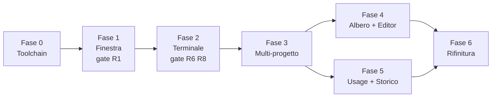

# OMP Studio — Piano di lavoro

Documento operativo. È la sequenza di passi da seguire dall'inizio alla consegna, con criteri di accettazione verificabili per ogni fase.

**Leggere prima:** `PRODUCT.md` (cosa e perché), `DESIGN.md` (sistema visivo), `ARCHITECTURE.md` (come è costruito).

---

## 0. Stato di partenza — verificato il 2026-07-29

| Elemento | Stato |
|---|---|
| `omp` | **17.1.8**, eseguibile nativo in `%LOCALAPPDATA%\omp\omp.exe` |
| WebView2 Runtime | **148.0.3967.96** presente |
| Node | v22.15.1 |
| Bun | 1.3.14 |
| npm | 11.14.1 |
| **Rust** | **NON installato** — prerequisito bloccante della Fase 0 |
| Dati `omp` disponibili | `stats.db` (11.695 messaggi), `history.db` (1.029 prompt + FTS5), `agent.db` (1.935 snapshot quota) |
| `omp usage --json` | Verificato, output strutturato, cachato, ~1,4 s |
| Progetti reali | ~25 cartelle sotto la radice dei repository |

### Le tre regole del piano

1. **Ogni fase finisce con qualcosa che si può usare.** Nessuna fase consegna solo scaffolding.
2. **I rischi si validano prima di costruirci sopra.** Le due incognite reali (finestra custom, stato dell'agente) hanno un gate dedicato all'inizio della fase che le riguarda, non un rinvio a fine progetto.
3. **Ogni feature fuori dalle fasi va in `IDEAS.md`.** Non nel codice. È la difesa contro la deriva verso "un IDE".

---

## Fase 0 — Toolchain e scheletro

**Obiettivo:** una finestra Tauri che si apre, con i token di design applicati.

### Passi

1. Installare Rust: `winget install --id Rustlang.Rustup`, poi `rustup default stable-x86_64-pc-windows-msvc`.
2. Installare Visual Studio Build Tools, workload **"Desktop development with C++"** (MSVC v143 + Windows 11 SDK).
3. Verificare: `rustc --version`, `cargo --version`.
4. Creare il progetto: `bun create tauri-app@latest omp-studio-app --template svelte-ts` (Svelte 5 + Vite puro, **non** SvelteKit).
5. Registrare i plugin nell'ordine corretto: `single-instance` **per primo**, poi `store`, `dialog`, `window-state`, `opener`.
6. Scrivere `src/app.css` con i token di `DESIGN.md` §8, incorporare Inter e JetBrainsMono Nerd Font via `@font-face` locale (nessuna risorsa remota).
7. Impostare la CSP restrittiva in `tauri.conf.json`.
8. Definire la griglia di `App.svelte`: barra 40px + tre colonne + barra di stato, con placeholder statici.

### Accettazione

- [ ] `bun tauri dev` apre la finestra; `bun tauri build` produce un `.exe` funzionante.
- [ ] Lo sfondo è `#131313`, i pannelli `#191919`: verificato con un color picker, non a occhio.
- [ ] Entrambi i font si caricano; nessun errore di rete in console.
- [ ] Nessun colore hard-coded nei componenti: solo `var(--*)`.

---

## Fase 1 — La finestra, con gate sul rischio R1

**Obiettivo:** decidere in modo definitivo la questione della barra del titolo, con prove alla mano.

Questo è il primo gate perché l'intera barra progetti si appoggia alla riga superiore della finestra. Scoprire più tardi che la finestra non si ridimensiona significherebbe rifare il layout.

### Passi

1. Prototipare la finestra con `"decorations": false`, area `data-tauri-drag-region`, e i controlli minimizza / massimizza / chiudi con le API `getCurrentWindow()`.
2. Concedere i permessi minimi: `core:window:allow-start-dragging`, `allow-minimize`, `allow-toggle-maximize`, `allow-close`.
3. **Eseguire il gate**, verificando a mano ognuna di queste voci:

| Verifica | Atteso |
|---|---|
| Trascinamento dalla barra | Sposta la finestra |
| Doppio click sulla barra | Massimizza / ripristina |
| Resize dagli 8 bordi e angoli | Funziona su tutti |
| `Win`+frecce | Snap nativo funzionante |
| Trascinamento al bordo schermo | Snap layout di Windows |
| Doppio monitor con DPI diversi | Nessun salto, nessuna scala errata |
| Massimizza su schermo secondario | Rispetta l'area di lavoro, non copre la taskbar |

4. **Decisione, da scrivere in `docs/DECISIONS.md`:**
   - Tutte le voci passano → si tiene la barra custom.
   - Anche una sola voce fallisce → `"decorations": true`, e la barra progetti diventa la prima riga del contenuto.

   La motivazione è nel registro rischi R1: una barra nativa è meno bella, una finestra che non si ridimensiona è rotta. Il bug noto è [tauri #8519](https://github.com/tauri-apps/tauri/issues/8519).
5. Attivare `window-state` per la persistenza di posizione e dimensione.

### Accettazione

- [ ] La tabella del gate è compilata con esito reale per ogni riga.
- [ ] La decisione è scritta con la sua motivazione.
- [ ] Riavviando, la finestra riappare dove era, anche sul monitor secondario.

---

## Fase 2 — Il terminale, con gate sui rischi R6 e R8

**Obiettivo:** la TUI di `omp` gira dentro l'app, indistinguibile da Windows Terminal.

È il cuore. Se questa fase non è perfetta, il progetto non ha ragione di esistere.

### Passi

1. Backend PTY in Rust con `portable-pty` 0.9.0: `native_pty_system()`, `openpty(PtySize)`, `CommandBuilder` sull'exe nativo, `try_clone_reader()`, `take_writer()`.
2. Risoluzione dell'eseguibile in ordine: impostazione utente → `%LOCALAPPDATA%\omp\omp.exe` → `PATH`. Errore chiaro se nessuna funziona.
3. Thread di lettura dedicato, buffer 64 KiB, coalescenza a un frame ogni 8 ms, tetto di 1 MiB con marcatore di troncamento.
4. Trasporto via `tauri::ipc::Channel` con `InvokeResponseBody::Raw`: byte grezzi, mai JSON né base64.
5. Frontend: `@xterm/xterm` 6.0.0 + **`@xterm/addon-canvas`** 0.7.0 (**non** WebGL: regressioni [#4665](https://github.com/xtermjs/xterm.js/issues/4665) e legature rotte [#3303](https://github.com/xtermjs/xterm.js/issues/3303) in WebView2) + `addon-fit` + `addon-ligatures` + `addon-unicode11` + `addon-web-links` + `addon-search`.
6. Cablare `onData` → `pty_write`, `onResize` → `pty_resize`, output → `term.write(Uint8Array)` senza conversioni.
7. `FitAddon` + `ResizeObserver` con debounce 150 ms; `fit()` solo su container visibile e dimensionato.
8. Env del figlio: `TERM=xterm-256color`, `COLORTERM=truecolor`, `OMP_STUDIO=1`.
9. Generare l'overlay `omp-overlay.yml` con `tui.titleState: true` e lanciare con `--config <overlay>`, senza toccare la configurazione dell'utente.
10. **Gate R8:** verificare che lo stato arrivi. Avviare `omp`, dare un compito lungo, e osservare `term.onTitleChange`. Atteso: `π > …` da fermo, `π : …` durante il lavoro, `π ! …` su una domanda. Riconoscitore unico: `/^\u03c0 ([>:!])(?: |$)/`.
    - Fallisce → fallback con estensione `omp` sugli eventi ufficiali. **Vietato analizzare lo schermo ANSI.**
11. **Gate R6:** far stampare a `omp` un file da diversi MB e verificare che l'output non perda byte e che la TUI non si sfasi. Confronto con l'output dello stesso comando in Windows Terminal.

### Accettazione

- [ ] La TUI si disegna correttamente: bordi, colori a 24 bit, spinner, legature.
- [ ] Tutte le scorciatoie di `omp` funzionano, incluse quelle con `Ctrl`. Nessuna viene intercettata dall'app.
- [ ] Ridimensionando la finestra la TUI si riadatta senza artefatti.
- [ ] Copia e incolla funzionano nei due sensi.
- [ ] Latenza tasto → glifo sotto i 16 ms in mediana.
- [ ] Throughput oltre 20 MB/s senza byte persi.
- [ ] Il gate R8 ha un esito scritto e lo stato è leggibile in console.
- [ ] Uscendo da `omp` il tab resta leggibile con il codice di uscita e l'azione di riavvio.

---

## Fase 3 — Multi-progetto

**Obiettivo:** più progetti aperti, switch istantaneo, sessioni che sopravvivono in background.

### Passi

1. Registry progetti in Rust: apri, crea cartella, chiudi, recenti. Colore di identità dall'hash del path sulla rampa a 8 tinte di `DESIGN.md` §2.7.
2. `PtyManager` con più sessioni indicizzate per progetto.
3. Store Svelte 5 con le rune: progetti aperti, progetto attivo, stato agente per progetto.
4. **Regola vincolante:** i terminali dei progetti non attivi **restano montati**, nascosti con `visibility: hidden` e `position: absolute`. Mai `display: none`, che azzera le dimensioni e rompe `FitAddon` ([#3029](https://github.com/xtermjs/xterm.js/issues/3029)).
5. Barra progetti: tessere 26×26px con iniziale, riordino per trascinamento, pulsante `+`, nome del progetto attivo al centro.
6. Indicatore attivo: una sola barra da 2px in `--brand` che trasla, `--dur-base`, `--ease-out`.
7. Stato sulla tessera: `idle` neutro, `running` anello che respira, `attention` punto fisso, `unknown` neutro. Alternativa statica sotto `prefers-reduced-motion`.
8. Persistenza in `settings.json`: progetti, larghezze colonne **per progetto**, progetto attivo. Scrittura atomica con debounce 500 ms.
9. Splitter con area di presa 8px, doppio click per ripristinare, larghezze persistenti.
10. Schermata di benvenuto: recenti, sfoglia, crea. Nessuna illustrazione.

### Accettazione

- [ ] Tre progetti aperti insieme, ognuno con la sua sessione viva.
- [ ] Lo switch è sotto i 50 ms e **non è animato**; si muove solo l'indicatore.
- [ ] La sessione di un progetto non a schermo continua a lavorare, e la sua tessera lo mostra.
- [ ] Tornando su un progetto, la TUI ha la dimensione giusta senza reflow visibile.
- [ ] Nessun PTY muore per: switch, resize, collasso colonna, minimizzazione.
- [ ] Riavviando l'app, progetti e layout tornano come erano.
- [ ] RAM sotto 500 MB con 3 progetti attivi.

---

## Fase 4 — Albero file ed editor

**Obiettivo:** leggere e modificare codice senza uscire dall'app.

### Passi

1. `tree_read` pigro, un livello per chiamata. Cartelle rumorose (`bin`, `obj`, `.vs`, `packages`, `node_modules`) collassate e in `--ink-faint`.
2. Validazione dei path in Rust: `project_id` + path **relativo**, ricomposizione e `canonicalize` per verificare che resti dentro la radice. Blocca traversal e junction.
3. `watcher.rs` con `notify` per invalidare l'albero sui cambi esterni: `omp` modifica i file mentre lavora, l'albero deve restare vero.
4. Filtro incrementale sull'albero.
5. Monaco 0.56.0: **una sola istanza**, un `ITextModel` per file. Worker via `MonacoEnvironment.getWorker` con import `?worker` di Vite; nessun plugin, nessun wrapper Svelte (non ne esiste uno mantenuto).
6. Tema Monaco derivato dai token di `DESIGN.md`. Nessuna minimap, nessun breadcrumb.
7. Lettura e scrittura file con rilevamento dell'encoding: i sorgenti più vecchi non sono tutti UTF-8. Preservare encoding e fine-riga originali, e non riscrivere il BOM se non c'era.
8. Indicatore di modifica e salvataggio con `Ctrl+S`.

### Accettazione

- [ ] L'albero apre un progetto reale con 130+ voci senza rallentamenti.
- [ ] Un file da 300 KB si apre e scorre fluido.
- [ ] Un file non-UTF-8 si apre, si salva e **non risulta modificato** in un confronto binario se non si è toccato nulla.
- [ ] Un path fuori dalla radice del progetto viene rifiutato dal backend.
- [ ] Un file modificato da `omp` si aggiorna nell'albero senza refresh manuale.

---

## Fase 5 — Usage e storico

**Obiettivo:** i due attriti restanti eliminati.

### Passi

1. `db.rs`: connessioni SQLite con `PRAGMA query_only = ON`, `busy_timeout = 3000`, e un filtro che rifiuta ogni statement non `SELECT`/`WITH`. Aperte in read-write per vedere il WAL: `SQLITE_OPEN_READONLY` nasconderebbe i dati appena scritti.
2. `usage.rs`: esecuzione di `omp usage --json`, parsing tollerante con `serde` e campi opzionali. Numero di finestre per provider variabile, `unit` letto e non assunto, `status != "ok"` trattato come severità massima.
3. Worker di polling a 60 s, **sospeso a finestra non focalizzata**, refresh immediato all'apertura del popover. Mai `usage invalidate` in automatico: forza il refetch verso i provider.
4. Chip in barra: mostra la quota peggiore, colore per severità secondo `DESIGN.md` §2.6.
5. Popover 360px: riga di sintesi con countdown al reset, elenco quote ordinate per severità, sparkline 24h da `agent.db.usage_history`, piede con costi da `stats.db`. `position: fixed`, focus trap, `Esc` per chiudere. **Non copre mai la viewport del terminale.**
6. `history.rs`: elenco sessioni da `history.db` filtrando su `cwd` (mai ricostruendo lo slug), titolo = primo prompt non-slash, ricerca via `history_fts` MATCH. Attenzione: `created_at` è in **secondi**, mentre `stats.db.timestamp` è in **millisecondi**.
7. Pannello SESSIONI nella colonna sinistra, con ricerca.
8. Ripresa in un click: `omp --resume <session_id>` in un nuovo tab, saltando il picker.
9. `contract_check` all'avvio: exe, versione, presenza e leggibilità dei tre DB, colonne attese. Ogni verifica fallita degrada la singola funzione e lo dichiara nell'interfaccia.
10. Controllo aggiornamenti all'avvio con `omp update --check` (non installa). L'installazione con `omp update` è **esplicita** e possibile solo con zero PTY attivi: aggiornare l'eseguibile sotto sessioni vive è un modo per rompere tutto.

### Accettazione

- [ ] Il chip mostra un numero reale e coerente con `omp usage` da terminale.
- [ ] Il popover si apre in meno di 100 ms con dato in cache.
- [ ] L'usage si aggiorna **mentre** una sessione lavora, senza toccarla.
- [ ] Il countdown al reset è corretto rispetto a `resetsAt`.
- [ ] Le sessioni di un progetto reale sono elencate con titoli sensati.
- [ ] La ricerca full-text trova un prompt di settimane fa.
- [ ] Un click riprende la sessione giusta nella cartella giusta.
- [ ] Rinominando temporaneamente `stats.db`, l'app parte, lo dichiara, e il terminale funziona comunque.

---

## Fase 6 — Chat temporanea e rifinitura

**Obiettivo:** consegna. Qualità 100, non 90.

### Passi

1. Chat temporanea con `omp --no-session`: tab non legato ad alcun progetto, nessuna sessione salvata.
2. Set di scorciatoie **minimo**, su `Ctrl+Alt` che la TUI non usa. Ogni combinazione che `omp` intercetta passa al terminale senza eccezioni. Documentate in `docs/SHORTCUTS.md`.
3. Passata sui divieti: la checklist di `DESIGN.md` §9, voce per voce.
4. Verifica del contrasto sull'app costruita, con misura reale e non a occhio.
5. Verifica `prefers-reduced-motion`: nessuna informazione veicolata solo dal movimento.
6. Passata sugli stati: primo avvio, nessun progetto, cartella vuota, `omp` non trovato, DB illeggibile, sessione uscita male, quota esaurita. Nessun placeholder plausibile: se un dato manca, si dice.
7. Misura del budget di performance di `ARCHITECTURE.md` §9, con i numeri scritti.
8. Icona dell'app, metadati, installer.
9. `README.md` con build e struttura; `docs/DECISIONS.md` con gli esiti dei gate.

### Accettazione

- [ ] Avvio a finestra interattiva sotto 700 ms, misurato.
- [ ] Tutte le metriche di §9 misurate e annotate.
- [ ] La checklist dei divieti è completa, tutte le voci spuntate.
- [ ] Nessun testo sotto 4.5:1, verificato sull'app reale.
- [ ] Ogni stato di errore è stato provocato di proposito e si presenta bene.
- [ ] **Prova finale: una settimana di lavoro reale su progetti reali senza riaprire VS Code per il flusso `omp`.**

---

## Ordine dei lavori e dipendenze

Le fasi 4 e 5 sono indipendenti: toccano colonne diverse e fonti dati diverse. Si possono affrontare in parallelo o nell'ordine che preferisci. Tutte le altre sono in sequenza stretta, perché ognuna appoggia sulla precedente.

---

## Cosa NON entra in questo piano

Da `PRODUCT.md`: nessuna integrazione git, nessun build o debug, nessun sistema di estensioni, nessun supporto multipiattaforma, nessuna sostituzione della TUI via ACP o `--mode rpc`, nessun tema chiaro, nessuna command palette generica.

Ogni idea che arriva durante il lavoro va in `IDEAS.md` e si valuta dopo la Fase 6. È l'unica difesa contro il rischio che ha ucciso più progetti simili di qualsiasi problema tecnico.
